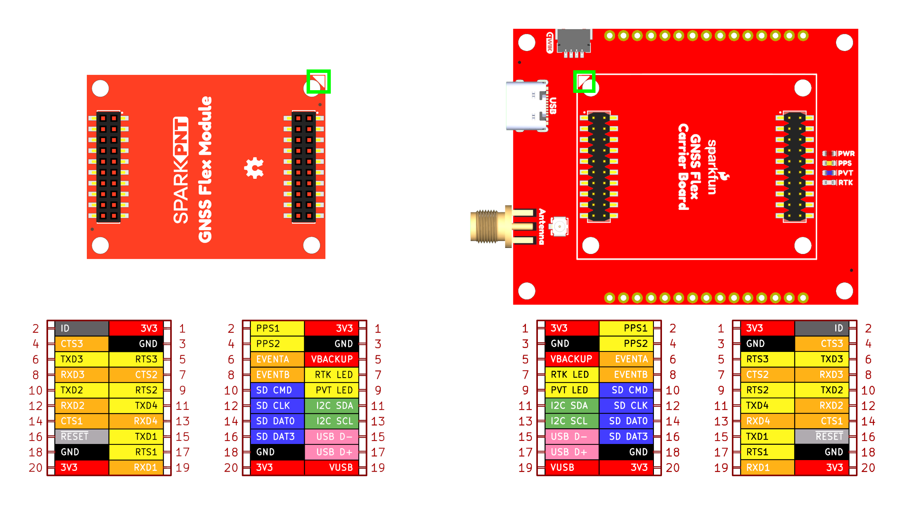

SparkFun GNSS Flex System
========================================

Our GNSS Flex system is designed to be modular with two board types:

- *Plug-in Modules*

    Each SparkPNT GNSS Flex module features a different GNSS receiver. These boards breakout the various interfaces of a GNSS receiver to the standardized female headers of the GNSS Flex system. This allows users to easily repair and upgrade their system's GNSS receiver.

- *Carrier Boards*

    These boards host GNSS Flex modules on the standardized male headers of the GNSS Flex system. Their designs usually have a specific intention; such as a breakout board, Raspberry Pi pHAT, SparkPNT product line, etc.

The entire ecosystem is centered around two 2x10-pin, 2mm pitch headers that mate the two types of boards. A standardized pin layout, keeps the ecosystem pin-compatible for upgrades and allows board to be easily swapped for repairs. Depending on the capabilities of the GNSS receiver, these pins will breakout the USB, UART (x4), I2C, and SD card interfaces along with any PPS or event signals of the GNSS receiver.

> [!IMPORTANT]
> Depending on the SparkPNT GNSS Flex module, these product will likely require an external antenna:
>
> - Be sure to check out the hookup guide for more information on the GNSS Flex module.
> - Users can also find [GNSS Antennas](https://www.sparkfun.com/gnss/gnss-antennas.html) in our catalog.
>
> Users will have two options for connecting an external GNSS antenna to their GNSS receiver.
>
> - The GNSS Flex modules will usually come with a U.FL connector for external antenna.
> - For a sturdier connection, a SMA connector on a *carrier board* can utilized. Users can simply jumper the U.FL connectors between the SparkPNT GNSS Flex module and the *carrier board* with a short U.FL cable.

Documentation
--------------
- **[Hookup Guide (mkdocs)](http://docs.sparkfun.com/SparkFun_GNSS_Flex_System/)** - A hookup guide for the entire ecosystem of SparkFun GNSS Flex carrier boards and SparkPNT GNSS Flex modules, hosted by GitHub pages. 
   

  *Need to download or print our hookup guide?*

  - [Print *(Print to PDF)* from Single-Page View](http://docs.sparkfun.com/SparkFun_GNSS_Flex_System/print_view)

Repository Contents
-------------------
- **[/docs](/docs/)** - Online documentation files
  - [/assets](/docs/assets/) - Assets files
    - [/component_documentation](/docs/assets/component_documentation/) - Datasheets for GNSS Flex system's standards
    - [/img/hookup_guide](/docs/assets/img/hookup_guide/) - Images for hookup guide documentation
- [/flex_boards](/flex_boards/)
  - /`<name>` - GNSS Flex board *(or associated GitHub submodule)*
    - /docs - Documentation files for the board
      - /assets - Assets files for the board
        - /3d_model - 3D models for the board
        - /board_files - Design files for the board
          - KiCad Design Files (.zip)
          - Schematic (.pdf)
          - Dimensions (.pdf)
        - /component_documentation - Datasheets for the board
        - /img/hookup_guide - Hookup guide images for the board
    - /Hardware - Hardware design files (.brd, .sch)
      - /Production - Production files

Product Variants
----------------

- GNSS Flex pHAT:
  - [GPS-28137](https://www.sparkfun.com/sparkfun-gnss-flex-phat.html)
- Kits:
  - [GPS-28766](https://www.sparkfun.com/sparkfun-gnss-flex-phat-mosaic-x5.html) - GNSS Flex pHAT w/ the Septentrio mosaic-X5 GNSS Flex module
  - [GPS-28929](https://www.sparkfun.com/sparkfun-gnss-flex-phat-lg290p.html) - GNSS Flex pHAT w/ the Quectel LG290P GNSS Flex module
- GNSS Modules:
  - [GPS-28138](https://www.sparkfun.com/sparkpnt-gnss-flex-module-mosaic-x5.html) - Septentrio mosaic-X5 GNSS Flex module
  - [GPS-28139](https://www.sparkfun.com/sparkpnt-gnss-flex-module-lg290p.html) - Quectel LG290P GNSS Flex module

Version History
---------------
- [r2025-05](https://github.com/sparkfun/SparkFun_GNSS_Flex_System/releases/tag/r2025-05) - Initial Release

> [!NOTE]
>
> The format of the release tag  `r[year]-[month][iteration]`
>
> - **year:** `YYYY` Format
> - **month:** `MM` Format
> - **iteration:** Revisions for that month *(i.e. `none`, `a`, `b`, etc.)*

License Information
-------------------

This product is ***open source***!

Please review the [`LICENSE.md`](./LICENSE.md) file for license information.

If you have any questions or concerns about licensing, please contact technical support on our [SparkFun forums](https://forum.sparkfun.com/viewforum.php?f=152).

Distributed as-is; no warranty is given.

- Your friends at SparkFun.
