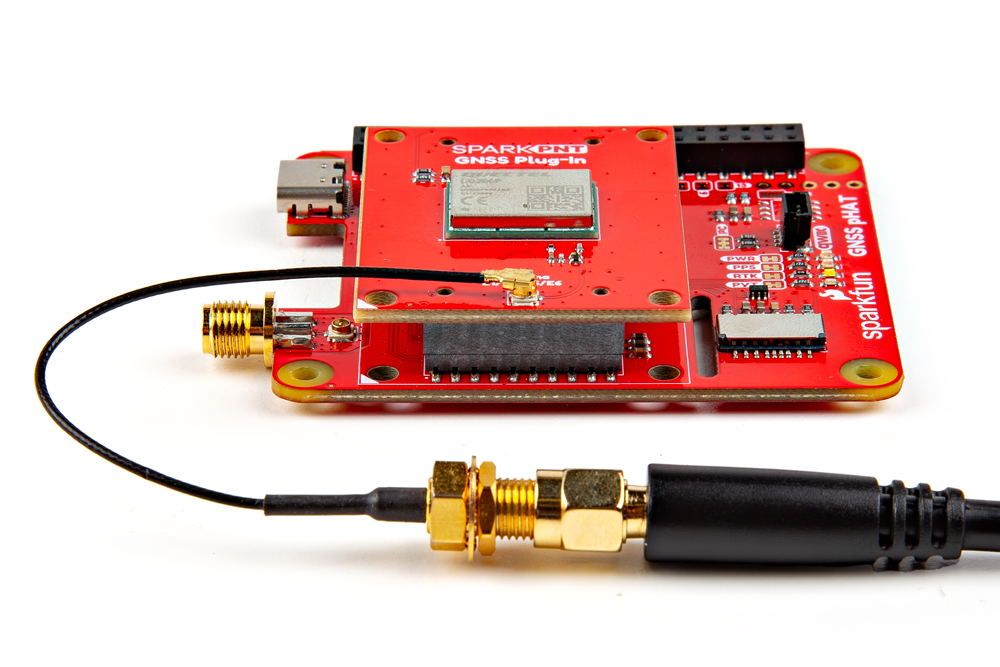
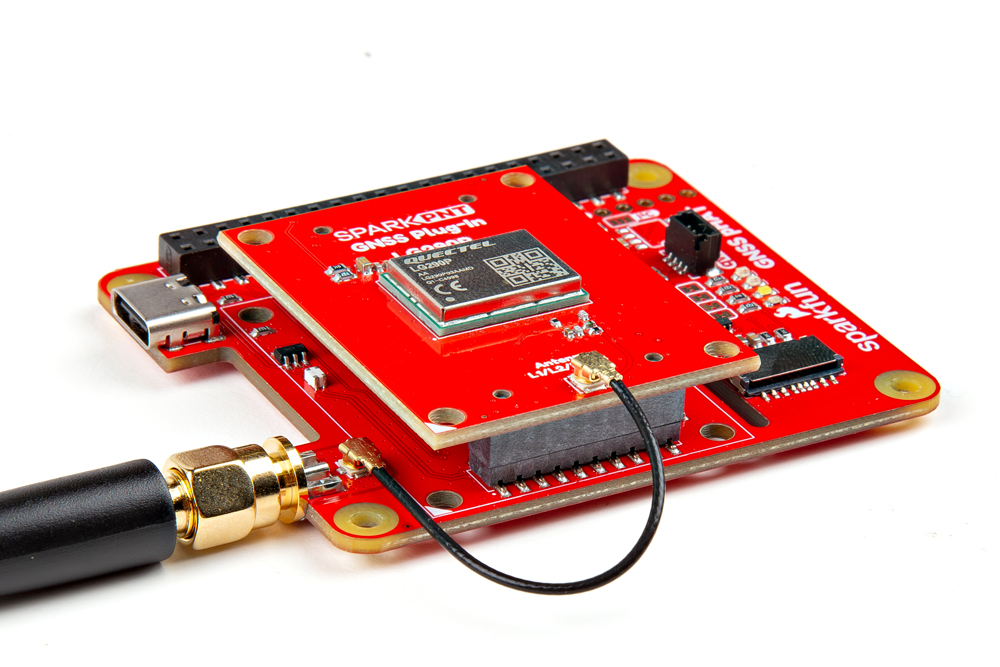

## Board Alignment
The GNSS Flex system is a modular ecosystem designed around two 2x10-pin, 2mm pitch headers, so boards are pin-compatible for upgrades and easily swapped for repairs. Users simply, stack a SparkPNT GNSS Flex module onto the headers of its associated *carrier* board. The alignment of these boards is annotated with a triangle in the corner of the mating area.

<figure markdown>
[{ width="400" }](./assets/img/hookup_guide/assembly-animation.gif "Click to enlarge")
<figcaption markdown>The alignment and connection of a SparkPNT GNSS Flex module on top of a *carrier* board.</figcaption>
</figure>

## External Antenna
In order to receive [GNSS](https://en.wikipedia.org/wiki/Satellite_navigation "Global Navigation Satellite System") signals, users will need a compatible antenna. For the best performance, we recommend an active, L1/L2/L5/L6 GNSS antenna.

- External antennas can be connected through the U.FL connector on the GNSS Flex board.
- For a sturdier connection, there is a signal pass-through between the U.FL and SMA antenna connectors of the Flex carrier boards. Users can to bridge the U.FL connections of the boards to utilize the SMA connector for a GNSS antenna.

<figure markdown>
[{ width="400" }](./assets/img/hookup_guide/assembly-antenna.jpg "Click to enlarge")
<figcaption markdown>Attaching an antenna directly to the GNSS Flex board.</figcaption>
</figure>

<figure markdown>
[{ width="400" }](./assets/img/hookup_guide/assembly-ufl_bridge.jpg "Click to enlarge")
<figcaption markdown>Bridging the U.FL connections to utilize the SMA connector on a *carrier* board.</figcaption>
</figure>

