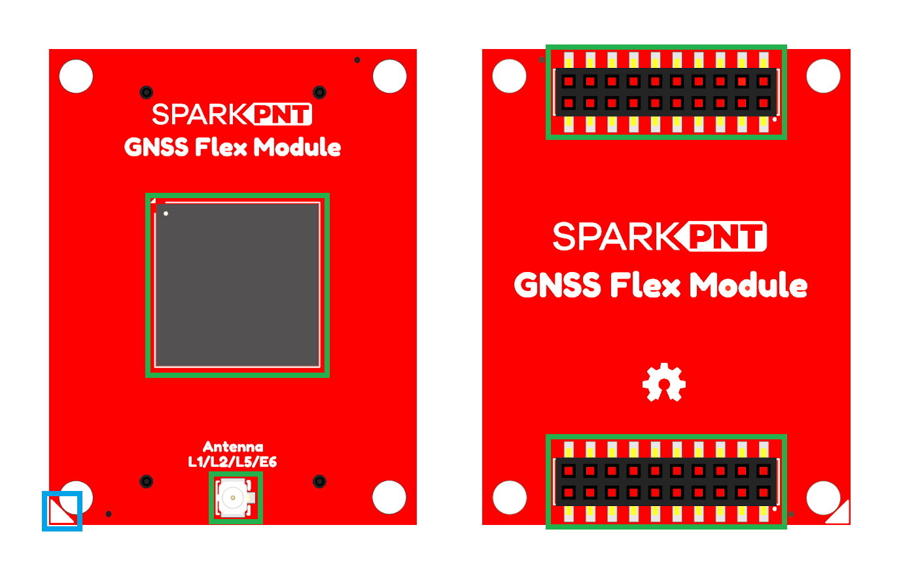
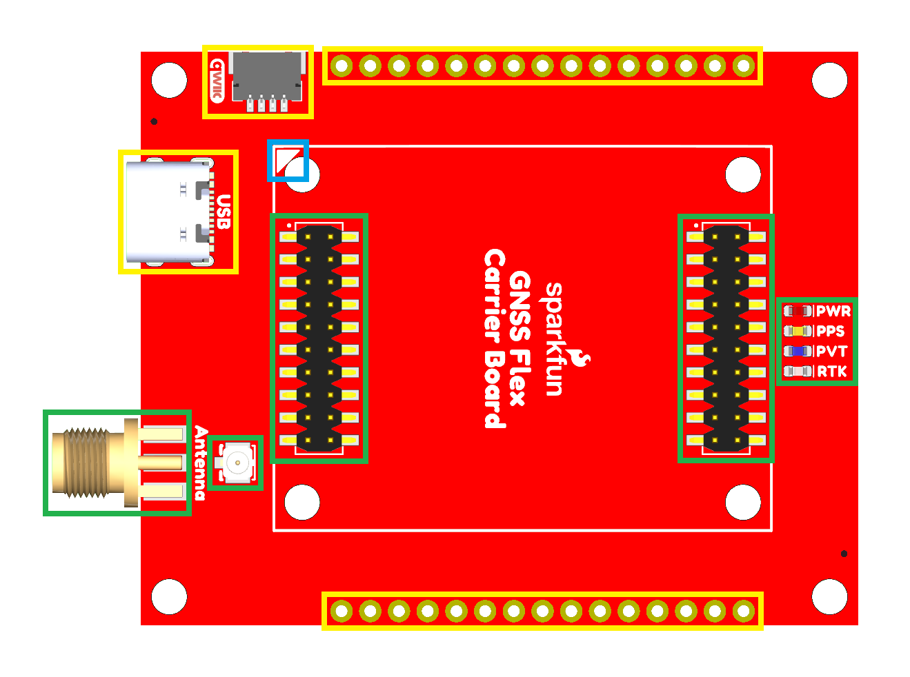
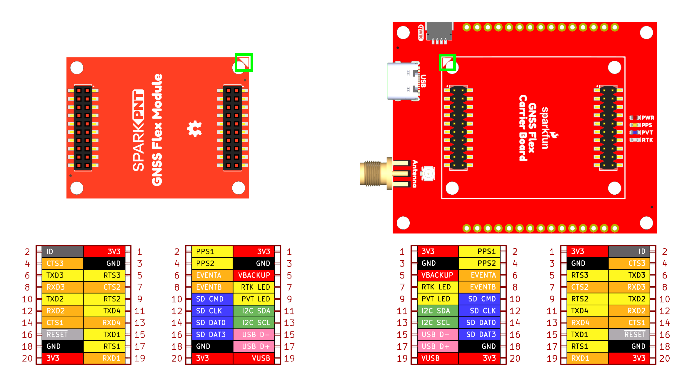
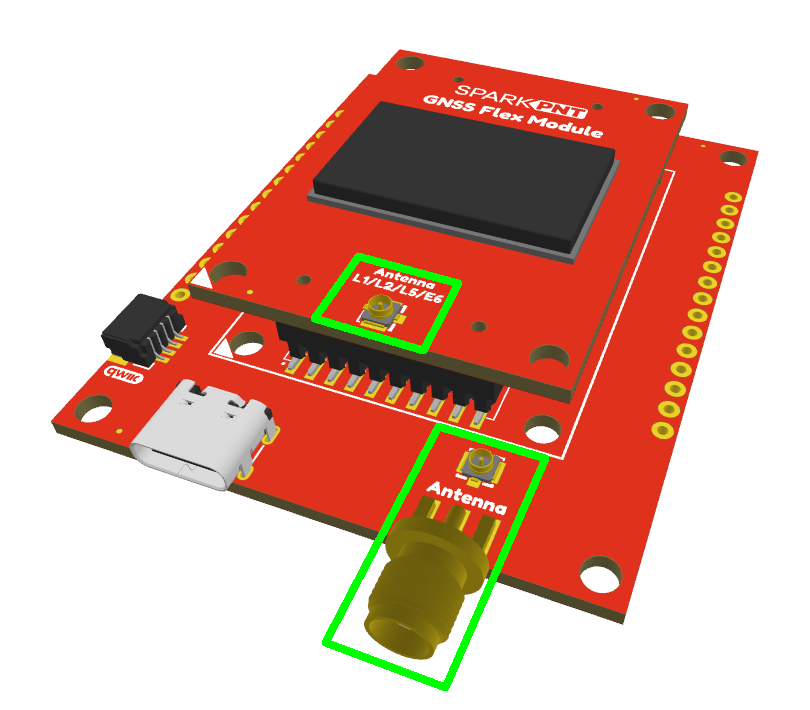

## Board Layout

The boards of the GNSS Flex system have the following features:

<figure markdown>
[{ width="460" }](./assets/img/hookup_guide/module-layout.png "Click to enlarge")
<figcaption markdown>Layout of the major components on the GNSS Flex modules.</figcaption>
</figure>

1. **Alignment Indicator**
:	A small triangle at the corner of the board is used to indicate the board's alignment on the *carrier* board.
1. **GNSS Receiver**
:	Each variant of the SparkPNT GNSS Flex modules features a unique GNSS receiver.
1. **U.FL Connector**
:	The primary interface for connecting an external GNSS antenna. *(Some GNSS modules may come packaged with a built-in ceramic antenna.)*
1. **GNSS Flex Female Headers**
:	The GNSS Flex system is designed around two 2x10-pin, 2mm pitch headers used mate the two types of boards. A standardized pin layout, keeps the ecosystem pin-compatible for upgrades and allows board to be easily swapped for repairs. Depending on the capabilities of the GNSS receiver, these pins will breakout the USB, UART (x4), I2C, and SD card interfaces along with any PPS or event signals of the GNSS receiver.

<figure markdown>
[{ width="400" }](./assets/img/hookup_guide/carrier-layout.png "Click to enlarge")
<figcaption markdown>Layout of the major components of GNSS Flex *carrier* boards.</figcaption>
</figure>

1. **Alignment Indicator**
: A small triangle in the corner of the GNSS Flex system's mating area is used to indicate the alignment for a GNSS Flex module on the *carrier* board.
1. **SMA Connector**
:	A more robust interface for connecting an external GNSS antenna to the GNSS Flex system. The signal is isolated and passed-through to the U.FL connector on the *carrier* board.
1. **U.FL Connector**
:	The signal for this connector is isolated and passed-through to the SMA connector on the *carrier* board. It is used for bridging the external antenna connection of the U.FL connector on GNSS Flex module to the SMA connector on the *carrier* board.
1. **GNSS Flex Male Headers**
:	The *carrier* boards host GNSS Flex modules on the two 2x10-pin, 2mm pitch male headers. A standardized pin layout, keeps the ecosystem pin-compatible for upgrades and allows board to be easily swapped for repairs. Depending on the capabilities of the GNSS receiver, these pins will breakout the USB, UART (x4), I2C, and SD card interfaces along with any PPS or event signals of the GNSS receiver.
1. **Status LED**
:	Often *carrier* boards will include status LEDs to indicate the board is powered, the RTK status, a PPS signal, and a GNSS fix.
1. **Other Features**
:	 The designs of the *carrier* boards usually have a specific purpose; therefore, they will often include other features. *(For more details, users can refer to the hardware information of the board they are interested in.)*

## Header Pins
The GNSS Flex ecosystem is designed around two 2x10-pin, 2mm pitch headers used mate the two board types. Depending on the capabilities of the GNSS receiver on the GNSS Flex module, these pins breakout the USB, UART (x4), I2C, and SD card interfaces along with any PPS or event signals of the GNSS receiver.

<figure markdown>
[{ width="600" }](./assets/img/hookup_guide/pinout.png "Click to enlarge")
<figcaption markdown>The pin layout of the headers on the GNSS Flex boards; with each board's mating alignment highlighted in green.</figcaption>
</figure>

## U.FL Connectors
Depending on the SparkPNT GNSS Flex module,	users will have two options for connecting an external GNSS antenna to their GNSS receiver.

- The GNSS Flex modules will usually come with a U.FL connector for external antenna.
- For a more robust interface, the GNSS Flex *carrier* boards will usually come with a U.FL connector that is bridged to a nearby SMA edge connector. Users simply need to jumper the U.FL connectors between the SparkPNT GNSS Flex module and the *carrier* board with a short U.FL cable.

<figure markdown>
[{ width="400" }](./assets/img/hookup_guide/antenna.png "Click to enlarge")
<figcaption markdown>Bridging the U.FL connections to utilize the SMA connector on a *carrier* board.</figcaption>
</figure>
