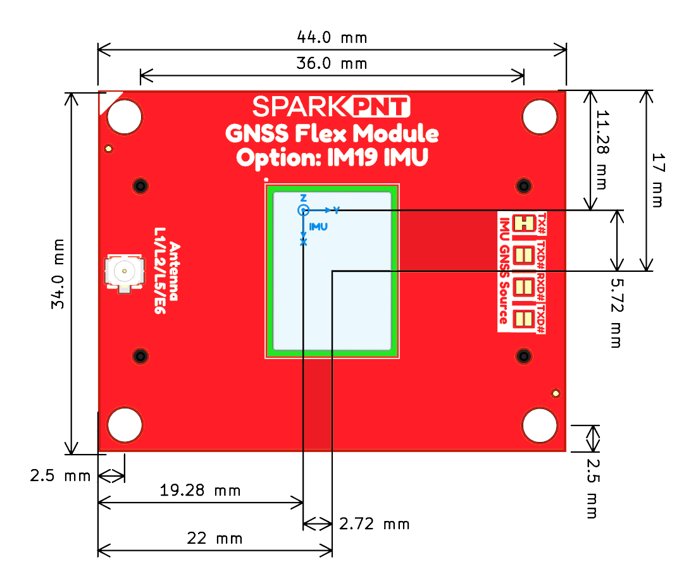
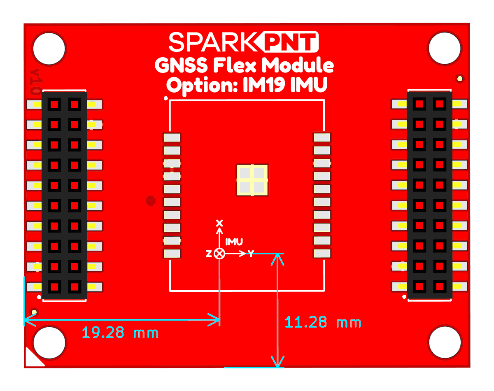
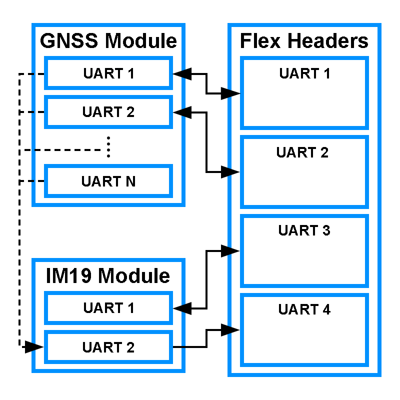
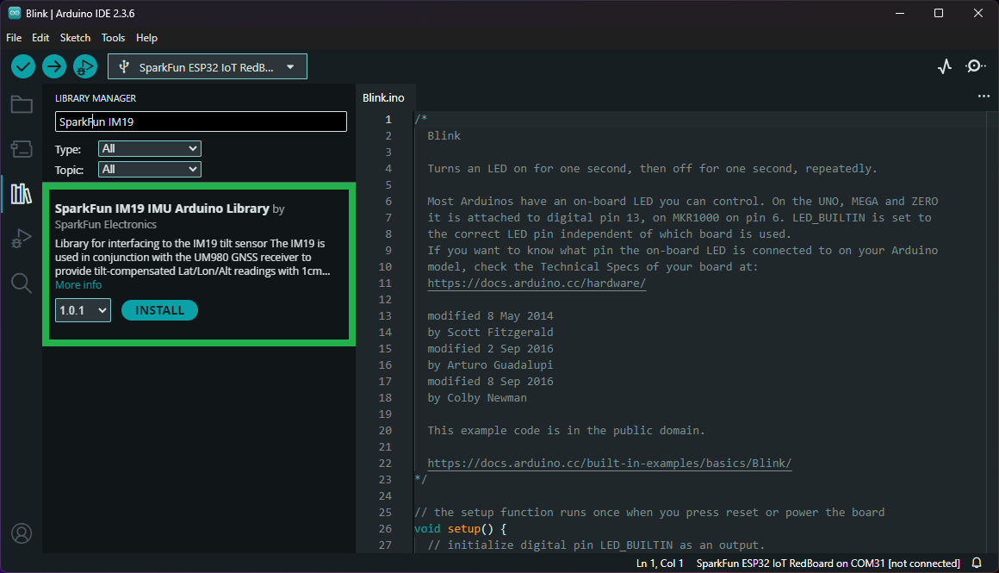

# IM19 Attitude Module
For certain GNSS Flex modules, users have the option to purchase a [variant with IM19 attitude module](modules.md#gnss-modules-w-optional-imu). The optional, [IM19 attitude module](./assets/component_documentation/IM19EI_v1.4.1.pdf) from [Feyman Inc. (FMI)](http://feymani.com/en/) fuses MEMS IMU sensor data and GNSS RTK positioning to deliver high-precision attitude compensated measurements, with roll and pitch accurate to within 0.05 degrees. This kind of superb accuracy has widespread uses in industrial applications such as tilt RTK surveys (where RTK poles need not be held straight vertical as the IM19 can calculate a virtual digital level at any tilt angle), agriculture machine automation, and dead reckoning.

<article class="video-500px" style="text-align: center; margin: auto;" markdown>
<iframe src="https://global.feymani.com/files/im19.mp4" type="video/mp4" title="KiCad Dimension Tool" frameborder="0" allow="accelerometer; clipboard-write; encrypted-media; gyroscope; picture-in-picture" allowfullscreen></iframe>
</article>

<article class="video-500px" style="text-align: center; margin: auto;" markdown>
<iframe src="https://www.youtube.com/embed/wND8cXVQSXo" title="IM19 Initialization Stability" frameborder="0" allow="accelerometer; autoplay; clipboard-write; encrypted-media; gyroscope; picture-in-picture" allowfullscreen></iframe>
</article>

**Features:**

- Power: 0.33W
- Data Rate: 100Hz
- IMU Accuracy: &le;1% * D（1&sigma;, vehicle)
- Gyroscope
	- ARW: 0.17&deg;/&radic;(h)
	- Bias Stability: &plusmn;4.5&deg;/h
	- Range: &plusmn;1000&deg;/s

 

- Accelerometer
	- Speed RW: 0.04m/s/&radic;(h)
	- Bias Stability: &plusmn;0.3mg
	- Range: &plusmn;16g
- Roll and Pitch: &le;0.02&deg;（1&sigma;）
- Heading/Yaw: &le;0.2&deg;（1&sigma;）
- Initialization: 1s (95%)
- Self-calibration Technique

!!! info
	For more information, please refer to the [IM19 datasheet](./assets/component_documentation/IM19.pdf).

### Accuracy
When configured and calibrated, the IM19 attitude module can fuses IMU sensor and GNSS RTK positioning data to deliver compensated position. The accuracy, displayed in the table below, should also be considered when implemented.

<article style="text-align: center;" markdown>

| Tilt Angle        | Accuracy |
| :---------------: | :------: |
| 0&deg; - 30&deg;  | 1cm      |
| 30&deg; - 60&deg; | 2cm      |

</article>

!!! tip
	It is recommended that the IM19 module is placed in a stable temperature region and avoid convection with the outside air.

## Hardware Overview
Once calibrated, the IM19 will output proprietary NMEA messages containing the compensated position and roll, pitch and yaw. However, it requires the Pulse-Per-Second signal and NMEA GGA, RMC and GST messages from the GNSS receiver; and information on the location of the GNSS antenna's phase center *(APC)* and the survey point, with respect to the IMU's origin.

### IMU Position
The measurements below are general guidelines for the position of the IMU inside the IM19 attitude module, with respect to the layout GNSS Flex module. The origin for the IMU is 2.72mm in Y-axis and 5.72mm in X-axis from the center of the IM19 attitude module. Users should also consider the manufacturing tolerances of the board in reference to these measurements. For example, the edges of the PCB may not be at their exact and that the exact position and orientation of the IM19 attitude module will be affected by the reflow process.

<figure markdown>
[{ width="400" }](./assets/img/hookup_guide/im19_offset-top.png "Click to enlarge")
<figcaption markdown>The IMU position offset, with respect to the IM19 attitude module and the GNSS Flex module.</figcaption>
</figure>

<figure markdown>
[{ width="400" }](./assets/img/hookup_guide/im19_offset-bottom.png "Click to enlarge")
<figcaption markdown>The IMU position offset as viewed from the bottom of the GNSS Flex module.</figcaption>
</figure>

### UART Interface
The diagram below, generalizes the connections of the UART interfaces between the GNSS receiver, IM19 attitude module, and the GNSS Flex headers. In general, the `UART1` and `UART2` interfaces of the IM19 attitude module will be connected to the `UART3` and `UART4` interfaces, respectively, of the GNSS Flex headers.

Depending on the GNSS receiver of the GNSS Flex module, the first two available UART interfaces of the GNSS receiver will usually be connected to the `UART1` and `UART2` interfaces, respectively, of the GNSS Flex headers. Additionally, one of the `TX` pins from the available UART interfaces of the GNSS receiver will be connected to the `RX` pin of the IM19 attitude module's `UART2` interface to provide the RTK GNSS data. However, this can connection can be changed through jumpers on the GNSS Flex Module, if necessary.

<figure markdown>
[{ width="400" }](./assets/img/hookup_guide/im19-uart.png "Click to enlarge")
<figcaption markdown>UART connections between the GNSS receiver, IM19 attitude module, and the GNSS Flex headers.</figcaption>
</figure>

!!! info
	For information on the exact connections between the UART interfaces of the GNSS receiver, IM19 attitude module, and the GNSS Flex headers, please refer to the [hookup guide for the specific GNSS Flex module](modules.md).

!!! abstract
	For the UART interface of the GNSS receiver that is connected to the IM19 attitude module, users will need to configure the UART port for the following settings:

	- Baudrate: 115200bps
	- Output NMEA Messages: `GPGGA`, `GPRMC`, and `GPGST`
	- Solution Rate: **1Hz**

### PPS Signal
The `PPS1` signal from the GNSS receiver, is used to fuse the MEMS IMU sensor data with the GNSS RTK position data. The timing of the PPS signal should match the solution rate of the GNSS RTK position data.

!!! abstract
	For the PPS signal from the GNSS receiver, users will need to configure the signal's timing to match the RTK GNSS solution rate:

	- Solution Rate: **1Hz**

## AT Commands
Below is a summary of the AT commands supported by the IM19 attitude module.

| AT Command | Description |
| :--------- | :---------- |
| `AT+SYSTEM_RESET`                  | System reset |
| `AT+SAVE_ALL`                      | Save the parameters |
| `AT+UPDATE_APP`                    | Update module firmware, see attachment for protocols |
| `AT+UPDATE_BOOT`                   | Update Bootloader，see attachment for protocols |
| `AT+GNSS_CARD=`                    | Set the GNSS RTK receiver type:<ul><li>`HEMI`, `NOVTEL`, `UNICORE`, `OEM`</li></ul> |
| `AT+READ_PARA=SYSTEM/ALL`          | Read parameters (SYSTEM/ALL) `AT+LOAD_DEFAULT` Loading default parameters |
| `AT+AUTO_FIX=ENABLE/DISABLE`       | Installation angle estimation in tilt measurement applications |
| `AT+CLUB_VECTOR=X,Y,Z`             | Set the RTK pole vector to map the position to the end of the RTK pole |
| `AT+NAVI_OUTPUT=UART1,ON/OFF`      | Binary NAVI positioning output |
| `AT+NASC_OUTPUT=UART1,ON/OFF`      | Ascii type NAVI positioning output |
| `AT+MEMS_OUTPUT=UART1,ON/OFF`      | MEMS raw output |
| `AT+GNSS_OUTPUT=UART1,ON/OFF`      | GNSS raw output |
| `AT+LEVER_ARM=``X,Y,Z`             | Set the lever arm |
| `AT+LEVER_ARM2=``X,Y,Z`            | Set the lever arm, the input value will be automatically adjusted according to the estimated installation angle |
| `AT+CHECK_SYNC`                    | Query whether time is synchronized between MEMS and GNSS |
| `AT+HIGH_RATE=``ENABLE`/`DISABLE`  | High-rate mode setting |
| `AT+ACTIVATE_KEY=``KEY`            | Module activation |
| `AT+ALIGN_VEL=1.0`                 | Set the initial alignment speed threshold |
| `AT+VERSION`                       | Query the Firmware version |
| `AT+GNSS_PORT=``PHYSICAL_UART2`    | Set the physical serial port for communicating with the GNSS RTK receiver. Save the Settings and restart to take effect |
| `AT+WORK_MODE=``X`                 | Set the module working mode |
| `AT+INSTALL_ANGLE=``X,Y,Z`         | Set the module installation angle |
| `AT+THIS_PORT`                     | Query the serial port number |
| `AT+FILTER_STOP=` `ENABLE`/`DISABLE`    | Causes the filter to enter or exitstop mode |
| `AT+LOOP_BACK=` `UARTn`/`NONE`          | UART n enters or exits the loopback mode |
| `AT+FILTER_RESET`                  | Filter Reset |
| `AT+CHECK_CRC=` `N`                | The IM19EE firmware CRC is calculated for checking the firmware, where N is the firmware size |
| `AT+CORRECT_HOLDER=` `ENABLE`/`DISABLE` | Turn on or off RTK pole length compensation |
| `AT+OUTPUT_DISABLE=` `UARTx`       | Disable the output of all messages over the serial port x |
| `AT+CALIBRATE_MODE2=` `STEP1`/`STEP2`   | Factory calibration command |
| `AT+SET_CHECK_LEVEL=` `LEVELx`     | Set check level of calibration parameter |
| `AT+FACTORY_PARA_x=` `X,Y,Z`       | Recovery factory calibration parameter |
| `AT+SET_PPS_EDGE=` `RISING`/`FALLING`   | Set PPS edge, accept falling pps edge by default |

!!! info
	For more information, please refer to the [IM19 integration manual](./assets/component_documentation/IM19EI_v1.4.1.pdf).

## Configuration Requirements

- Access to the UART interfaces of the IM19 IMU
- Access to configure the UART interface and PPS signal that are transmitting from the GNSS receiver to the IM19 IMU

	!!! abstract
		For the UART interface of the GNSS receiver that is connected to the IM19 attitude module, users will need to configure the UART port for the following settings:

		- Baudrate: 115200bps
		- Output NMEA Messages: `GPGGA`, `GPRMC`, and `GPGST`
        - Solution Rate: 1Hz

		The timing of the `PPS` signal from the GNSS receiver should match the RTK GNSS solution rate being transmitted to the IM19 IMU.

- The location of the **APC** of the GNSS antenna and the survey point, with respect to the IMU's origin.

!!! info
	For information on the antenna reference point (ARP) and antenna phase center (APC), check out this useful [tutorial by Septentrio](https://customersupport.septentrio.com/s/article/ARP-APC-offsets).

!!! tip
	It is recommended that the IM19 module is placed in a stable temperature region and avoid convection with the outside air.

## Compatible Software
Below are some compatible software options for configuring the IM19 attitude module and receiving the tilt-compensated position in its proprietary message format.

### PyGPSClient
As of [v1.5.8](https://github.com/semuconsulting/PyGPSClient/releases/tag/v1.5.8), a widget has been added to the [PyGPSClient](https://github.com/semuconsulting/PyGPSClient) application to configure and utilize the IM19 attitude module.

???+ info "Resources"
	For additional information, users can refer to the following resources for the PyGPSClient software:

	- :material-github: [GitHub Repository](https://github.com/semuconsulting/PyGPSClient)
	- [Installation Instructions](https://github.com/semuconsulting/PyGPSClient?tab=readme-ov-file#installation)
	- [PyPI Project](https://pypi.org/project/pygpsclient/)

### IM19 IMU Arduino Library
The [SparkFun IM19 Tilt Sensor Arduino Library](https://github.com/sparkfun/SparkFun_IM19_IMU_Arduino_Library) can be installed from the library manager in the Arduino IDE by searching for:

	SparkFun IM19 IMU Arduino Library

<figure markdown>
[{ width="400" }](./assets/img/hookup_guide/arduino_library-im19.png)
<figcaption markdown>SparkFun IM19 IMU Arduino Library in the library manager of the Arduino IDE.</figcaption>
</figure>

!!! tip "Manually Download the Arduino Library"
	For users who would like to manually download and install the library, the `*.zip` file can be accessed from the [GitHub repository](https://github.com/sparkfun/SparkFun_IM19_IMU_Arduino_Library) or downloaded by clicking the button below.

	<article style="text-align: center;" markdown>
	[:octicons-download-16:{ .heart } Download the Arduino Library](https://github.com/sparkfun/SparkFun_IM19_IMU_Arduino_Library/archive/refs/heads/main.zip){ .md-button .md-button--primary }
	</article>

## Resources
Feyman Inc. also provides some resources for the IM19 attitude module:

- :material-web: [IM19 Product Page](https://global.feymani.com/product/attitede/im19ee/)
	- :material-newspaper-variant: [Documentation](https://global.feymani.com/document/)
- :material-web: [IM19 Product Page](http://feymani.com/en/show-53-2-1.html) *(alternate website)*
- :material-youtube: [Feyman Inc. YouTube Channel](https://www.youtube.com/@FeymanIncFMI)
- :material-email: [Support Email](mailto:fmi-support@feymani.com)
