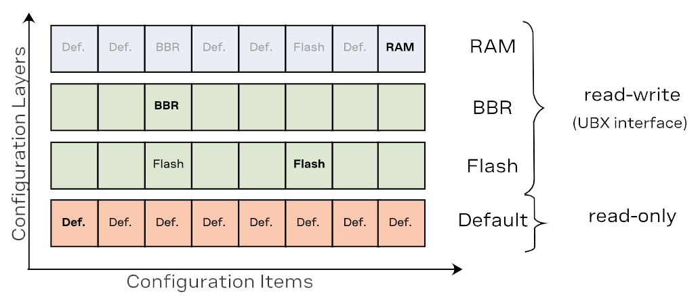

## Configuration Database
All configuration settings for the GNSS receiver are stored in a database, which is organized by separate layers. At startup, the receiver reads all the **Configuration Layers** from the database to constructs the **Current Configuration**, which is stored in the RAM and used by the receiver at run-time. Any configuration in any layer is organized as **Configuration Items**, where each **Configuration Item** is referenced to by a unique **Configuration Key ID** and holds a single **Configuration Value**.

- **Configuration Data** - The binary representation of a list of Key ID and Value pairs
- **Configuration Items** - Consists of a (Configuration) Key ID and its (Configuration) Value
- **Configuration Layers** - These layers store the **Configuration Items**
- **Current Configuration** - The culmination of highers priority configuration items from all the configuration layers, which are used by the receiver at run-time. The *Current Configuration* is called the RAM layer.

<figure markdown>
[{ width="750px" }](./assets/img/hookup_guide/current_configuration.png "Click to enlarge")
<figcaption markdown>A chart of the **Configuration Layers** and **Configuration Items** from the **Configuration Database**.</figcaption>
</figure>

## Configuration Layers
The receiver has several **Configuration Layers**, some of the layers are read-only while others are modifiable. The layers are organized in terms of priority. Values in a high-priority layer replace values stored in a low-priority layers. At startup, the receiver reads all **Configuration Layers** and stacks up the items to create the **Current Configuration**, which is used by the receiver at run-time.

The following **Configuration Layers** are available (in order of priority, highest priority first):

1. **RAM**
:   This layer contains items stored in volatile RAM. This is known as the **Current Configuration**. The value of any item can be set by the user at run-time (see [UBX protocol] interface) and it is effective immediately.
1. **BBR**
:   This layer contains items stored in the battery-backed RAM. The contents in this layer are preserved as long as a battery backup supply is provided during off periods. The value of any item can be set by the user at run-time (see UBX protocol interface) and it becomes effective when the receiver is restarted.
1. **Flash**
:   This layer contains items stored permanently in the external flash memory. This layer is only available if there is a usable external flash memory. The value of any item can be set by the user at run-time (see UBX protocol interface) and it becomes effective when the receiver is restarted.
1. **Default**
:   This layer contains all items known to the running receiver software and their hard-coded default values. Data in this layer is not writable.

## UBX Protocol
The following UBX protocol messages are available to access the ***Configuration Database**:

- `UBX-CFG-VALGET`: Read **Configuration Items** from the database
- `UBX-CFG-VALSET`: Set **Configuration Items** in the database
- `UBX-CFG-VALDEL`: Delete **Configuration Items** from the database

### Configuration Reset
The RAM layer is always rebuilt from the **Configuration Layers** when the chip's processor comes out from reset. When using `UBX-CFG-RST`, the processor goes through a reset cycle with these reset types (`resetMode` field):

- `0x00` hardware reset (watchdog) immediately
- `0x01` controlled software reset
- `0x04` hardware reset (watchdog) after shutdown

## Common Configuration Groups
These are groups of specific **Configuration Items** that users will likely be interested in:

| Group | Description |
| :---- | :---------- |
| `CFG-HW`           | Hardware configuration |
| `CFG-I2C`          | Configuration of the I2C interface |
| `CFG-I2CINPROT`    | Input protocol configuration of the I2C interface |
| `CFG-I2COUTPROT`   | Output protocol configuration of the I2C interface |
| `CFG-MSGOUT`       | Message output configuration |
| `CFG-NMEA`         | NMEA protocol configuration |
| `CFG-RATE`         | Navigation and measurement rate configuration |
| `CFG-SPI`          | Configuration of the SPI interface |
| `CFG-SPIINPROT`    | Input protocol configuration of the SPI interface |
| `CFG-SPIOUTPROT`   | Output protocol configuration of the SPI interface |
| `CFG-TP`           | Time pulse configuration |
| `CFG-UART1`        | Configuration of the UART1 interface |
| `CFG-UART1INPROT`  | Input protocol configuration of the UART1 interface |
| `CFG-UART1OUTPROT` | Output protocol configuration of the UART1 interface |
