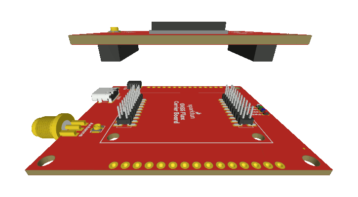
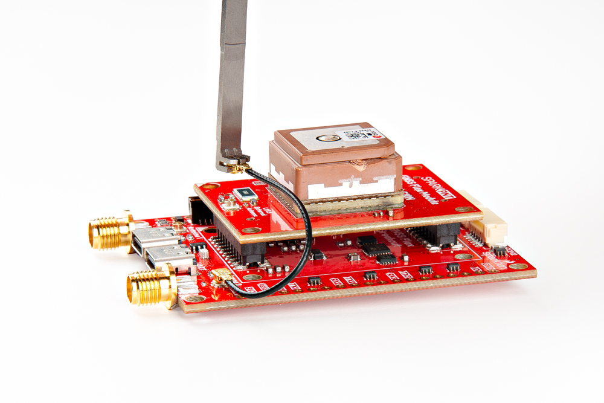
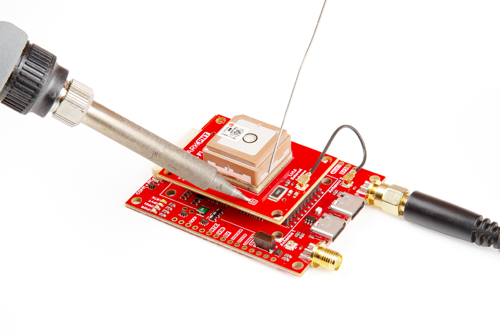

## GNSS Flex Headers
SparkPNT GNSS Flex modules are *plug-in boards* featuring different GNSS receivers. They are designed to be easily swapped for repairs and pin-compatible for upgrades. The boards come populated with two 2x10 pin, 2mm pitch female headers for connecting to *carrier boards*.

<figure markdown>
[{ width="400" }](./assets/img/hookup_guide/animation-attach_module.gif "Click to enlarge")
<figcaption markdown>Stacking a GNSS Flex module onto a *carrier* board.</figcaption>
</figure>

## External GNSS Antenna
In order to receive [GNSS](https://en.wikipedia.org/wiki/Satellite_navigation "Global Navigation Satellite System") signals, a compatible antenna is required. Users have the option of utilizing the integrated L1/L5 dual-band patch antenna or attaching an external GNSS antenna.

### U.FL Connector
An external antenna can be connected to the U.FL connector on the GNSS Flex board with an [U.FL to SMA adapter cable](https://www.sparkfun.com/sma-to-u-fl-cable-150mm.html). For a sturdier connection, users also have the option to bridging the connection to the SMA connector on a Flex carrier board.

<figure markdown>
[{ width="400" }](./assets/img/hookup_guide/assembly-ufl.jpg "Click to enlarge")
<figcaption markdown>Attaching an U.FL cable to the GNSS Flex board.</figcaption>
</figure>

!!! tip
	For the best performance, we recommend users choose a compatible L1/L5 GNSS antenna and utilize a low-loss cable. Also, don't forget that GNSS signals are fairly weak and can't penetrate buildings or dense vegetation. The GNSS antenna should have an unobstructed view of the sky.

### RF Switch
In order to trigger the RF switch inside the DAN-F10N GNSS module to utilize the U.FL connector as its signal source, the `EXT_ANT` jumper must be modified.

<figure markdown>
[{ width="400" }](./assets/img/hookup_guide/assembly-jumper.jpg "Click to enlarge")
<figcaption markdown>Soldering the `EXT_ANT` jumper on the DAN-F10N GNSS Flex module to utilize the GNSS antenna attached to the U.FL connector.</figcaption>
</figure>

??? note "Never modified a jumper before?"
	Check out our <a href="https://learn.sparkfun.com/tutorials/664">Jumper Pads and PCB Traces tutorial</a> for a quick introduction!

	<article class="grid cards" markdown align="center">

	-   <a href="https://learn.sparkfun.com/tutorials/664">
		<figure markdown>
		
		</figure>

		---

		**How to Work with Jumper Pads and PCB Traces**</a>

	</article>

