<article style="text-align: center;" markdown>
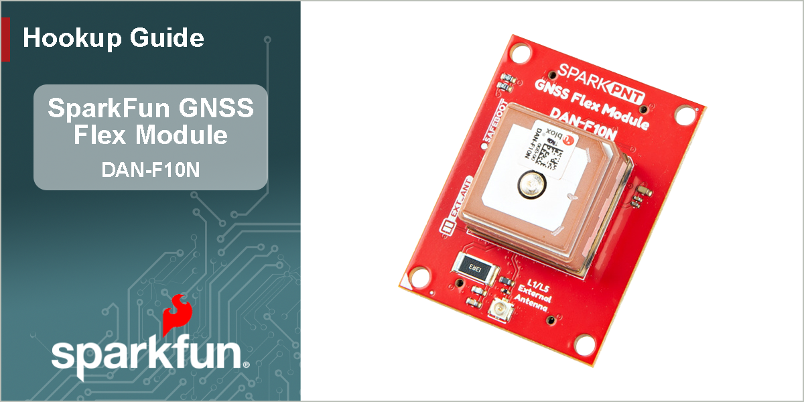{ width="650px" }
</article>

## Introduction

-   <a href="https://www.sparkfun.com/sparkpnt-gnss-flex-module-dan-f10n.html">
	**SparkPNT GNSS Flex Module - DAN-F10N** 
	**SKU:** GPS-29061

	---

	<figure markdown>
	
	</figure></a>

	<article style="text-align: center;" markdown>
	{ .tinyqr }[Purchase from SparkFun :fontawesome-solid-cart-plus:{ .heart }](https://www.sparkfun.com/sparkpnt-gnss-flex-module-dan-f10n.html){ .md-button .md-button--primary }
	</article>

-   This SparkPNT GNSS Flex module features the u-blox DAN-F10N GNSS module with u-blox's dual-band GNSS technology for the L1/L5 frequency bands. Their proprietary dual-band multipath mitigation technology enables the u-blox F10 GNSS engine to isolate the best signals from the L1 and L5 bands; delivering a solid meter-level position accuracy in challenging urban environments. Additionally, the DAN-F10N module's robust SAW-LNA-SAW RF architecture with an additional notch filter (LTE B13) on the L1 RF path ensures the best possible out-of-band interference mitigation from nearby cellular modems.

	The DAN-F10N GNSS module on this board comes with a 20 x 20 x 8 mm, integrated, Right Hand Circular Polarized (RHCP), L1/L5 dual-band patch antenna that offers the best compromise between size and performance. The patch antenna's wide beamwidth provides flexibility in the device's orientation; while alternatively, the module also has an antenna switch function to give users the option to utilize an external dual-band antenna, further increasing its utility.

	The DAN-F10N module is supported by the u-blox u-center 2 GNSS software for real-time performance analysis, receiver configuration, and data logging. The AssistNow Online, Offline, and Autonomous A-GNSS services can also be used with the module for faster satellite acquisition. Users can also interface with the GNSS module using NMEA 4.11 and UBX binary protocols.

	!!! note "GPS `L5` Signals"
		The GPS `L5` signals are currently, considered as *"pre-operational"* and not utilized by default in navigation solutions. However, it is possible override the receiver's configuration to evaluate the GPS `L5` signals. Please refer to the integration manual for more details.

		This is an operational limitation of the satellite/space segment and not an issue of the u-blox product.

## :material-folder-cog: Design Files

<!-- Import the component -->

-   :kicad-primary:{ .enlarge-logo } Design Files

	---

	- :fontawesome-solid-file-pdf: [Schematic](./assets/board_files/schematic.pdf)
	- :material-folder-zip: [KiCad Files](./assets/board_files/kicad_files.zip)
	- :material-rotate-3d: [STEP File](./assets/3d_model/cad_model.step)
	- :fontawesome-solid-file-pdf: [Board Dimensions](./assets/board_files/dimensions.pdf):
		- 1.75" x 1.25" (44.45mm x 31.75mm)

-   <!-- Boxes in tabs -->

	=== "3D Model"
		<article style="text-align: center;" markdown>
		<model-viewer src="../assets/3d_model/web_model.glb" camera-controls poster="../assets/3d_model/poster.png" tone-mapping="neutral" shadow-intensity="2" shadow-softness="0.2" camera-orbit="90deg 75deg 0.103m" field-of-view="25.11deg" style="width: 100%; height: 450px;">
		</model-viewer>

		[Download the `*.step` File](./assets/3d_model/cad_model.step "Click to download"){ .md-button .md-button--primary width="250px" }

		</article>

		???+ tip "Manipulate 3D Model"
			<article style="text-align: center;" markdown>

			| Controls       | Mouse                    | Touchscreen    |
			| :------------- | :----------------------: | :------------: |
			| Zoom           | Scroll Wheel             | 2-Finger Pinch |
			| Rotate         | ++"Left-Click"++ & Drag  | 1-Finger Drag  |
			| Move/Translate | ++"Right-Click"++ & Drag | 2-Finger Drag  |

			</article>

	=== "Dimensions"
		<article style="text-align: center;" markdown>
		[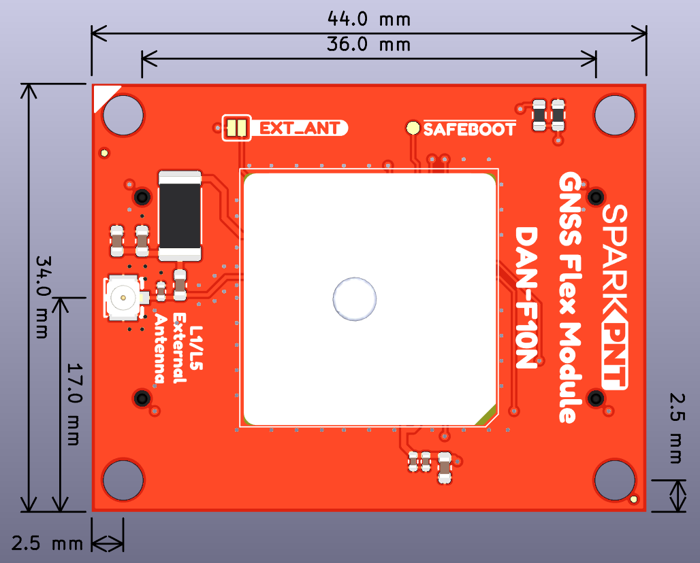{ width="450" }](./assets/board_files/dimensions.png "Click to enlarge")
		<figcaption markdown>Dimensions of the DAN-F10N GNSS Flex module.</figcaption>
		</article>

		???+ tip "Need more measurements?"
			For more information about the board's dimensions, users can download the [KiCad files](./assets/board_files/kicad_files.zip) for this board. These files can be opened in KiCad and additional measurements can be made with the measuring tool.

			!!! info ":octicons-download-16:{ .heart } KiCad - Free Download!"
				KiCad is free, open-source [CAD]("computer-aided design") program for electronics. Click on the button below to download their software. *(\*Users can find out more information about KiCad from their [website](https://www.kicad.org/).)*

				<article style="text-align: center;" markdown>
				[Download :kicad-primary:{ .enlarge-logo }](https://www.kicad.org/download/ "Go to downloads page"){ .md-button .md-button--primary width="250px" }
				</article>

			???+ info ":straight_ruler: Measuring Tool"
				This video demonstrates how to utilize the dimensions tool in KiCad, to include additional measurements:

				<article class="video-500px" style="text-align: center; margin: auto;" markdown>
				<iframe src="https://www.youtube.com/embed/-eXuD8pkCYw" title="KiCad Dimension Tool" frameborder="0" allow="accelerometer; autoplay; clipboard-write; encrypted-media; gyroscope; picture-in-picture" allowfullscreen></iframe>
				{ .qr width="85px" }
				</article>

## Board Layout
The GNSS Flex system is designed around two 2x10-pin, 2mm pitch headers used mate the two types of boards. A standardized pin layout, keeps the ecosystem pin-compatible for upgrades and allows board to be easily swapped for repairs. Depending on the capabilities of the GNSS receiver, these pins will breakout the USB, UART (x4), I^2^C, and SD card interfaces along with any PPS or event signals of the GNSS receiver.

The DAN-F10N GNSS Flex module has the following features:

<figure markdown>
[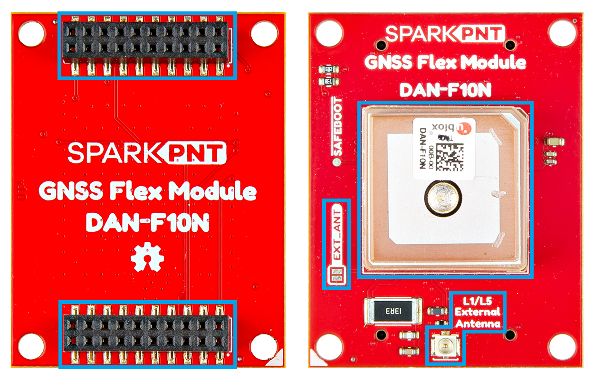{ width="750" }](./assets/img/hookup_guide/layout.png "Click to enlarge")
<figcaption markdown>Layout of the major components on the DAN-F10N GNSS Flex module.</figcaption>
</figure>

1. **DAN-F10N GNSS Receiver**
:	The u-blox DAN-F10N GNSS receiver
1. **GNSS Flex Headers**
:	Two sets of 2x10 pin, 2mm pitch female headers for connecting a GNSS Flex module to *carrier boards*
1. **`External Antenna L1/L5` U.FL Connector**
:	An U.FL connector for attaching an external GNSS antenna
1. **`EXT_ANT` Jumper**
:	Controls the RF switch for GNSS signal source

## DAN-F10N GNSS Receiver
The centerpiece of the DAN-F10N GNSS Flex module, is the [DAN-F10N GNSS receiver](./assets/component_documentation/DAN-F10N_DataSheet_UBXDOC-963802114-13074.pdf) from [u-blox](https://www.u-blox.com/en). Their proprietary dual-band multipath mitigation technology enables the u-blox F10 GNSS engine to isolate the best signals from the L1 and L5 bands; delivering a solid meter-level position accuracy in challenging urban environments. Additionally, the DAN-F10N module's robust SAW-LNA-SAW RF architecture with an additional notch filter on the L1 RF path ensures the best possible out-of-band interference mitigation from nearby cellular modems.

The DAN-F10N GNSS module comes with a 20 x 20 x 8 mm, integrated, Right Hand Circular Polarized (RHCP), L1/L5 dual-band patch antenna that offers the best compromise between size and performance. The patch antenna's wide beamwidth provides flexibility in the device's orientation; while alternatively, the module also has an antenna switch function to give users the option to utilize an external dual-band antenna, further increasing its utility.

{ .qr width="85" }

<article class="video-500px" style="margin: auto;" markdown>
<iframe src="https://www.youtube.com/embed/7_Pxe2rVFIQ" title="u-blox F10 GNSS platform for meter-level accuracy in urban environments" frameborder="0" allow="accelerometer; autoplay; clipboard-write; encrypted-media; gyroscope; picture-in-picture" allowfullscreen></iframe>
</article>

-   <figure markdown>
	[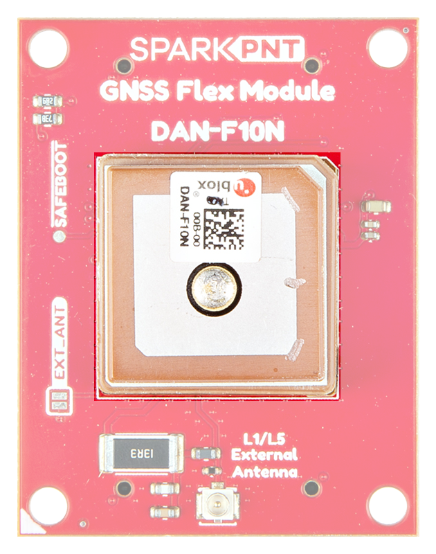{ width="400" }](./assets/img/hookup_guide/DAN-F10N.png "Click to enlarge")
	<figcaption markdown>The DAN-F10N GNSS receiver on the GNSS Flex module.</figcaption>
	</figure>

**Features:**

- Operating Voltage: **2.7 - 3.6V**
- Operating Temperature: -40 - 85&deg;C
- GNSS Support
	- GPS: L1 C/A, L5
	- QZSS: L1C/A, L1S, L1Sb, L5
	- GAL: E1B/C, E5a
	- BDS: B1C, B2a
	- NavIC: L5
	- SBAS: L1C/A
	- BDSBAS: B1C
- Sensitivity
	- Tracking & Nav: –164dBm
	- Reacquisition: –156dBm
	- Cold start: –145dBm
	- Hot start: –156dBm

 

- Update Rate: Up to 10Hz
- Time to Fix
	- Cold Start: < 28s
	- Aided Start: < 2s
	- Hot Start: 2s
- Position Accuracy
	- 1.0 m (with SBAS)
	- 1.5 m (without SBAS)
- Interfaces
	- 1x Serial interface
		- Raw data output: Code phase data
		- Protocols: NMEA 4.11, UBX binary
	- 2x Digital I/O
		- Timepulse Configurable: 0.25 - 10MHz
		- `EXTINT` input for Wakeup

### Power Modes
The DAN-F10N GNSS module supports three different operation modes:

- ***Continuous Mode***

:   In this mode, the module uses dedicated signal processing engines optimized for signal acquisition and tracking.

	- The acquisition engine actively searches and acquires signals, during cold starts or when insufficient signals are available during navigation.
	- The tracking engine continuously tracks signals, downloads all the almanac data, and acquires new signals as they become available during navigation.
	
	The tracking engine consumes less power than the acquisition engine. Therefore, the module's current consumption is lower when a valid position is obtained quickly after startup, the entire almanac has been downloaded, and the ephemeris for available satellites are valid.

- *Backup Modes*

:   The DAN-F10N module supports two backup modes. The backup modes are inactive states with reduced power consumption, where the receiver maintains time, information, and navigation data to speed up signal acquisitions upon restart.

	- **Hardware backup mode**

	:   The hardware backup mode requires `V_BCKP` power to be supplied. It allows the module to enter a backup state and maintain the backup domain (`BBR` and `RTC`), after the main power has been switched off.

	- **Software standby mode**

	:   Software standby mode is entered using the `UBX-RXM-PMREQ` message. This mode will clear the RAM memory; to maintain the receiver configuration, it should be stored on `BBR` or flash layers. The software standby mode can be set for a specific duration, or until the receiver is woken up by a signal from the UART `RX` and/or `EXTINT` pins, as defined in `UBX-RXM-PMREQ` message. A system reset with the `RESET_N` signal also terminates the software standby mode, clears the `BBR` content and restarts the receiver.

### Power Consumption
The power consumption of the DAN-F10N module depends on the GNSS signals enabled and if the module is acquiring or tacking those signals. The table below, lists the average current consumption with a supply voltage of 3.3V.

<article style="text-align: center;" markdown>

| GNSS Signals | Acquisition | Tracking |
| :----------- | :---------: | :------: |
| GPS+GAL+BDS  | 26mA        | 21mA     |
| GPS+BDS      | 26mA        | 20mA     |
| GPS+GAL      | 22mA        | 19mA     |
| GPS+NavIC    | 21mA        | 18mA     |
| GPS          | 20mA        | 18mA     |
| BDS          | 24mA        | 19mA     |

</article>

!!! tip
	At startup, the inrush current can reach up to 100 mA at startup. Make sure the primary power source can sustain the required current consumption.

!!! info "Backup Modes"
	The current consumption for the backup modes:

	- Hardware backup Mode: 31µA
	- Software standby Mode: 49µA

!!! info
	For more information, please refer to the [DAN-F10N Datasheet](./assets/component_documentation/DAN-F10N_DataSheet_UBXDOC-963802114-13074.pdf).

### Frequency Bands
The DAN-F10N GNSS module is a dual-band, multi-constellation GNSS receiver. Below, are the frequency bands provided by all the global navigation satellite systems and the ones supported by the DAN-F10N module.

<article style="text-align: center;" markdown>

| Constellation | Frequency Bands      |
| :-----------: | :------------------- |
| GPS           | L1 C/A, L5           |
| QZSS          | L1C/A, L1S, L1Sb, L5 |
| GAL           | E1B/C, E5a           |
| BDS           | B1C, B2a             |
| NavIC         | L5                   |
| SBAS          | L1C/A                |
| BDSBAS        | B1C                  |

*The frequency bands supported by the DAN-F10N GNSS receiver.*
</article>

<figure markdown>
[{ width="800" style="background-color: rgba(255, 255, 255, 0.85); padding: 5px;" }](https://www.tallysman.com/app/uploads/2021/07/Tallysman-GNSS-Frequencies-v8.0_Chart-1-1024x425.png "Click to enlarge")
<figcaption markdown>Frequency bands of the global navigation satellite systems. (Source: [Tallysman](https://www.tallysman.com/gnss-constellations-radio-frequencies-and-signals/))</figcaption>
</figure>

??? info "What are Frequency Bands?"
	A [frequency band](https://en.wikipedia.org/wiki/Frequency_band) is a section of the [electromagnetic spectrum](https://en.wikipedia.org/wiki/Electromagnetic_spectrum), usually denoted by the range of its upper and lower limits. In the [radio spectrum](https://en.wikipedia.org/wiki/Radio_spectrum), these frequency bands are usually regulated by region, often through a government entity. This regulation prevents the interference of RF communication; and often includes major penalties for any interference with critical infrastructure systems and emergency services.

	<figure markdown>
	[{ width="400" }](https://gssc.esa.int/navipedia/images/c/cf/GNSS_All_Signals.png "Click to enlarge")
	<figcaption markdown>Frequency bands of the global navigation satellite systems. (Source: [ESA](https://gssc.esa.int/navipedia/index.php?title=File:GNSS_All_Signals.png "European Space Agency"))</figcaption>
	</figure>

	However, if the various GNSS constellations share similar frequency bands, then how do they avoid interfering with one another? Without going too far into detail, the image above illustrates the frequency bands of each system with a few characteristics specific to their signals. Wit these characteristics in mind, along with other factors, the chart can help users to visualize how multiple GNSS constellations might co-exist with each other.

	For more information, users may find these articles of interest:

	- [GNSS signal](https://gssc.esa.int/navipedia/index.php/GNSS_signal)
	- [GPS Signal Plan](https://gssc.esa.int/navipedia/index.php?title=GPS_Signal_Plan)
	- [GLONASS Signal Plan](https://gssc.esa.int/navipedia/index.php?title=GLONASS_Signal_Plan)
	- [GALILEO Signal Plan](https://gssc.esa.int/navipedia/index.php?title=GALILEO_Signal_Plan)

## GNSS Flex Headers
The GNSS Flex system is designed around two 2x10-pin, 2mm pitch headers used mate the two types of boards. A standardized pin layout, keeps the ecosystem pin-compatible for upgrades and allows boards to be easily swapped for repairs. For the DAN-F10N GNSS receiver, these pins will breakout the UART interface along with three of the programmable I/O pins; the LNA enable pin is not broken out and the safe-boot pin is only exposed as a test point on this board.

<figure markdown>
[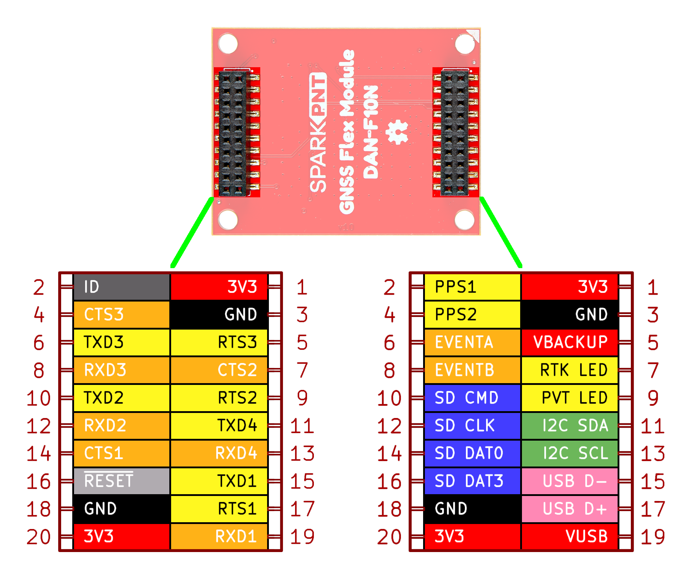{ width="400" }](./assets/img/hookup_guide/pinout-full.png "Click to enlarge")
<figcaption markdown>The peripherals and I/O pins on the DAN-F10N GNSS Flex module.</figcaption>
</figure>

Below, are the features that are available from the DAN-F10N GNSS receiver.

<article class="annotate" markdown>

**Supported Interfaces:**

- 1x UART
- ~~1x LNA enable pin~~ (1)
- 1x External interrupt
- 1x PPS output signal
- *1x Safe boot pin* (2)
- 1x Reset pin

</article>

1. Not available on the DAN-F10N GNSS Flex module.
2. Only exposed as a test point.

!!! note
	All the input pins on the DAN-F10N GNSSS module have internal pull-up resistors; in normal operation, they can be left floating if unused.

=== "UART Interface"

	

	

	<figure markdown>
	[{ width="400" }](./assets/img/hookup_guide/headers-uart.png "Click to enlarge")
	<figcaption markdown>The `UART1` pins on the DAN-F10N GNSS Flex module.</figcaption>
	</figure>

	

	

	The DAN-F10N has a single UART interface that supports the following protocols:

	- Input messages: NMEA and UBX
	- Output messages: NMEA (GGA, GLL, GSA, GSV, RMC, VTG, and TXT)

	!!! info "Configuration Settings"
		The UART interface can be configured with the `CFG-UART1-*` messages, but will initially have the following settings: 

		- Baudrate: 9600 to 921600bps *(Default: 38400bps)*
		- Data Bits: 8
		- Parity: No
		- Stop Bits: 1
		- Flow Control: None

	

	

=== "PPS Output"

	

	

	<figure markdown>
	[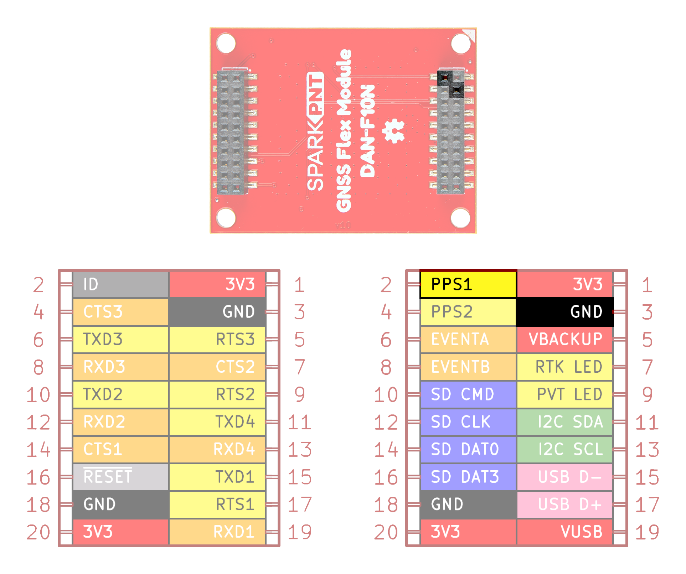{ width="400" }](./assets/img/hookup_guide/headers-pps.png "Click to enlarge")
	<figcaption markdown>The `PPS` output signal on the DAN-F10N GNSS Flex module.</figcaption>
	</figure>

	

	

	The `PPS1` pin is connected to the module's time pulse (`TIMEPULSE`) signal. The period, length, and polarity (rising or falling edge) of the `TIMEPULSE` signal can be configured with the `CFG-TP-*` messages.

	!!! info
		The module's [`SAFEBOOT_N` pin](#safe-boot-test-point) is internally connected to its `TIMEPULSE` pin through a 1 k&ohm; series resistor. Make sure these pins have no load that could pull them low at startup; otherwise, the receiver will enter its safeboot mode.

	

	

=== "Interrupt Pin"

	The DAN-F10N supports external interrupts through its `EXTINT` pin. This is useful for waking the module up from its standby mode or for timing applications.

	<figure markdown>
	[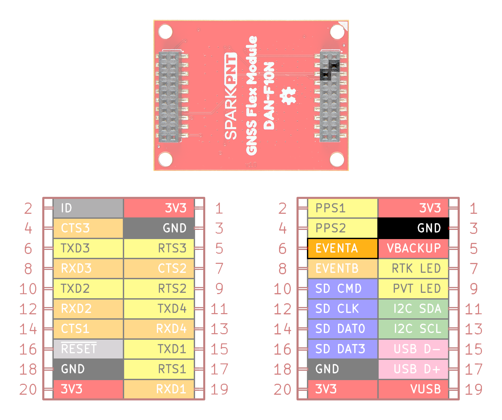{ width="400" }](./assets/img/hookup_guide/headers-event.png "Click to enlarge")
	<figcaption markdown>The interrupt pin on the DAN-F10N GNSS Flex module.</figcaption>
	</figure>

=== "Reset Pin"

	The `RESET_N` pin resets the DAN-F10N module. Driving the pin `LOW` for at least 1ms triggers a cold-start reset, clearing the `BBR` content *(receiver configuration, real-time clock (RTC), and GNSS orbit data)*. Capacitors should not be placed between `RST` and `GND`; otherwise, it could trigger a reset on startup.

	<figure markdown>
	[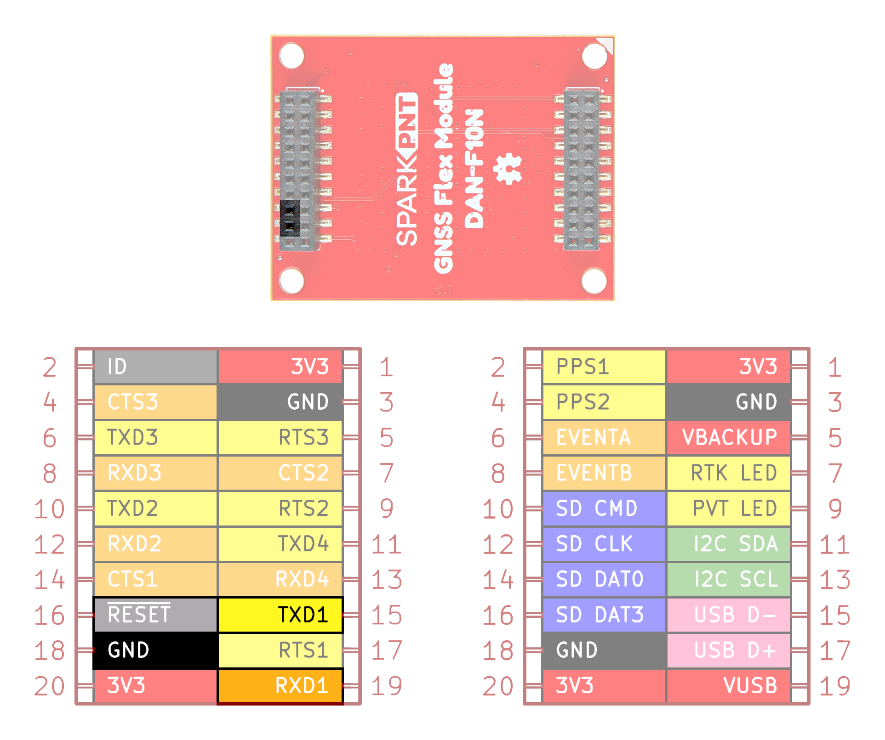{ width="400" }](./assets/img/hookup_guide/headers-reset.png "Click to enlarge")
	<figcaption markdown>The `RESET` pin on the DAN-F10N GNSS Flex module.</figcaption>
	</figure>

=== "Safe Boot Test Point"

	

	

	<figure markdown>
	[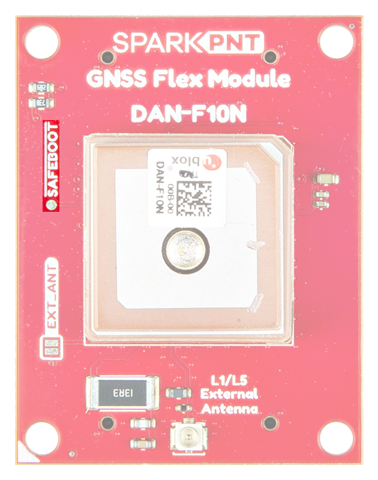{ width="400" }](./assets/img/hookup_guide/pin-safe_boot.png "Click to enlarge")
	<figcaption markdown>The `SAFEBOOT` test point on the DAN-F10N GNSS Flex module.</figcaption>
	</figure>

	

	

	The `SAFEBOOT_N` pin *(reserved for future use)* is used for updates and reconfiguration. The DAN-F10N module will enter safeboot mode, if this pin is pulled `LOW` at starup.

	!!! info
		The module's `SAFEBOOT_N` pin is internally connected to its [`TIMEPULSE` pin](#pps-output) through a 1 k&ohm; series resistor. Make sure these pins have no load that could pull them low at startup; otherwise, the receiver will enter its safeboot mode.

	

	

## U.FL Connector
The `L1/L5 External Antenna` U.FL connector provides the flexibility to use an external GNSS antenna instead of the integrated patch antenna. Users will need to modify the [`EXT_ANT` jumper](#ext_ant-jumper), to trigger the RF switch to change to the U.FL connector as the GNSS receiver's signal source.

<figure markdown>
[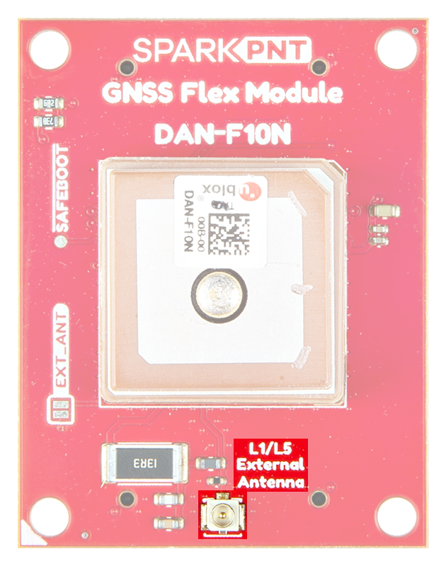{ width="400" }](./assets/img/hookup_guide/ufl_connector.png "Click to enlarge")
<figcaption markdown>The U.FL connector to attach an external GNSS antenna to the DAN-F10N GNSS Flex module.</figcaption>
</figure>

!!! tip
	For the best performance, we recommend users choose a compatible L1/L5 GNSS antenna and utilize a low-loss cable. Also, don't forget that GNSS signals are fairly weak and can't penetrate buildings or dense vegetation. The GNSS antenna should have an unobstructed view of the sky.

### `EXT_ANT` Jumper
The `EXT_ANT` jumper can be modified to control the source of the GNSS signals between the DAN-F10N module's integrated L1/L5 dual-band patch antenna or an external antenna connected to the board's U.FL connector.

<figure markdown>
[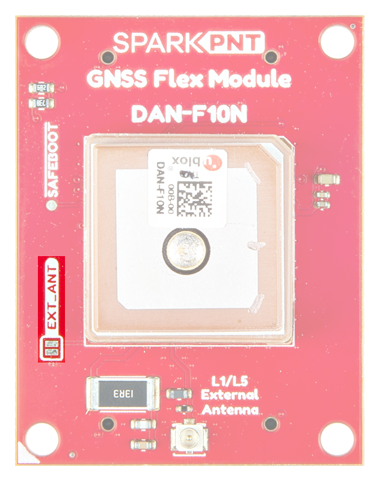{ width="400" }](./assets/img/hookup_guide/jumpers.png "Click to enlarge")
<figcaption markdown>The jumper on the top of the DAN-F10N GNSS Flex module.</figcaption>
</figure>

???+ note "Never modified a jumper before?"
	Check out our <a href="https://learn.sparkfun.com/tutorials/664">Jumper Pads and PCB Traces tutorial</a> for a quick introduction!

	<article class="grid cards" markdown align="center">

	-   <a href="https://learn.sparkfun.com/tutorials/664">
		<figure markdown>
		
		</figure>

		---

		**How to Work with Jumper Pads and PCB Traces**</a>

	</article>

!!! info
	By default, the module's integrated L1/L5 dual-band patch antenna is utilized.

