<article style="text-align: center;" markdown>
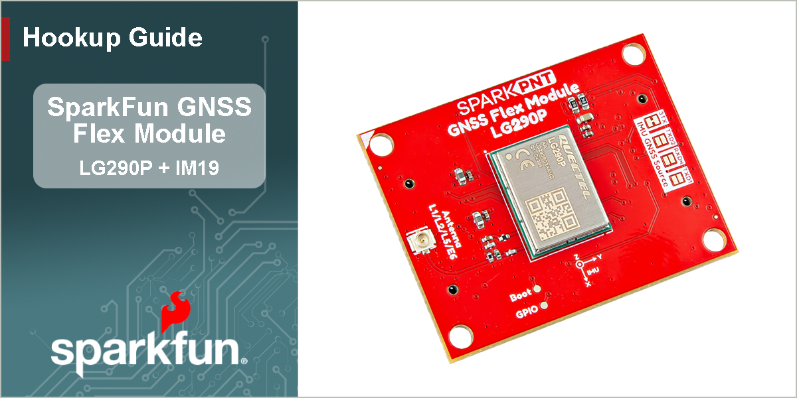{ width="650px" }
</article>

## Introduction

-   <a href="https://www.sparkfun.com/sparkpnt-gnss-flex-module-lg290p-im19-imu.html">
	**SparkPNT GNSS Flex Module - LG290P & IM19 IMU** 
	**SKU:** GPS-29469

	---

	<figure markdown>
	
	</figure></a>

	<article style="text-align: center;" markdown>
	{ .tinyqr }
	[Purchase from SparkFun :fontawesome-solid-cart-plus:{ .heart }](https://www.sparkfun.com/sparkpnt-gnss-flex-module-lg290p-im19-imu.html){ .md-button .md-button--primary }
	</article>

	??? info "Tilt Compensation"
		The IM19 attitude module from Feyman (FMI) fuses MEMS IMU sensor data and GNSS RTK positioning to deliver high-precision attitude compensated measurements, with roll and pitch accurate to within 0.05 degrees. This kind of superb accuracy has widespread uses in industrial applications such as tilt RTK surveys (where RTK poles need not be held straight vertical as the IM19 can calculate a virtual digital level at any tilt angle), agriculture machine automation, and dead reckoning.

		When configured, fed with the LG290P Pulse-Per-Second signal and NMEA GGA, RMC, and GST messages; once calibrated, the IM19 will output proprietary NMEA messages containing the compensated position and roll, pitch and yaw. By default, the LG290P `COM3` `TX` is linked to the IM19 `UART2` `RX` to carry the required NMEA messages. However, this can be changed via jumper links on the Flex Module, if necessary.

-   SparkPNT GNSS Flex modules are plug-in boards featuring different GNSS receivers. They are designed to be easily swapped for repairs and pin-compatible for upgrades. The boards have two 2x10-pin, 2mm pitch female headers connecting to carrier boards. For the LG290P GNSS receiver, these pins will break out the UART (x2) and I^2^C* interfaces, along with the PPS and event signals using a standardized pinout. Additionally, these pins break out the two UART interfaces of the IM19 IMU.

	This SparkPNT GNSS Flex module combines the Quectel LG290P GNSS receiver with the IM19 Inertial Measurement Unit for tilt compensation or dead reckoning. The LG290P module is a quad-band, multi-constellation, high-precision, RTK GNSS receiver. The module can simultaneously receive signals from the `L1`, `L2`, `L5`, and `L6`/`E6` frequency bands of the GPS, GLONASS, Galileo, BDS, QZSS, and NavIC GNSS constellations. In addition, the module supports SBAS augmentation systems (WASS, EGNOS, BDSBAS, MSAS, GAGAN, and SDCM), PPP services* (BDS PPP-B2b, QZSS CLAS, MADOCA-PPP, and Galileo HAS), RTCM, and RTK corrections for precision navigation with a fast convergence time and reliable performance.

	The built-in NIC anti-jamming unit provides professional-grade interference signal detection and elimination algorithms, effectively mitigating multiple narrow-band interference sources and significantly improving signal reception performance in complex electromagnetic environments. Additionally, the embedded algorithms ensure reliable positioning in complex scenarios such as urban environments and deep tree cover.

	!!! warning "Features Under Development"
		- **I^2^C/SPI** - Currently, only the UART interface is supported by the module.
		- **PPP Services** - Corrections for some of the PPP services have not been implemented.

## :material-folder-cog: Design Files

<!-- Import the component -->

-   :kicad-primary:{ .enlarge-logo } Design Files

	---

	- :fontawesome-solid-file-pdf: [Schematic](./assets/board_files/schematic.pdf)
	- :material-folder-zip: [KiCad Files](./assets/board_files/kicad_files.zip)
	- :material-rotate-3d: [STEP File](./assets/3d_model/cad_model.step)
	- :fontawesome-solid-file-pdf: [Board Dimensions](./assets/board_files/dimensions.pdf):
		- 1.75" x 1.25" (44.45mm x 31.75mm)

-   <!-- Boxes in tabs -->

	=== "3D Model"
		<article style="text-align: center;" markdown>
		<model-viewer src="../assets/3d_model/web_model.glb" camera-controls poster="../assets/3d_model/poster.png" tone-mapping="neutral" shadow-intensity="2" shadow-softness="0.2" camera-orbit="90deg 75deg 0.103m" field-of-view="25.11deg" style="width: 100%; height: 450px;">
		</model-viewer>

		[Download the `*.step` File](./assets/3d_model/cad_model.step "Click to download"){ .md-button .md-button--primary width="250px" }

		</article>

		???+ tip "Manipulate 3D Model"
			<article style="text-align: center;" markdown>

			| Controls       | Mouse                    | Touchscreen    |
			| :------------- | :----------------------: | :------------: |
			| Zoom           | Scroll Wheel             | 2-Finger Pinch |
			| Rotate         | ++"Left-Click"++ & Drag  | 1-Finger Drag  |
			| Move/Translate | ++"Right-Click"++ & Drag | 2-Finger Drag  |

			</article>

	=== "Dimensions"
		<article style="text-align: center;" markdown>
		[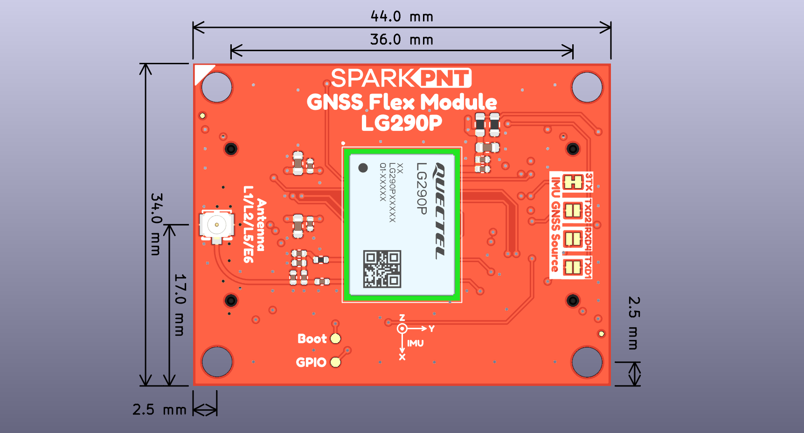{ width="450" }](./assets/board_files/dimensions.png "Click to enlarge")
		<figcaption markdown>Dimensions of the LG290P GNSS Flex module.</figcaption>
		</article>

		???+ tip "Need more measurements?"
			For more information about the board's dimensions, users can download the [KiCad files](./assets/board_files/kicad_files.zip) for this board. These files can be opened in KiCad and additional measurements can be made with the measuring tool.

			!!! info ":octicons-download-16:{ .heart } KiCad - Free Download!"
				KiCad is free, open-source [CAD]("computer-aided design") program for electronics. Click on the button below to download their software. *(\*Users can find out more information about KiCad from their [website](https://www.kicad.org/).)*

				<article style="text-align: center;" markdown>
				[Download :kicad-primary:{ .enlarge-logo }](https://www.kicad.org/download/ "Go to downloads page"){ .md-button .md-button--primary width="250px" }
				</article>

	
			???+ info ":straight_ruler: Measuring Tool"
				This video demonstrates how to utilize the dimensions tool in KiCad, to include additional measurements:

				<article class="video-500px" style="text-align: center; margin: auto;" markdown>
				<iframe src="https://www.youtube.com/embed/-eXuD8pkCYw" title="KiCad Dimension Tool" frameborder="0" allow="accelerometer; autoplay; clipboard-write; encrypted-media; gyroscope; picture-in-picture" allowfullscreen></iframe>
				{ .qr width="85px" }
				</article>

## Board Layout
The GNSS Flex system is designed around two 2x10-pin, 2mm pitch headers used mate the two types of boards. A standardized pin layout, keeps the ecosystem pin-compatible for upgrades and allows board to be easily swapped for repairs. Depending on the capabilities of the GNSS receiver, these pins will breakout the USB, UART (x4), I^2^C, and SD card interfaces along with any PPS or event signals of the GNSS receiver.

The LG290P GNSS Flex module has the following features:

<figure markdown>
[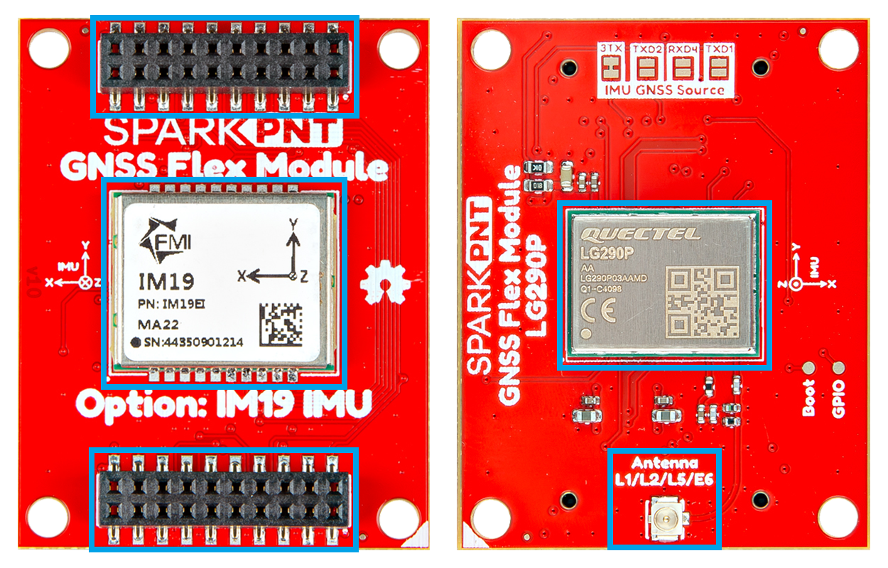{ width="750" }](./assets/img/hookup_guide/layout.png "Click to enlarge")
<figcaption markdown>Layout of the major components on the LG290P GNSS Flex module.</figcaption>
</figure>

1. **LG290P GNSS Receiver**
:	The Quectel LG290P GNSS receiver
1. **GNSS Flex Headers**
:	Two sets of 2x10 pin, 2mm pitch female headers for connecting a GNSS Flex module to *carrier boards*
1. **IM19 IMU** *(optional)*
:	An optional Feyman IM19 attitude module to provide tilt compensation in surveying applications
1. **`Antenna L1/L2/L5/E6` U.FL Connector**
:	An U.FL connector for attaching an external GNSS antenna

## LG290P GNSS Receiver
One of the centerpieces of the GNSS Flex module, is the [LG290P GNSS receiver](./assets/component_documentation/quectel_lg290p03_hardware_design_v1-1.pdf) from [Quectel](https://www.quectel.com/). The LG290P is a low-power, multi-band, multi-constellation GNSS receiver capable of delivering centimeter-level precision at high update rates. The built-in NIC anti-jamming unit provides professional-grade interference signal detection and elimination algorithms, which effectively mitigate against multiple narrow-band interference sources and significantly improves the signal reception performance in complex electromagnetic environments. With its performance advantages of high-precision and power consumption, this board is an ideal choice for high-precision navigation applications, such as intelligent robots, UAVs, precision agriculture, mining, surveying, and autonomous navigation.

{ .qr width="85px" }

<article class="video-500px" style="margin: auto;" markdown>
<iframe src="https://player.vimeo.com/video/1000742664?dnt=1&amp;app_id=122963" title="Quectel: Product Intro for LG290P GNSS Receiver" frameborder="0" allow="accelerometer; autoplay; clipboard-write; encrypted-media; gyroscope; picture-in-picture" allowfullscreen></iframe>
</article>

-   <figure markdown>
	[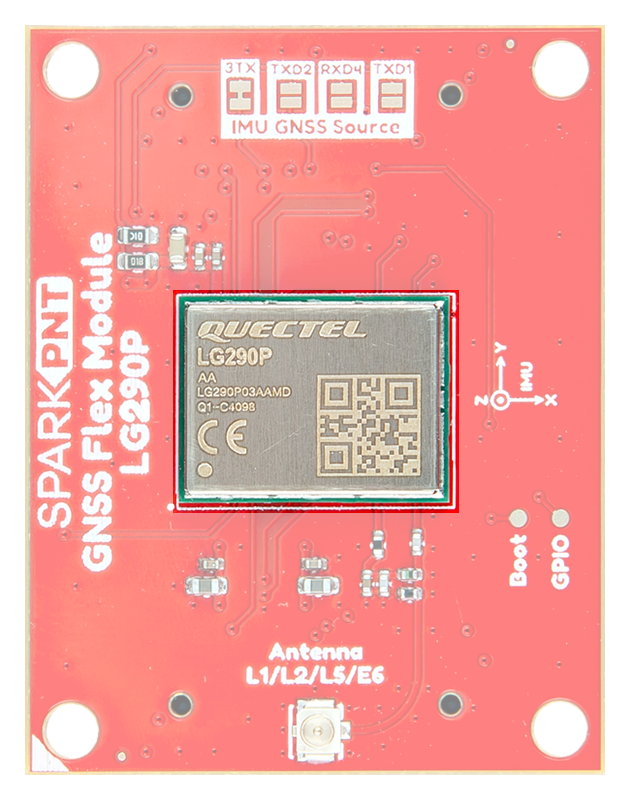{ width="300" }](./assets/img/hookup_guide/LG290P.png "Click to enlarge")
	<figcaption markdown>The LG290P GNSS receiver on the LG290P GNSS Flex module.</figcaption>
	</figure>

**Features:**

- Supply Voltage: **3.15–3.45V**
- Tracking Channels: 1040
- Concurrent signal reception: 5 + QZSS
	- `L1`, `L2`, `L5`, `E6` frequency bands
- Sensitivity:
	- Acquisition: -146dBm
	- Tracking: -160dBm
	- Reacquisition: -155dBm
- Antenna Power: External or Internal
- GNSS Constellations and SBAS Systems:
	- **USA:** GPS + WASS
	- **Russia:** GLONASS + SDCM
	- **EU:** Galileo + EGNOS
	- **China:** BDS + BDSDAS
	- **Japan:** QZSS + MSAS
	- **India:** NavIC + GAGAN
- Accuracy of 1PPS Signal: 5ns *(RMS)*
- Update Rate:
	- Default: 10Hz
	- Max: 20Hz

 

- Time to First Fix *(without AGNSS)*:
	- Cold Start: 28s
	- Warm Start: 28s
	- Hot Start: 1.7s
- RTK Convergence Time: 5s
- Dynamic Performance:
	- Maximum Altitude: 10000m
	- Maximum Velocity: 490m/s
	- Maximum Acceleration: 4g
- Built-in NIC anti-jamming unit
- Interfaces
	- UART (x3)
		- Baud Rate: 9600–3000000bps
			- **Default:** 460800bps
		- Protocol: `NMEA 0183`/`RTCM 3.x`
	- SPI[^1] (x1)
	- I^2^C[^1] (x1)
- Operating temperature: -40&deg;C to +85&deg;C

[^1]:
	!!! warning "Feature Under Development"
		Currently, only the UART interface is supported by the module. Support for the **I^2^C** and **SPI** interfaces are still under development.

### Power Consumption
The power consumption of the LG290P GNSS receiver depends on the GNSS signals enabled and the positioning mode.

<article style="text-align: center;" markdown>

| Mode        | Power (mW) | Current (mA) |
| :---------- | :--------: | :----------: |
| Acquisition | 300.3      | 91           |
| Tracking    | 300.3      | 91           |
| Backup      | 39.6       | 0.012        |

</article>

!!! info "Power Modes"

	**Acquisition:**
	:   Module searches for satellites and to determine visible satellites, coarse frequency, and the code phase of satellite signals

	**Tracking:**
	:   Once acquisition is completed, the module tracks satellites and demodulates the navigation data from specific satellites

	**Backup Mode:**
	:   Reduces power consumption. Only backup domain is active and keeps track of time.

### Frequency Bands
The LG290P module is a multi-band, multi-constellation GNSS receiver. Below, is a chart illustrating the frequency bands utilized by all the global navigation satellite systems; along with a list of the frequency bands and GNSS systems supported by the LG290P GNSS receiver.

<figure markdown>
[{ width="800" style="background-color:white"}](https://www.tallysman.com/app/uploads/2021/07/Tallysman-GNSS-Frequencies-v8.0_Chart-1-1024x425.png "Click to enlarge")
<figcaption markdown>Frequency bands of the global navigation satellite systems. (Source: [Tallysman](https://www.tallysman.com/gnss-constellations-radio-frequencies-and-signals/))</figcaption>
</figure>

**Supported Frequency Bands:**

- GPS: `L1 C/A`, `L1C`[^2], `L5`, `L2C`
- GLONASS: `L1`, `L2`
- Galileo: `E1`, `E5a`, `E5b`, `E6`
- BDS: `B1I`, `B1C`, `B2a`, `B2b`, `B2I`, `B3I`
- QZSS: `L1 C/A`, `L1C`[^2], `L5`, `L2C`
- NavIC: `L5`
- SBAS: `L1 C/A`
- L-band PPP[^3]:
	- PPP: `B2b`
	- QZSS: `L6`
	- Galileo HAS: `E6`

**Supported GNSS Constellations:**

- GPS (USA)
- GLONASS (Russia)
- Galileo (EU)
- BDS (China)
- QZSS (Japan)
- NavIC (India)

**Supported SBAS Systems:**

- WASS (USA)
- SDCM (Russia)
- EGNOS (EU)
- BDSBAS (China)
- MSAS (Japan)
- GAGAN (India)

[^2]:
	!!! warning "Feature Under Development"
		Support for the `L1C` frequency band has not been implemented.
[^3]:
	!!! warning "Feature Under Development"
		Corrections for some of the PPP services have not been implemented.

!!! info
	For a comparison of the frequency bands supported by the LG290P GNSS receivers, refer to sections **1.2**, **1.5**, and **1.6** of the [hardware design manual](./assets/component_documentation/quectel_lg290p03_hardware_design_v1-1.pdf).

	??? info "What are Frequency Bands?"
		A [frequency band](https://en.wikipedia.org/wiki/Frequency_band) is a section of the [electromagnetic spectrum](https://en.wikipedia.org/wiki/Electromagnetic_spectrum), usually denoted by the range of its upper and lower limits. In the [radio spectrum](https://en.wikipedia.org/wiki/Radio_spectrum), these frequency bands are usually regulated by region, often through a government entity. This regulation prevents the interference of RF communication; and often includes major penalties for any interference with critical infrastructure systems and emergency services.

		<figure markdown>
		[{ width="400" }](https://gssc.esa.int/navipedia/images/c/cf/GNSS_All_Signals.png "Click to enlarge")
		<figcaption markdown>Frequency bands of the global navigation satellite systems. (Source: [ESA](https://gssc.esa.int/navipedia/index.php?title=File:GNSS_All_Signals.png "European Space Agency"))</figcaption>
		</figure>

		However, if the various GNSS constellations share similar frequency bands, then how do they avoid interfering with one another? Without going too far into detail, the image above helps illustrate some of the characteristics, specific to the frequency bands of each system. With these characteristics in mind, along with other factors, the chart can help users to visualize how multiple GNSS constellations might co-exist with each other.

		For more information, users may find these articles of interest:

		- [GNSS signal](https://gssc.esa.int/navipedia/index.php/GNSS_signal)
		- [GPS Signal Plan](https://gssc.esa.int/navipedia/index.php?title=GPS_Signal_Plan)
		- [GLONASS Signal Plan](https://gssc.esa.int/navipedia/index.php?title=GLONASS_Signal_Plan)
		- [GALILEO Signal Plan](https://gssc.esa.int/navipedia/index.php?title=GALILEO_Signal_Plan)

### Position Accuracy

The accuracy of the position reported from the LG290P GNSS receiver, can be improved based upon the correction method being employed. Currently, [RTK](https://en.wikipedia.org/wiki/Real-time_kinematic_positioning "Real-Time Kinematic") corrections provide the highest level of accuracy; however, users should be aware of certain limitations of the system:

- RTK technique requires real-time correction data from a reference station or network of base stations.
	- RTK corrections usually come from RTCM messages that are signal specific *(i.e. an RTK network may only provide corrections for specific signals; only `E5b` and not `E5a`)*.
- The range of the base stations will vary based upon the method used to transmit the correction data.
- The reliability of RTK corrections are inherently reduced in [multipath environments](https://en.wikipedia.org/wiki/Multipath_propagation).

<article style="text-align: center;" markdown>

| Correction Method | Horizontal                   | Vertical                | Velocity                                |
| :---------------- | :--------------------------: | :---------------------: | :-------------------------------------: |
| Standalone        | 0.7m ~2.3'                | 2.5m ~8.2'           | 3cm/s (0.108kph) ~1.2in/s (0.067mph) |
| RTK               | **0.8cm** *(+1ppm)* ~0.3" | 1.5cm *(+1ppm)* ~.6" |                                         |

</article>

??? warning "IM19 Attitude Module"
	When configured and calibrated, the IM19 attitude module can fuses IMU sensor and GNSS RTK positioning data to deliver compensated position. The accuracy, displayed in the table below, should also be considered when implemented.

	<article style="text-align: center;" markdown>

	| Tilt Angle       | Accuracy |
	| :--------------: | :------: |
	| 0&deg; - 30&deg; | 1cm      |
	| <60&deg;         | 2cm      |

	</article>

??? info "RTK Corrections"
	To understand how RTK works, users will need a more fundamental understanding of the signal error sources.

	

	-   <a href="https://www.sparkfun.com/news/7533">
		<figure markdown>
		
		</figure>

		---

		**Real-Time Kinematics Explained**</a>

	-   <a href="https://www.sparkfun.com/news/7138">
		<figure markdown>
		
		</figure>

		---

		**What is Correction Data?**</a>

	-   <a href="https://www.septentrio.com/en/learn-more/insights/gnss-corrections-demystified">
		<figure markdown>
		
		</figure>

		---

		**GNSS Corrections Demystified**</a>

	

!!! tip
	For the best performance, we highly recommend that users configure the module to utilize/provide RTK corrections with a compatible L1/L2/L5/L6 GNSS antenna and utilize a low-loss cable.

## IM19 IMU *(Optional)*
The other centerpiece of the GNSS Flex module is the [IM19 attitude module](../assets/component_documentation/IM19EI_v1.4.1.pdf) from [Feyman Inc.](http://feymani.com/en/), which fuses MEMS sensor and GNSS RTK positioning data to deliver high-precision attitude measurement, with roll and pitch accurate to within 0.05 degrees. This kind of superb accuracy has widespread uses in industrial applications such as tilt RTK surveys (where RTK poles need not be held straight vertical as the IM19 can calculate a virtual digital level at any tilt angle), agriculture machine automation, and dead reckoning.

When configured, fed with the LG290P Pulse-Per-Second signal and NMEA GGA, RMC, and GST messages; once calibrated, the IM19 will output proprietary NMEA messages containing the compensated position and roll, pitch and yaw. By default, the LG290P `COM3` `TX` is linked to the IM19 `UART2` `RX` to carry the required NMEA messages. However, this can be changed via jumper links on the Flex Module, if necessary.

<article class="video-500px" style="text-align: center; margin: auto;" markdown>
<iframe src="https://global.feymani.com/files/im19.mp4" type="video/mp4" title="Feyman Inc - Product Intro for IM19 Module" frameborder="0" allow="accelerometer; clipboard-write; encrypted-media; gyroscope; picture-in-picture" allowfullscreen></iframe>
</article>

-   <figure markdown>
	[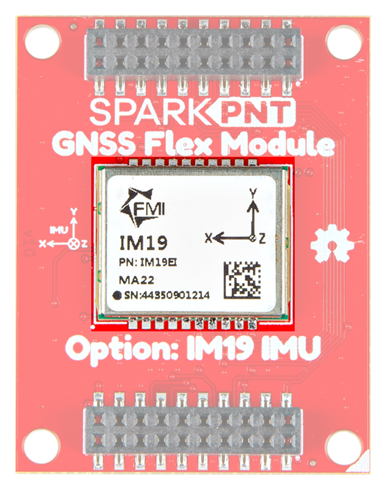{ width="300" }](./assets/img/hookup_guide/im19.png "Click to enlarge")
	<figcaption markdown>The IM19 attitude module on the LG290P GNSS Flex module.</figcaption>
	</figure>

**Features:**

- Self-calibration Technique
- Initialization: <2s
- Power: 0.33W
- Data Rate: 100Hz
- Attitude Accuracy: &plusmn;0.05&deg; *(Pitch/Roll)*
- Heading Accuracy: &plusmn;0.5&deg; *(Yaw)*

 

- Gyroscope
	- Bias Stability: &plusmn;0.2&deg;/s
	- Range: &plusmn;1000&deg;/s
- Accelerometer
	- Bias Stability: &plusmn;5mg
	- Range: &plusmn;8g

!!! info
	Please refer to the hookup guide linked below, for the operation of the IM19 attitude module in tilt-compensation applications:

	<article style="text-align: center;" markdown>
	[IM19 Hookup Guide - Tilt Compensation](../im19.md "Click to navigate"){ .md-button .md-button--primary }
	</article>

### Position Accuracy
When configured and calibrated, the IM19 attitude module can fuses its IMU sensor data with the received GNSS RTK positioning data to deliver a tilt compensated position.

<article style="text-align: center;" markdown>

| Tilt Angle       | Accuracy |
| :--------------: | :------: |
| 0&deg; - 30&deg; | 1cm      |
| <60&deg;         | 2cm      |

</article>

??? warning "LG290P GNSS Receiver"
	The accuracy of the position reported from the LG290P GNSS receiver, can be improved based upon the correction method being employed. Currently, [RTK](https://en.wikipedia.org/wiki/Real-time_kinematic_positioning "Real-Time Kinematic") corrections provide the highest level of accuracy. Its accuracy, displayed in the table below, should also be considered when implemented.

	<article style="text-align: center;" markdown>

	| Correction Method | Horizontal                   | Vertical                | Velocity                                |
	| :---------------- | :--------------------------: | :---------------------: | :-------------------------------------: |
	| Standalone        | 0.7m ~2.3'                | 2.5m ~8.2'           | 3cm/s (0.108kph) ~1.2in/s (0.067mph) |
	| RTK               | **0.8cm** *(+1ppm)* ~0.3" | 1.5cm *(+1ppm)* ~.6" |                                         |

	</article>

## GNSS Flex Headers
The GNSS Flex system is designed around two 2x10-pin, 2mm pitch headers used mate the two types of boards. A standardized pin layout, keeps the ecosystem pin-compatible for upgrades and allows boards to be easily swapped for repairs. For the LG290P GNSS receiver, these pins will breakout the UART (x2) and I^2^C interfaces along with a PPS, event, and LED status indication signals from the GNSS receiver. Additionally, these pins break out the two UART interfaces of the IM19 attitude module.

<figure markdown>
[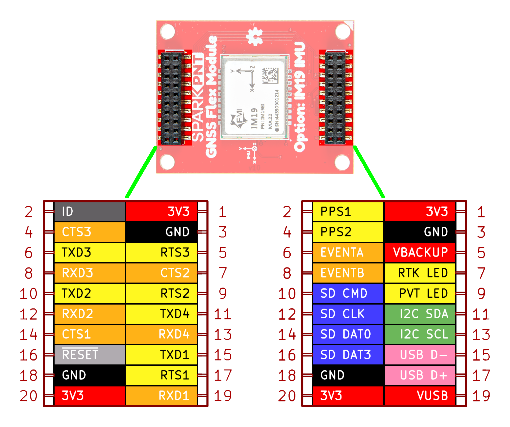{ width="400" }](./assets/img/hookup_guide/pinout-full.png "Click to enlarge")
<figcaption markdown>The peripherals and I/O pins on the LG290P GNSS Flex module.</figcaption>
</figure>

Below, are the features that are available from the LG290P GNSS receiver.

<article class="annotate" markdown>

**Supported Interfaces:**

- UART (x2) (1)
- ~~SPI[^1]~~
- I^2^C[^1]
- Event Trigger
- Timing Signal
- RTK Signal

</article>

1. One of the three UART ports is piped to the IM19 module

Below, are the features that are available from the IM19 attitude module.

<article class="annotate" markdown>

**Supported Interfaces:**

- UART (x2)
- Timing Signal (1)

</article>

1. The timing signal comes from the LG290P GNSS receiver

=== "UART Ports"
	The headers of the GNSS Flex system supports up to four UART ports. On this GNSS Flex module, these are connected to both the GNSS receiver and IM19 attitude module.

	<figure markdown>
	[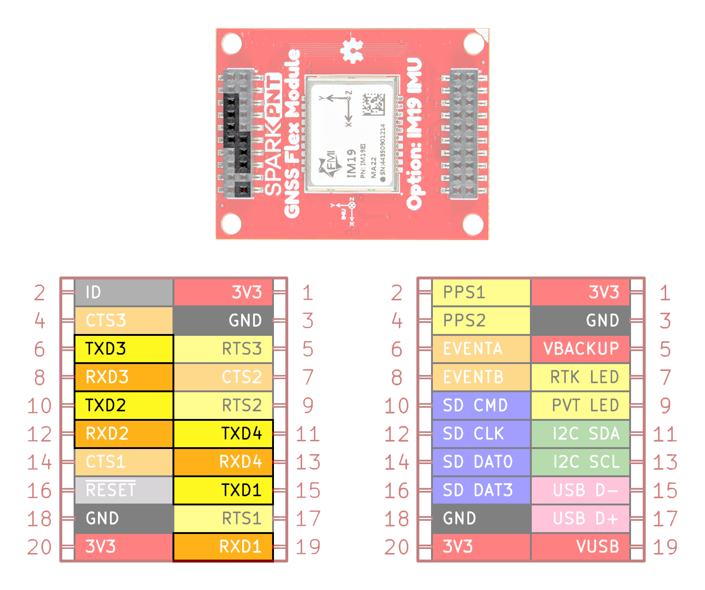{ width="400" }](./assets/img/hookup_guide/headers-uart.png "Click to enlarge")
	<figcaption markdown>The UART ports on the LG290P GNSS Flex module.</figcaption>
	</figure>

	

	

	**LG290P**

	---

	The LG290P GNSS receiver has three UART ports, which can be operated and configured separately.

	<figure markdown>
	[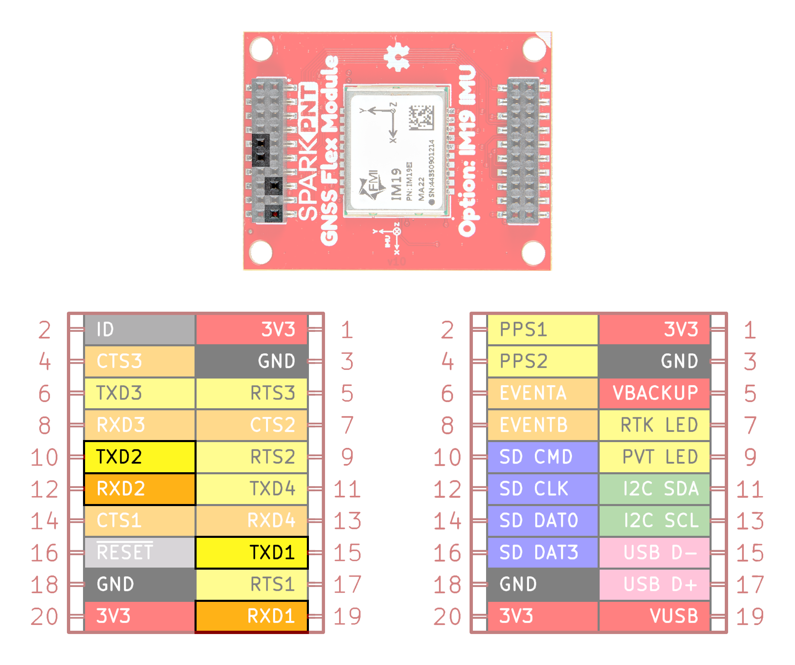{ width="400" }](./assets/img/hookup_guide/headers-uart-lg290p.png "Click to enlarge")
	<figcaption markdown>The UART ports from the LG290P on the GNSS Flex module.</figcaption>
	</figure>

	- The `UART1` and `UART2` ports of the LG290P GNSS receiver are broken out to the headers of the GNSS Flex system. These can be used to interact with the LG290P.
	- The `TX` pin of the `UART3` port from the LG290P GNSS receiver is piped directly to the `RX` pin of the IM19 attitude module's `UART2` port.

	!!! info "Default Configuration"
		By default, the UART ports are configured with the following settings: 

		

		

		- Baudrate: **460800bps**
		- Data Bits: 8
		- Parity: No
		- Stop Bits: 1
		- Flow Control: None
		- Protocols:
			- `NMEA 0183`
			- `RTCM 3.x`

		

		

		| LG290P | Pins of GNSS Flex Headers |
		| :-----: | :------------ |
		| `UART1` | `TXD1`/`RXD1` |
		| `UART2` | `TXD2`/`RXD2` |

		

		

	??? info "UART Protocols"
		### UART Protocols
		By default, these UART ports are configured to transmit and receive `NMEA 0183`, `RTCM 3.x`, and/or `QGC` messages. These messages are generally used for transmitting PNT data; providing or receiving RTK corrections; and receiving PPP data, respectively. Quectel also implements a system of proprietary messages (`PQTM`) for users to configure the LG290P that follows a data format similar to the `NMEA` protocol. The expected structure of these proprietary messages is shown below:

		

		

		<figure markdown>
		[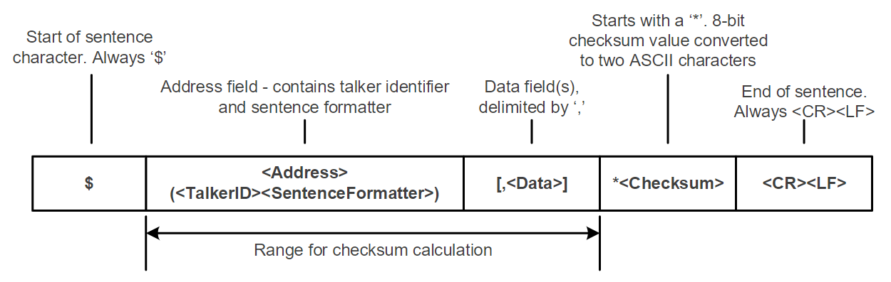{ width="600" }](./assets/img/hookup_guide/nmea_protocol.png "Click to enlarge")
		<figcaption markdown>The data structure of Quectel messages for the `NMEA` and `PQTM` protocols.</figcaption>
		</figure>

		

		

		<figure markdown>
		[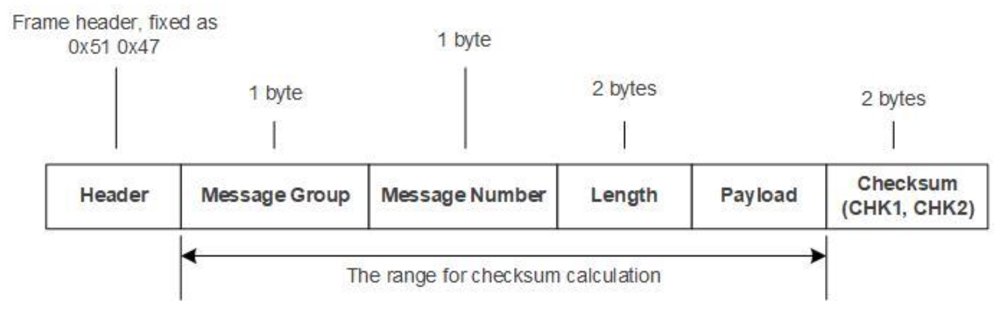{ width="600" }](./assets/img/hookup_guide/qgc_protocol.png "Click to enlarge")
		<figcaption markdown>The data structure of Quectel messages for the `QGC` protocol.</figcaption>
		</figure>

		

		

		=== "NMEA"
			A full list of compatible `NMEA 0183` v4.11 messages, is provided in section **2.2. Standard Messages** of the [GNSS Protocol Specification](./assets/component_documentation/quectel_lg290p03lgx80p03_gnss_protocol_specification_v1-1.pdf) manual. This protocol is used for outputting GNSS data, as detailed by the [National Marine Electronics Association](https://www.nmea.org/) organization.

			??? abstract "List of Standard NMEA Messages"
				<article style="text-align: center;" markdown>

				| Message | Type Mode | Message Description               |
				| :-----: | :-------: | :-------------------------------- |
				| RMC | Output | Recommended Minimum Specific GNSS Data   |
				| GGA | Output | Global Positioning System Fix Data       |
				| GSV | Output | GNSS Satellites in View                  |
				| GSA | Output | GNSS DOP and Active Satellites           |
				| VTG | Output | Course Over Ground & Ground Speed        |
				| GLL | Output | Geographic Position – Latitude/Longitude |
				| GBS | Output | GNSS Satellite Fault Detection           |
				| GNS | Output | GNSS Fix Data                            |
				| GST | Output | GNSS Pseudorange Error Statistics        |
				| ZDA | Output | UTC Time & Date                          |
				| HDT | Output | True Vessel Heading                      |
				| THS | Output | True, Heading, and Status                |

				</article>

		=== "PQTM"
			A full list of PQTM messages (proprietary NMEA messages defined by Quectel) supported by LG290P, is provided in section **2.3. PQTM Messages** of the [GNSS Protocol Specification](./assets/component_documentation/quectel_lg290p03lgx80p03_gnss_protocol_specification_v1-1.pdf) manual. This protocol is used to configure or read the settings for the LG290P GNSS receiver.

			??? abstract "List of Proprietary Quectel Messages"
				<article style="text-align: center;" markdown>

				| Message            | Type Mode    | Message Description                              |
				| :----------------- | :----------: | :----------------------------------------------- |
				| PQTMVER            | Output       | Outputs the firmware version                     |
				| PQTMCOLD           | Command      | Performs a cold start                            |
				| PQTMWARM           | Command      | Performs a warm start                            |
				| PQTMHOT            | Command      | Performs a hot start                             |
				| PQTMSRR            | Command      | Performs a system reset and reboots the receiver |
				| PQTMUNIQID         | Command      | Queries the module unique ID                     |
				| PQTMSAVEPAR        | Command      | Saves the configurations into NVM                |
				| PQTMRESTOREPAR     | Command      | Restores the parameters configured by all commands to their default values |
				| PQTMVERNO          | Command      | Queries the firmware version                     |
				| PQTMCFGUART        | Set/Get      | Sets/gets the UART interface                     |
				| PQTMCFGPPS         | Set/Get      | Sets/gets the PPS feature                        |
				| PQTMCFGPROT        | Set/Get      | Sets/gets the input and output protocol for a specified port |
				| PQTMCFGNMEADP      | Set/Get      | Sets/gets the decimal places of standard NMEA messages |
				| PQTMEPE            | Output       | Outputs the estimated position error             |
				| PQTMCFGMSGRATE     | Set/Get      | Sets/gets the message output rate on the current interface |
				| PQTMVEL            | Output       | Outputs the velocity information                 |
				| PQTMCFGGEOFENCE    | Set/Get      | Sets/gets geofence feature                       |
				| PQTMGEOFENCESTATUS | Output       | Outputs the geofence status                      |
				| PQTMGNSSSTART      | Command      | Starts GNSS engine                               |
				| PQTMGNSSSTOP       | Command      | Stops GNSS engine                                |
				| PQTMTXT            | Output       | Outputs short text messages                      |
				| PQTMCFGSVIN        | Set/Get      | Sets/gets the Survey-in feature                  |
				| PQTMSVINSTATUS     | Output       | Outputs the Survey-in status                     |
				| PQTMPVT            | Output       | Outputs the PVT (GNSS only) result               |
				| PQTMCFGRCVRMODE    | Set/Get      | Sets/gets the receiver working mode              |
				| PQTMDEBUGON        | Command      | Enables debug log output                         |
				| PQTMDEBUGOFF       | Command      | Disables debug log output                        |
				| PQTMCFGFIXRATE     | Set/Get      | Sets/gets the fix interval                       |
				| PQTMCFGRTK         | Set/Get      | Sets/gets the RTK mode                           |
				| PQTMCFGCNST        | Set/Get      | Sets/gets the constellation configuration        |
				| PQTMDOP            | Output       | Outputs dilution of precision                    |
				| PQTMPL             | Output       | Outputs protection level information             |
				| PQTMCFGODO         | Set/Get      | Sets/gets the odometer feature                   |
				| PQTMRESETODO       | Command      | Resets the accumulated distance recorded by the odometer |
				| PQTMODO            | Output       | Outputs the odometer information                 |
				| PQTMCFGSIGNAL      | Set/Get      | Sets/gets GNSS signal mask                       |
				| PQTMCFGSAT         | Set/Get      | Sets/gets GNSS satellite mask                    |
				| PQTMCFGRSID        | Set/Get      | Sets/gets the reference station ID               |
				| PQTMCFGRTCM        | Set/Get      | Sets/gets RTCM                                   |
				| PQTMCFGSBAS        | Set/Get      | Configures SBAS                                  |
				| PQTMCFGNMEATID     | Set/Get      | Configures the NMEA Talker ID                    |
				| PQTMTAR            | Output       | Outputs the time and attitude                    |
				| PQTMCFGBLD         | Set/Get      | Configures the baseline distance                 |
				| PQTMCFGRTKSRCTYPE  | Set/Get      | Configures RTK differential source type          |
				| PQTMSN             | Command      | Reads the SN of module                           |
				| PQTMCFGANTINF      | Set/Get      | Configures the antenna information               |
				| PQTMCFGANTDELTA    | Set/Get      | Configures the delta between antennas            |
				| PQTMCFGSIGGRP      | Set/Get      | Configures the GNSS signal group                 |
				| PQTMCFGSIGNAL2     | Set/Get      | Configures GNSS signal mask for second antenna   |
				| PQTMCFGGEOSEP      | Set/Get      | Configures geoidal separation                    |
				| PQTMCFGCNRTHD      | Set/Get      | Configures the CNR threshold for position engine |
				| PQTMCFGELETHD      | Set/Get      | Configures the elevation threshold for position engine |
				| PQTMNAV            | Output       | Outputs the navigation information               |
				| PQTMEOE            | Output       | Outputs the end of epoch information             |
				| PQTMCFGWN          | Set/Get      | Configures the reference start week number       |
				| PQTMANTENNASTATUS  | Output       | Reports the antenna status                       |

				</article>

		=== "QGC"
			A full list of QGC messages (proprietary protocol defined by Quectel) supported by LG290P, is provided in section **3. QGC Protocol** of the [GNSS Protocol Specification](./assets/component_documentation/quectel_lg290p03lgx80p03_gnss_protocol_specification_v1-1.pdf) manual. This protocol is used to output the PPP raw data.

			??? abstract "List of Proprietary Quectel Messages"
				<article style="text-align: center;" markdown>

				| GQC Message Name | Message Group | Message Number | Type | Description |
				| :--------- | :--: | :--: | :----: | :--------------------------------- |
				| RAW-PPPB2B | 0x0A | 0xB2 | Output | BDS PPPB2B binary raw messages     |
				| RAW-QZSSL6 | 0x0A | 0xB6 | Output | QZSSL6 binary raw messages         |
				| RAW-HASE6  | 0x0A | 0xE6 | Output | Galileo HASE6 binary raw messages  |

				</article>

		=== "RTCM"
			A full list of compatible `RTCM v3` messages, is provided in section **4. RTCM Protocol** of the [GNSS Protocol Specification](./assets/component_documentation/quectel_lg290p03lgx80p03_gnss_protocol_specification_v1-1.pdf) manual. This protocol is used for transferring GNSS raw measurement data, as detailed by the [Radio Technical Commission for Maritime Services](https://www.rtcm.org/) organization.

			??? abstract "List of Supported RTCMv3 *(MSM)* Messages"
				<article style="text-align: center;" markdown>

				| Message | Type Mode | Message Description                              |
				| :--: | :----------: | :----------------------------------------------- |
				| 1005 | Input/Output | Stationary RTK Reference Station ARP             |
				| 1006 | Input/Output | Stationary RTK Reference Station ARP with height |
				| 1019 | Input/Output | GPS Ephemerides                                  |
				| 1020 | Input/Output | GLONASS Ephemerides                              |
				| 1041 | Input/Output | NavIC/IRNSS Ephemerides                          |
				| 1042 | Input/Output | BDS Satellite Ephemeris Data                     |
				| 1044 | Input/Output | QZSS Ephemerides                                 |
				| 1046 | Input/Output | Galileo I/NAV Satellite Ephemeris Data           |
				| 1073 | Input/Output | GPS MSM3 |
				| 1074 | Input/Output | GPS MSM4 |
				| 1075 | Input/Output | GPS MSM5 |
				| 1076 | Input/Output | GPS MSM6 |
				| 1077 | Input/Output | GPS MSM7 |
				| 1083 | Input/Output | GLONASS MSM3 |
				| 1084 | Input/Output | GLONASS MSM4 |
				| 1085 | Input/Output | GLONASS MSM5 |
				| 1086 | Input/Output | GLONASS MSM6 |
				| 1087 | Input/Output | GLONASS MSM7 |
				| 1093 | Input/Output | Galileo MSM3 |
				| 1094 | Input/Output | Galileo MSM4 |
				| 1095 | Input/Output | Galileo MSM5 |
				| 1096 | Input/Output | Galileo MSM6 |
				| 1097 | Input/Output | Galileo MSM7 |
				| 1113 | Input/Output | QZSS MSM3 |
				| 1114 | Input/Output | QZSS MSM4 |
				| 1115 | Input/Output | QZSS MSM5 |
				| 1116 | Input/Output | QZSS MSM6 |
				| 1117 | Input/Output | QZSS MSM7 |
				| 1123 | Input/Output | BDS MSM3 |
				| 1124 | Input/Output | BDS MSM4 |
				| 1125 | Input/Output | BDS MSM5 |
				| 1126 | Input/Output | BDS MSM6 |
				| 1127 | Input/Output | BDS MSM7 |
				| 1133 | Input/Output | NavIC/IRNSS MSM3 |
				| 1134 | Input/Output | NavIC/IRNSS MSM4 |
				| 1135 | Input/Output | NavIC/IRNSS MSM5 |
				| 1136 | Input/Output | NavIC/IRNSS MSM6 |
				| 1137 | Input/Output | NavIC/IRNSS MSM7 |

				</article>

	

	

	**IM19**

	---

	The IM19 attitude module has two UART ports, which operate separately.

	<figure markdown>
	[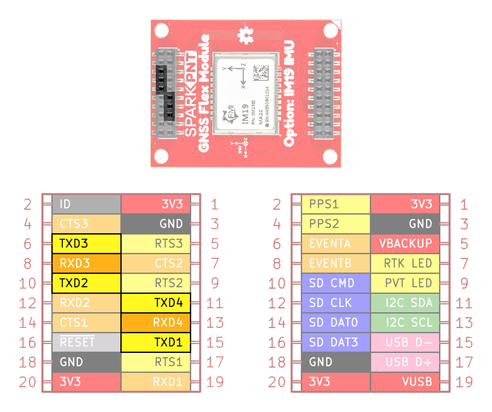{ width="400" }](./assets/img/hookup_guide/headers-uart-im19.png "Click to enlarge")
	<figcaption markdown>The UART ports from the IM19 on the LG290P GNSS Flex module.</figcaption>
	</figure>

	- The `UART1` port of the IM19 module is broken out to the headers of the GNSS Flex system, on pins `TXD3` and `RXD3`. These pins should be used to configure the IM19 module.
	- The `UART2` port of the IM19 module is used to receive GNSS data from the GNSS receiver and output the tilt compensated data.
		- By default, the `RX` pin receives data from the `UART3` port of the LG290P GNSS receiver.
			- Users can [modify the jumpers](#jumpers) on the top of the GNSS Flex module, to utilize the `TXD1`, `TXD2`, or `RXD4` pins *(of the GNSS Flex headers)* instead.
		- Once IM19 module is configured and calibrated, the `TX` pin outputs the tilt compensated data to the `TXD4` pin on the GNSS Flex headers.

	!!! info "Default Configuration"
		By default, the UART ports are configured with the following settings: 

		

		

		- Baudrate: **115200bps**
		- Data Bits: 8
		- Parity: No
		- Stop Bits: 1
		- Flow Control: None
		- Protocols:
			- AT Commands
			- Proprietary Data Formats
				- MEMS Raw data protocol
				- GNSS Raw data protocol
				- Binary NAVI positioning data protocol

		

		

		| IM19 | Pins of GNSS Flex Headers |
		| :-----: | :------------ |
		| `UART1` | `TXD3`/`RXD3` |
		| `UART2` | `TXD4` |

		

		

	

	

=== "PPS Output"
	From the module, the [PPS](https://en.wikipedia.org/wiki/Pulse-per-second_signal "Pulse Per Second") output signal is a 3.3V signal output. In order to receive tilt-compensated data from the IM19 attitude module, this pin needs to be configured to provide a timing pulse at the same rate as the PVT solutions.

	<figure markdown>
	[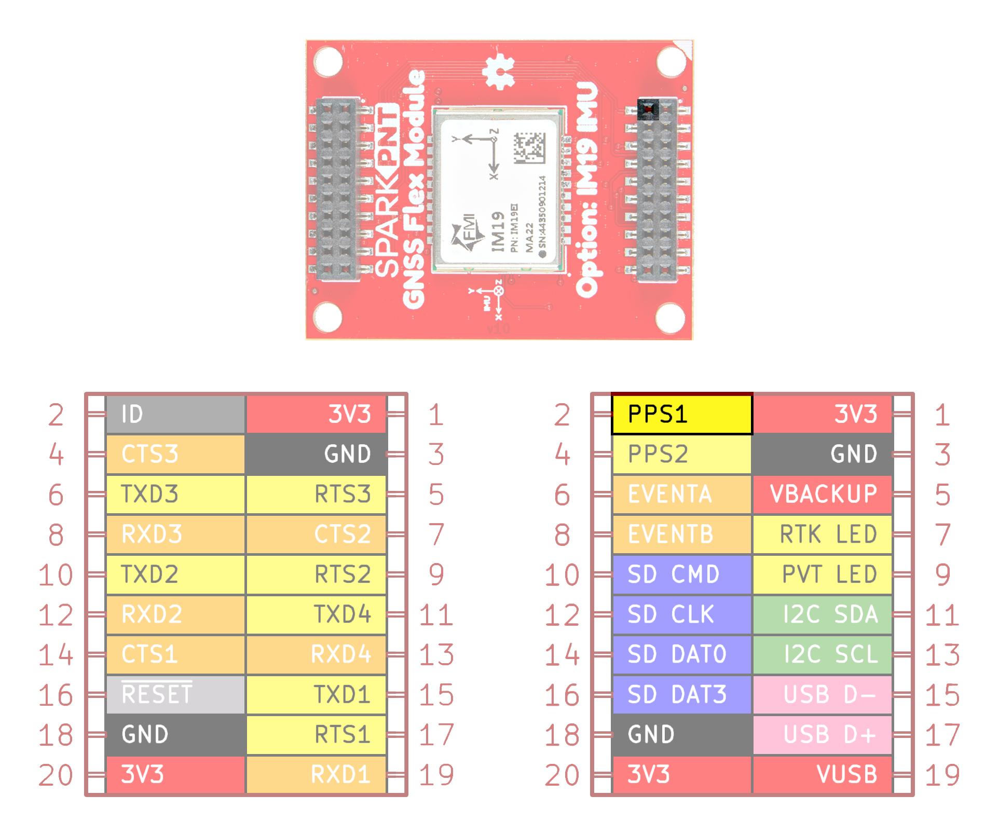{ width="400" }](./assets/img/hookup_guide/headers-pps.png "Click to enlarge")
	<figcaption markdown>The `PPS` signal's output on the LG290P GNSS Flex module.</figcaption>
	</figure>

=== "LED Output"
	The `RTK` pin operates as both the `RTK_LED` status indicator for the RTK positioning and `ANT_ON` power control for the external LNA or active antenna power.

	<figure markdown>
	[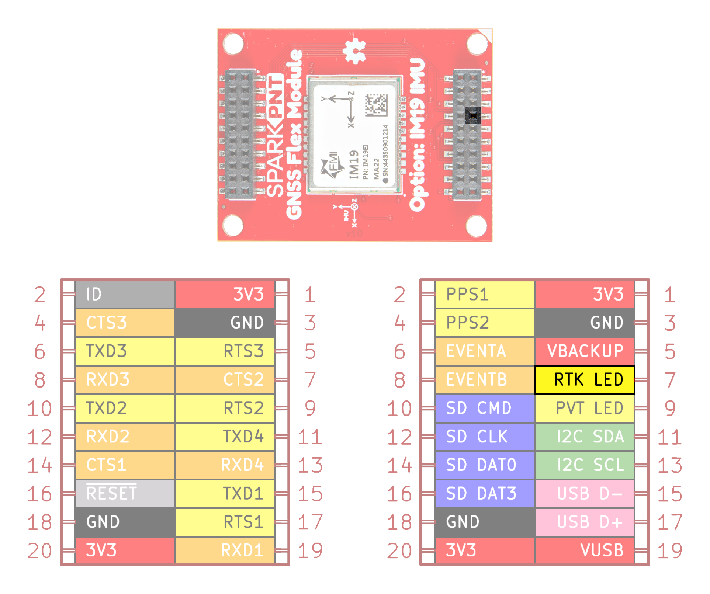{ width="400" }](./assets/img/hookup_guide/headers-rtk.png "Click to enlarge")
	<figcaption markdown>The `RTK_LED` pin on the LG290P GNSS Flex module.</figcaption>
	</figure>

	=== "`RTK_LED`"
		In this configuration, the pin is set to a high level at startup.

		1. If the pin output is high, it indicates the module has entered the RTK fixed mode.
		2. If the pin output is low, it indicates that the module exited the RTK fixed mode.
		3. If the pin outputs an alternating pin level, it indicates that the module received the correct RTCM data and did not enter the RTK fixed mode.

	=== "`ANT_ON`"
		In this configuration, the pin is used to control the external LNA or active antenna power supply.

		- When the pin is high, the antenna is powered.
		- When the pin is low, the antenna is not powered.

=== "Event Trigger"
	This pin can be triggered by inputs with an adjustable frequency and polarity.

	<figure markdown>
	[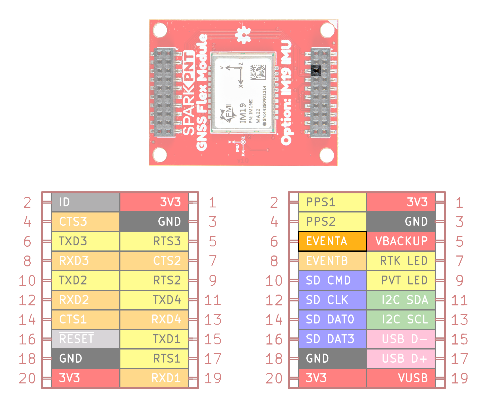{ width="400" }](./assets/img/hookup_guide/headers-event.png "Click to enlarge")
	<figcaption markdown>The event pin on the LG290P GNSS Flex module.</figcaption>
	</figure>

	!!! tip "Use Case"
		Users could use this pin in conjunction with the PPS signal to synchronize two modules with each other.

=== "Reset"
	This pin can be used to reset both the LG290P GNSS receiver and IM19 attitude module. Driving the pin `LOW` for at least 100ms triggers a restart of both modules.

	<figure markdown>
	[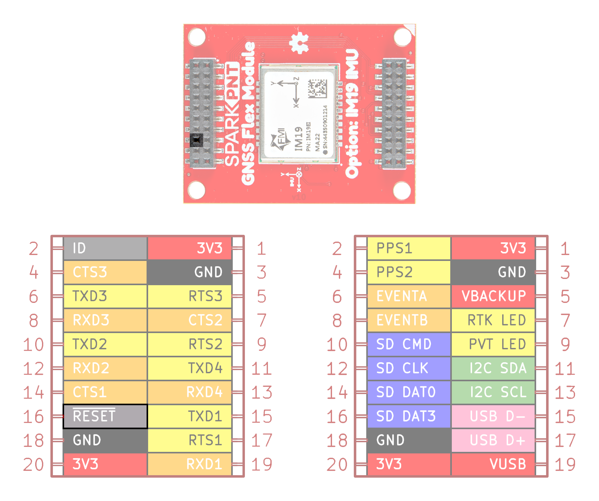{ width="400" }](./assets/img/hookup_guide/headers-reset.png "Click to enlarge")
	<figcaption markdown>The reset pin on the LG290P GNSS Flex module.</figcaption>
	</figure>

## U.FL Connector
Users will need to connect a compatible GNSS antenna to the `Antenna L1/L2/L5/E6` U.FL connector. The type of antenna used with the LG290P module affects the overall accuracy of the positions calculated by the GNSS receiver.

- Passive antennas are not recommended for the LG290P GNSS receiver.
- To mitigate the impact of out-of-band signals, utilize an active antenna whose SAW filter is placed in front of the LNA in the internal framework.
	- **DO NOT** select an antenna with the LNA placed in the front.
- There is no need to inject an external DC voltage for the GNSS antenna. Power is already provided from the LG290P module for the LNA of an active antenna.

<figure markdown>
[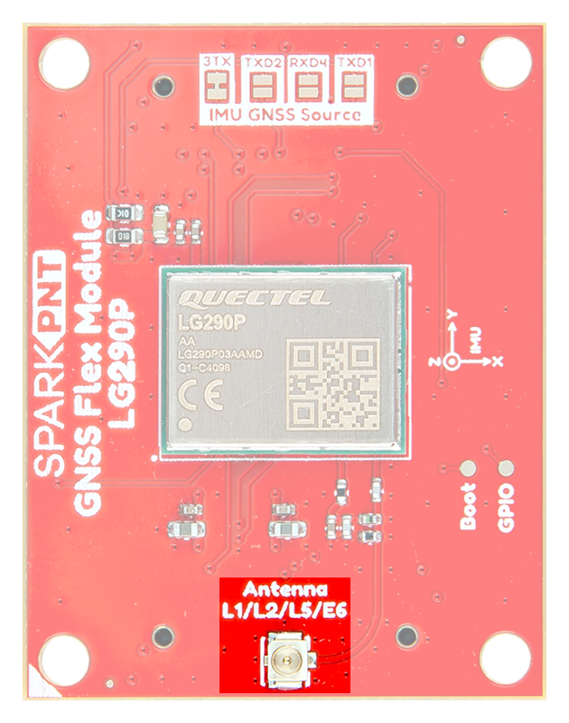{ width="400" }](./assets/img/hookup_guide/ant.png "Click to enlarge")
<figcaption markdown>The U.FL connector to attach an external GNSS antenna to the LG290P GNSS Flex module.</figcaption>
</figure>

!!! tip
	For the best performance, we recommend users choose a compatible L1/L2/L5/E6 GNSS antenna and utilize a low-loss cable. Also, don't forget that GNSS signals are fairly weak and can't penetrate buildings or dense vegetation. The GNSS antenna should have an unobstructed view of the sky.

## Jumpers
The are four jumpers on top of the LG290P GNSS Flex module that can be modified to change the source of the GNSS data for the IM19 attitude module.

<figure markdown>
[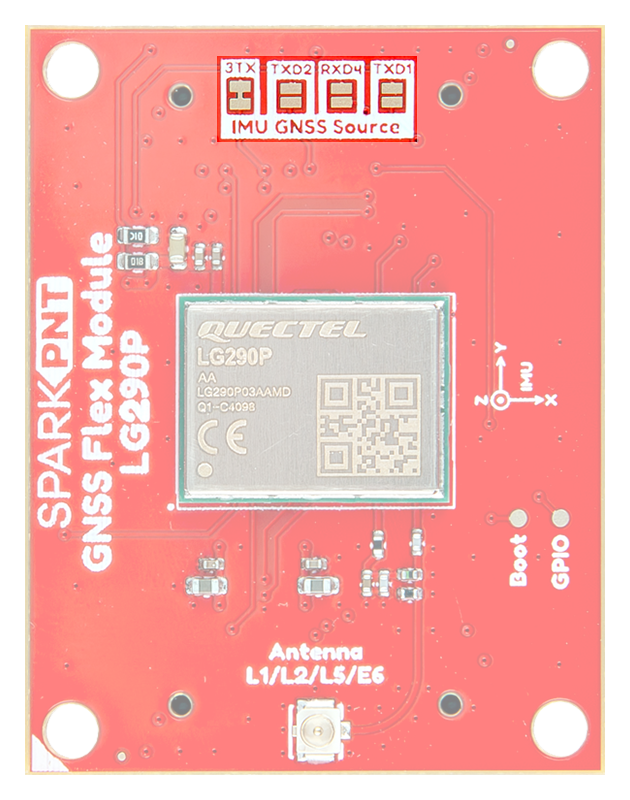{ width="400" }](./assets/img/hookup_guide/jumpers.png "Click to enlarge")
<figcaption markdown>The jumper on the top of the LG290P GNSS Flex module.</figcaption>
</figure>

???+ note "Never modified a jumper before?"
	Check out our <a href="https://learn.sparkfun.com/tutorials/664">Jumper Pads and PCB Traces tutorial</a> for a quick introduction!

	<article class="grid cards" markdown align="center">

	-   <a href="https://learn.sparkfun.com/tutorials/664">
		<figure markdown>
		
		</figure>

		---

		**How to Work with Jumper Pads and PCB Traces**</a>

	</article>

