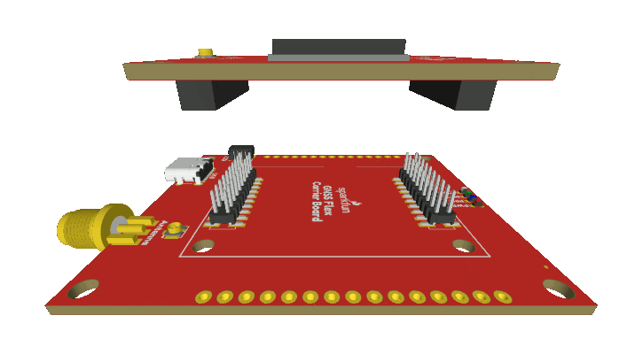

## GNSS Antenna
In order to receive [GNSS](https://en.wikipedia.org/wiki/Satellite_navigation "Global Navigation Satellite System") signals, users will need to connect a compatible antenna. For the best performance, we recommend users choose an active, L1/L2/L5/L6 GNSS antenna and utilize a low-loss cable.

### U.FL Connector
GNSS antennas are connected to the U.FL connector on the GNSS Flex board. For sturdier connections, users have the option to bridging the connection to the SMA connector on a Flex carrier board.

<figure markdown>
[{ width="400" }](./assets/img/hookup_guide/assembly-ufl.jpg "Click to enlarge")
<figcaption markdown>Attaching an U.FL cable to the GNSS Flex board.</figcaption>
</figure>

## GNSS Flex Headers
SparkPNT GNSS Flex modules are *plug-in boards* featuring different GNSS receivers. They are designed to be easily swapped for repairs and pin-compatible for upgrades. The boards come populated with two 2x10 pin, 2mm pitch female headers for connecting to *carrier boards*.

<figure markdown>
[{ width="400" }](./assets/img/hookup_guide/animation-attach_module.gif "Click to enlarge")
<figcaption markdown>Stacking a GNSS Flex module onto a *carrier* board.</figcaption>
</figure>
