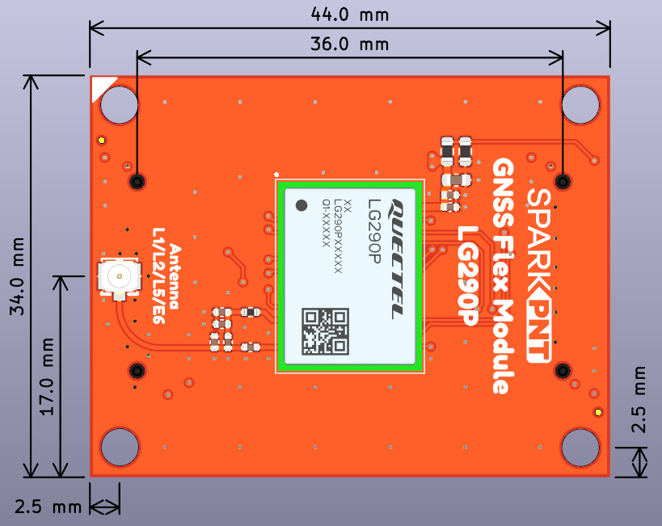
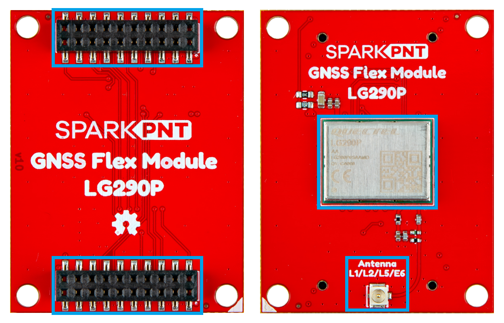
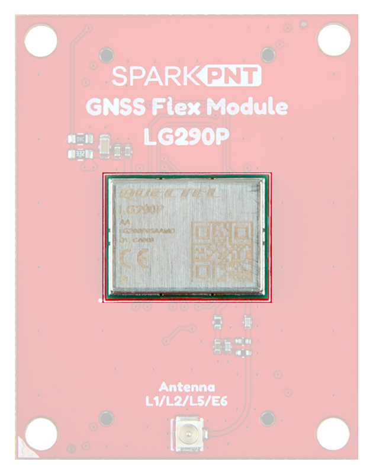
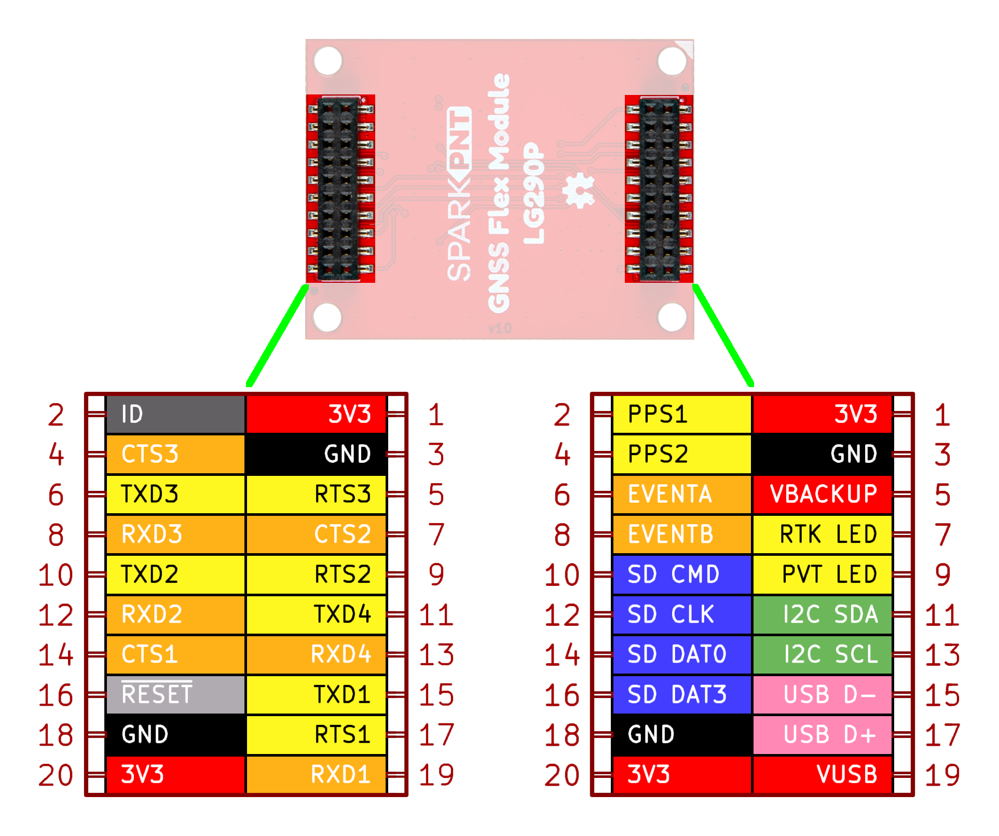
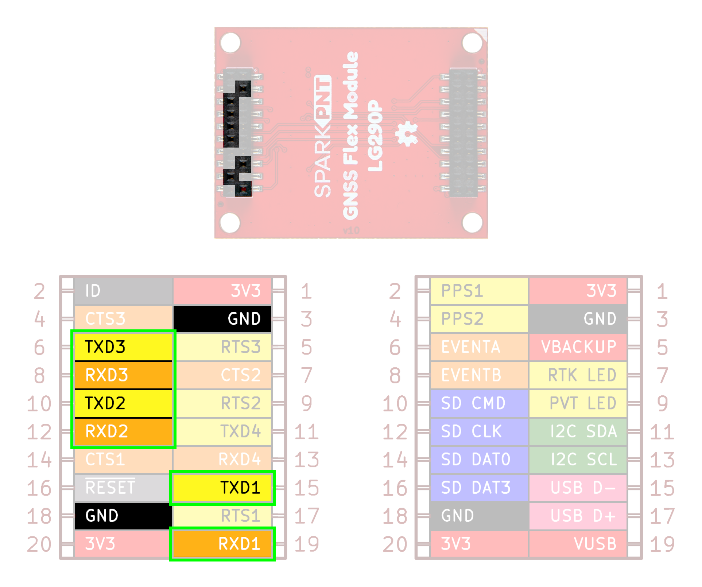
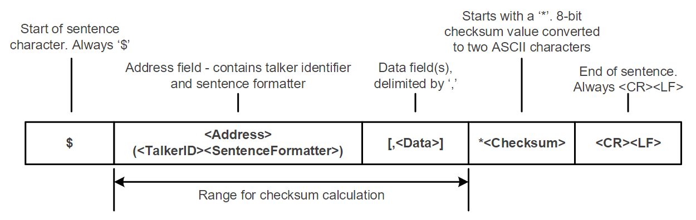
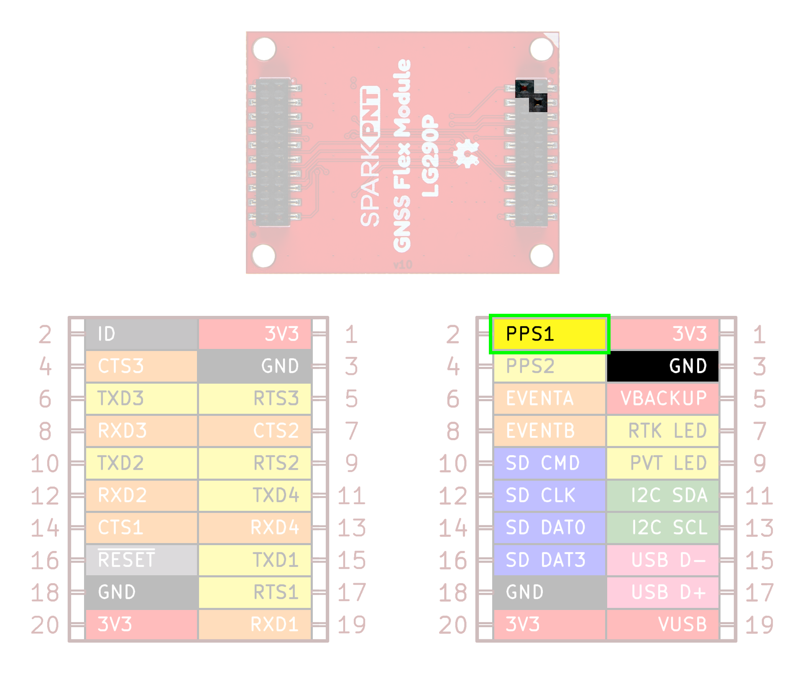
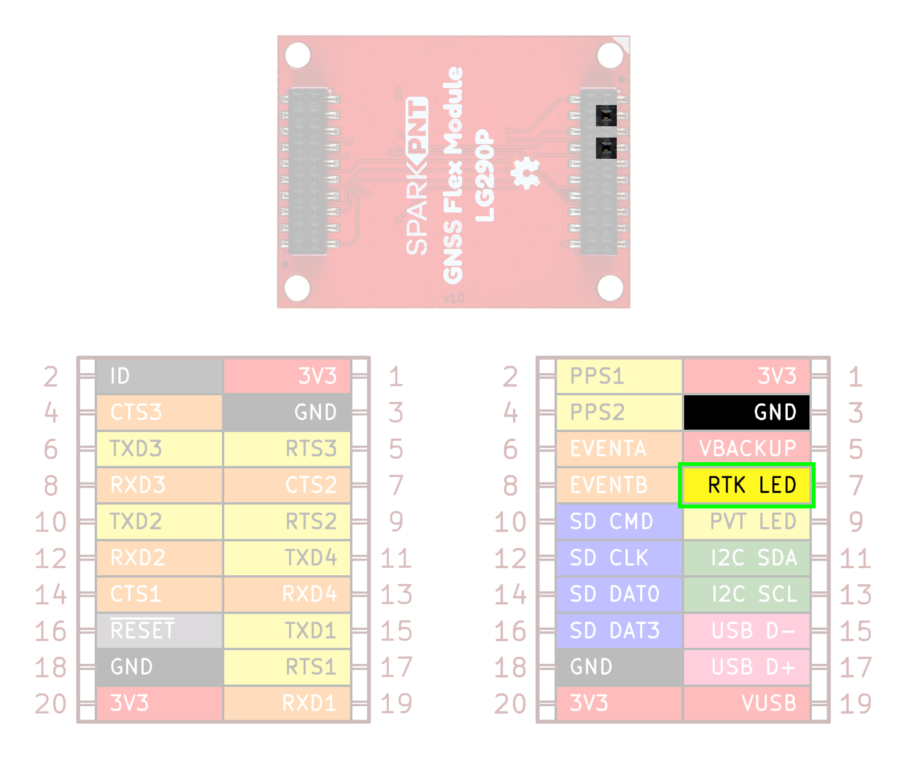
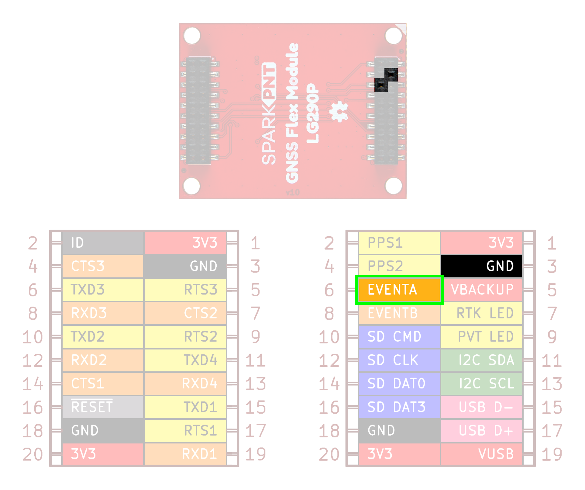
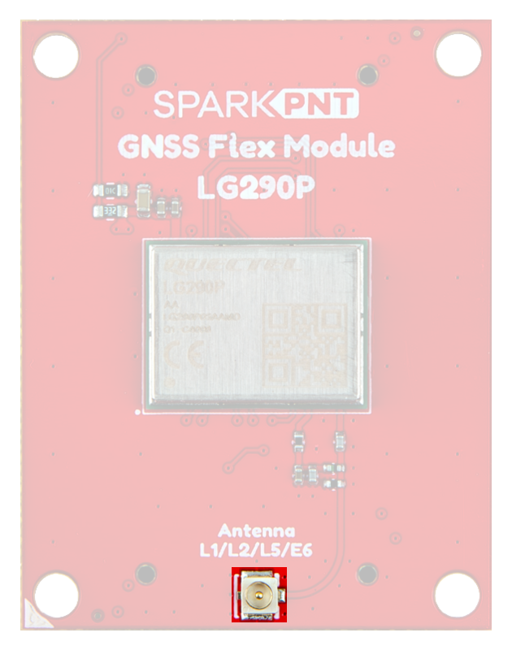

## Introduction
This SparkPNT GNSS Flex module features the Quectel LG290P GNSS receiver. The LG290P module is a quad-band, multi-constellation, high-precision, RTK GNSS receiver. The module can simultaneously receive signals from the `L1`, `L2`, `L5`, and `L6`/`E6` frequency bands of the GPS, GLONASS, Galileo, BDS, QZSS, and NavIC GNSS constellations. In addition, the module supports SBAS augmentation systems (WASS, EGNOS, BDSBAS, MSAS, GAGAN, and SDCM), PPP services (Feature is still under development) (BDS PPP-B2b, QZSS CLAS, MADOCA-PPP, and Galileo HAS), RTCM, and RTK corrections for precision navigation with a fast convergence time and reliable performance.

The built-in NIC anti-jamming unit provides professional-grade interference signal detection and elimination algorithms, effectively mitigating multiple narrow-band interference sources and significantly improving signal reception performance in complex electromagnetic environments. Additionally, the embedded algorithms ensure reliable positioning in complex scenarios such as urban environments and deep tree cover.

!!! warning "Features Under Development"
	- **I^2^C/SPI** - Currently, only the UART interface is supported by the module.
	- **PPP Services** - Corrections for some of the PPP services have not been implemented.

## :material-folder-cog: Design Files

<!-- Import the component -->

<!-- Material color adjustment (for soldermask) -->

-   :kicad-primary:{ .enlarge-logo } Design Files

	---

	- :fontawesome-solid-file-pdf: [Schematic](./assets/board_files/schematic.pdf)
	- :material-folder-zip: [KiCad Files](./assets/board_files/kicad_files.zip)
	- :material-rotate-3d: [STEP File](./assets/3d_model/cad_model.step)
	- :fontawesome-solid-file-pdf: [Board Dimensions](./assets/board_files/dimensions.pdf):
		- 1.75" x 1.25" (44.45mm x 31.75mm)

-   <!-- Boxes in tabs -->

	=== "3D Model"
		<article style="text-align: center;" markdown>
		<model-viewer src="../assets/3d_model/web_model.glb" camera-controls poster="../assets/3d_model/poster.png" tone-mapping="neutral" shadow-intensity="2" shadow-softness="0.2" camera-orbit="0deg 75deg 0.103m" field-of-view="25.11deg" style="width: 100%; height: 450px;">
		</model-viewer>

		[Download the `*.step` File](./assets/3d_model/cad_model.step "Click download"){ .md-button .md-button--primary width="250px" }

		</article>

		???+ tip "Manipulate 3D Model"
			<article style="text-align: center;" markdown>

			| Controls       | Mouse                    | Touchscreen    |
			| :------------- | :----------------------: | :------------: |
			| Zoom           | Scroll Wheel             | 2-Finger Pinch |
			| Rotate         | ++"Left-Click"++ & Drag  | 1-Finger Drag  |
			| Move/Translate | ++"Right-Click"++ & Drag | 2-Finger Drag  |

			</article>

	=== "Dimensions"
		<article style="text-align: center;" markdown>
		[{ width="450" }](./assets/board_files/dimensions.png "Click to enlarge")
		<figcaption markdown>
		Dimensions of the LG290P GNSS Flex module.
		</figcaption>
		</article>

		???+ tip "Need more measurements?"
			For more information about the board's dimensions, users can download the [KiCad files](./assets/board_files/kicad_files.zip) for this board. These files can be opened in KiCad and additional measurements can be made with the measuring tool.

			!!! info ":octicons-download-16:{ .heart } KiCad - Free Download!"
				KiCad is free, open-source [CAD]("computer-aided design") program for electronics. Click on the button below to download their software. *(\*Users can find out more information about KiCad from their [website](https://www.kicad.org/).)*

				<article style="text-align: center;" markdown>
				[Download :kicad-primary:{ .enlarge-logo }](https://www.kicad.org/download/ "Go to downloads page"){ .md-button .md-button--primary width="250px" }
				</article>

	
			???+ info ":straight_ruler: Measuring Tool"
				This video demonstrates how to utilize the dimensions tool in KiCad, to include additional measurements:

				<article style="text-align: center;" markdown>
				<article class="video-500px">
				<iframe src="https://www.youtube.com/embed/-eXuD8pkCYw" title="KiCad Dimension Tool" frameborder="0" allow="accelerometer; autoplay; clipboard-write; encrypted-media; gyroscope; picture-in-picture" allowfullscreen></iframe>
				</article>
				{ .qr }
				</article>

## Board Layout
The GNSS Flex system is designed around two 2x10-pin, 2mm pitch headers used mate the two types of boards. A standardized pin layout, keeps the ecosystem pin-compatible for upgrades and allows board to be easily swapped for repairs. Depending on the capabilities of the GNSS receiver, these pins will breakout the UART (x4), I2C, and SD card interfaces along with any PPS or event signals of the GNSS receiver.

The LG290P GNSS Flex module has the following features:

<figure markdown>
[{ width="750" }](./assets/img/hookup_guide/layout.png "Click to enlarge")
<figcaption markdown>Layout of the major components on the LG290P GNSS Flex module.</figcaption>
</figure>

1. **LG290P GNSS Receiver**
:	The Quectel LG290P GNSS receiver
1. **GNSS Flex Headers**
:	Two sets of 2x10 pin, 2mm pitch female headers for connecting a GNSS Flex module to *carrier boards*
1. **Ethernet PHY Header**
:	A 2x10 pin, 2mm pitch female header that breaks out the Ethernet PHY pins of the LG290P
1. **`ANT1` U.FL Connector**
:	An U.FL connector for attaching an external GNSS antenna

## LG290P GNSS
The centerpiece of the LG290P GNSS Flex module, is the [LG290P GNSS module](./assets/component_documentation/quectel_lg290p03_hardware_design_v1-1.pdf) from [Quectel](https://www.quectel.com/). The LG290P is a low-power, multi-band, multi-constellation GNSS receiver capable of delivering centimeter-level precision at high update rates. The built-in NIC anti-jamming unit provides professional-grade interference signal detection and elimination algorithms, which effectively mitigate against multiple narrow-band interference sources and significantly improves the signal reception performance in complex electromagnetic environments. With its performance advantages of high-precision and power consumption, this board is an ideal choice for high-precision navigation applications, such as intelligent robots, UAVs, precision agriculture, mining, surveying, and autonomous navigation.

<article style="text-align: center;" markdown>
{ .qr width=100 }
<article class="video-500px">
<iframe src="https://player.vimeo.com/video/1000742664?dnt=1&amp;app_id=122963" title="Quectel: Product Intro for LG290P GNSS Module" frameborder="0" allow="accelerometer; autoplay; clipboard-write; encrypted-media; gyroscope; picture-in-picture" allowfullscreen></iframe>
</article>
</article>

-   <figure markdown>
	[{ width="300" }](./assets/img/hookup_guide/LG290P.png "Click to enlarge")
	<figcaption markdown>The LG290P module on the LG290P GNSS Flex module.</figcaption>
	</figure>

**Features:**

- Supply Voltage: **3.15–3.45V**
- Tracking Channels: 1040
- Concurrent signal reception: 5 + QZSS
	- `L1`, `L2`, `L5`, `E6` frequency bands
- Sensitivity:
	- Acquisition: -146dBm
	- Tracking: -160dBm
	- Reacquisition: -155dBm
- Antenna Power: External or Internal
- GNSS Constellations and SBAS Systems:
	- **USA:** GPS + WASS
	- **Russia:** GLONASS + SDCM
	- **EU:** Galileo + EGNOS
	- **China:** BDS + BDSDAS
	- **Japan:** QZSS + MSAS
	- **India:** NavIC + GAGAN
- Accuracy of 1PPS Signal: 5ns *(RMS)*
- Update Rate:
	- Default: 10Hz
	- Max: 20Hz

 

- Time to First Fix *(without AGNSS)*:
	- Cold Start: 28s
	- Warm Start: 28s
	- Hot Start: 1.7s
- RTK Convergence Time: 5s
- Dynamic Performance:
	- Maximum Altitude: 10000m
	- Maximum Velocity: 490m/s
	- Maximum Acceleration: 4g
- Built-in NIC anti-jamming unit
- Interfaces
	- UART (x3)
		- Baud Rate: 9600–3000000bps
			- **Default:** 460800bps
		- Protocol: `NMEA 0183`/`RTCM 3.x`
	- SPI[^1] (x1)
	- I^2^C[^1] (x1)
- Operating temperature: -40&deg;C to +85&deg;C

[^1]:
	!!! warning "Feature Under Development"
		Currently, only the UART interface is supported by the module. Support for the **I^2^C** and **SPI** interfaces are still under development.

### Power Consumption
The power consumption of the LG290P GNSS module depends on the GNSS signals enabled and the positioning mode.

<article style="text-align: center;" markdown>

| Mode        | Power (mW) | Current (mA) |
| :---------- | :--------: | :----------: |
| Acquisition | 300.3      | 91           |
| Tracking    | 300.3      | 91           |
| Backup      | 39.6       | 0.012        |

</article>

### Frequency Bands
The LG290P module is a multi-band, multi-constellation GNSS receiver. Below, is a chart illustrating the frequency bands utilized by all the global navigation satellite systems; along with a list of the frequency bands and GNSS systems supported by the LG290P GNSS module.

<figure markdown>
[{ width="800" style="background-color:white"}](https://www.tallysman.com/app/uploads/2021/07/Tallysman-GNSS-Frequencies-v8.0_Chart-1-1024x425.png "Click to enlarge")
<figcaption markdown>
Frequency bands of the global navigation satellite systems. (Source: [Tallysman](https://www.tallysman.com/gnss-constellations-radio-frequencies-and-signals/))
</figcaption>
</figure>

**Supported Frequency Bands:**

- GPS: `L1 C/A`, `L1C`[^2], `L5`, `L2C`
- GLONASS: `L1`, `L2`
- Galileo: `E1`, `E5a`, `E5b`, `E6`
- BDS: `B1I`, `B1C`, `B2a`, `B2b`, `B2I`, `B3I`
- QZSS: `L1 C/A`, `L1C`[^2], `L5`, `L2C`
- NavIC: `L5`
- SBAS: `L1 C/A`
- L-band PPP[^3]:
	- PPP: `B2b`
	- QZSS: `L6`
	- Galileo HAS: `E6`

**Supported GNSS Constellations:**

- GPS (USA)
- GLONASS (Russia)
- Galileo (EU)
- BDS (China)
- QZSS (Japan)
- NavIC (India)

**Supported SBAS Systems:**

- WASS (USA)
- SDCM (Russia)
- EGNOS (EU)
- BDSBAS (China)
- MSAS (Japan)
- GAGAN (India)

[^2]:
	!!! warning "Feature Under Development"
		Support for the `L1C` frequency band has not been implemented.
[^3]:
	!!! warning "Feature Under Development"
		Corrections for some of the PPP services have not been implemented.

!!! info
	For a comparison of the frequency bands supported by the LG290P GNSS modules, refer to sections **1.2**, **1.5**, and **1.6** of the [hardware design manual](./assets/component_documentation/quectel_lg290p03_hardware_design_v1-1.pdf).

	??? info "What are Frequency Bands?"
		A [frequency band](https://en.wikipedia.org/wiki/Frequency_band) is a section of the [electromagnetic spectrum](https://en.wikipedia.org/wiki/Electromagnetic_spectrum), usually denoted by the range of its upper and lower limits. In the [radio spectrum](https://en.wikipedia.org/wiki/Radio_spectrum), these frequency bands are usually regulated by region, often through a government entity. This regulation prevents the interference of RF communication; and often includes major penalties for any interference with critical infrastructure systems and emergency services.

		<figure markdown>
		[{ width="400" }](https://gssc.esa.int/navipedia/images/c/cf/GNSS_All_Signals.png "Click to enlarge")
		<figcaption markdown>Frequency bands of the global navigation satellite systems. (Source: [ESA](https://gssc.esa.int/navipedia/index.php?title=File:GNSS_All_Signals.png "European Space Agency"))</figcaption>
		</figure>

		However, if the various GNSS constellations share similar frequency bands, then how do they avoid interfering with one another? Without going too far into detail, the image above helps illustrate some of the characteristics, specific to the frequency bands of each system. With these characteristics in mind, along with other factors, the chart can help users to visualize how multiple GNSS constellations might co-exist with each other.

		For more information, users may find these articles of interest:

		- [GNSS signal](https://gssc.esa.int/navipedia/index.php/GNSS_signal)
		- [GPS Signal Plan](https://gssc.esa.int/navipedia/index.php?title=GPS_Signal_Plan)
		- [GLONASS Signal Plan](https://gssc.esa.int/navipedia/index.php?title=GLONASS_Signal_Plan)
		- [GALILEO Signal Plan](https://gssc.esa.int/navipedia/index.php?title=GALILEO_Signal_Plan)

### Position Accuracy

The accuracy of the position reported from the LG290P GNSS module, can be improved based upon the correction method being employed. Currently, [RTK](https://en.wikipedia.org/wiki/	Real-time_kinematic_positioning "Real-Time Kinematic") corrections provide the highest level of accuracy; however, users should be aware of certain limitations of the system:

- RTK technique requires real-time correction data from a reference station or network of base stations.
	- RTK corrections usually come from RTCM messages that are signal specific *(i.e. an RTK network may only provide corrections for specific signals; only `E5b` and not `E5a`)*.
- The range of the base stations will vary based upon the method used to transmit the correction data.
- The reliability of RTK corrections are inherently reduced in [multipath environments](https://en.wikipedia.org/wiki/Multipath_propagation).

<article style="text-align: center;" markdown>

| Correction Method | Horizontal                   | Vertical                | Velocity                                |
| :---------------- | :--------------------------: | :---------------------: | :-------------------------------------: |
| Standalone        | 0.7m ~2.3'                | 2.5m ~8.2'           | 3cm/s (0.108kph) ~1.2in/s (0.067mph) |
| RTK               | **0.8cm** *(+1ppm)* ~0.3" | 1.5cm *(+1ppm)* ~.6" |                                         |

</article>

??? info "RTK Corrections"
	To understand how RTK works, users will need a more fundamental understanding of the signal error sources.

	

	-   <a href="https://www.sparkfun.com/news/7533">
		<figure markdown>
		
		</figure>

		---

		**Real-Time Kinematics Explained**</a>

	-   <a href="https://www.sparkfun.com/news/7138">
		<figure markdown>
		
		</figure>

		---

		**What is Correction Data?**</a>

	-   <a href="https://www.septentrio.com/en/learn-more/insights/gnss-corrections-demystified">
		<figure markdown>
		
		</figure>

		---

		**GNSS Corrections Demystified**</a>

	

!!! tip
	For the best performance, we highly recommend that users configure the module to utilize/provide RTK corrections with a compatible L1/L2/L5/L6 GNSS antenna and utilize a low-loss cable.

## GNSS Flex Headers
The GNSS Flex system is designed around two 2x10-pin, 2mm pitch headers used mate the two types of boards. A standardized pin layout, keeps the ecosystem pin-compatible for upgrades and allows boards to be easily swapped for repairs. Depending on the capabilities of the GNSS receiver, these pins will breakout the UART (x4), I2C, and SD card interfaces along with any PPS or event signals of the GNSS receiver.

<figure markdown>
[{ width="400" }](./assets/img/hookup_guide/pinout-full.png "Click to enlarge")
<figcaption markdown>The peripherals and I/O pins on the LG290P GNSS Flex module.</figcaption>
</figure>

Below, are the features that are available from the LG290P GNSS receiver.

**Supported Interfaces:**

- UART (x3)
- ~~SPI[^1]~~
- I^2^C[^1]
- Event Trigger
- Timing Signal
- RTK Signal

=== "UART Ports"
	The LG290P GNSS has three UART ports, which can be operated and configured separately.

	

	

	<figure markdown>
	[{ width="400" }](./assets/img/hookup_guide/headers-uart.png "Click to enlarge")
	<figcaption markdown>The UART ports on the LG290P GNSS Flex module.</figcaption>
	</figure>

	

	

	!!! info "Default Configuration"
		By default, the UART ports are configured with the following settings: 

		- Logic Level: **3.3V**
		- Baudrate: **460800bps**
		- Data Bits: 8
		- Parity: No
		- Stop Bits: 1
		- Flow Control: None
		- Protocols:
			- `NMEA 0183`
			- `RTCM 3.x`

	

	

	??? info "UART Protocols"
		By default, these UART ports are configured to transmit and receive `NMEA 0183` and/or `RTCM 3.x` messages. These messages are generally used for transmitting PNT data; and providing or receiving RTK corrections, respectively. Quectel also implements a system of proprietary messages (`PQTM`) for users to configure the LG290P that follows a data format similar to the `NMEA` protocol. The expected structure of these proprietary messages is shown below:

		<figure markdown>
		[{ width="600" }](./assets/img/hookup_guide/nmea_protocol.png "Click to enlarge")
		<figcaption markdown>
		The data structure of Quectel messages for the `NMEA` protocol.
		</figcaption>
		</figure>

		=== "NMEA"
			A full list of compatible `NMEA 0183` v4.11 messages, is provided in section **2.2. Standard Messages** of the [GNSS Protocol Specification](./assets/component_documentation/quectel_lg290p03_gnss_protocol_specification_v1-0.pdf) manual. This protocol is used for outputting GNSS data, as detailed by the [National Marine Electronics Association](https://www.nmea.org/) organization.

			??? abstract "List of Standard NMEA Messages"
				<article style="text-align: center;" markdown>

				| Message | Type Mode | Message Description               |
				| :-----: | :-------: | :-------------------------------- |
				| RMC | Output | Recommended Minimum Specific GNSS Data   |
				| GGA | Output | Global Positioning System Fix Data       |
				| GSV | Output | GNSS Satellites in View                  |
				| GSA | Output | GNSS DOP and Active Satellites           |
				| VTG | Output | Course Over Ground & Ground Speed        |
				| GLL | Output | Geographic Position – Latitude/Longitude |

				</article>

		=== "PQTM"
			A full list of PQTM messages (proprietary NMEA messages defined by Quectel) supported by LG290P, is provided in section **2.3. PQTM Messages** of the [GNSS Protocol Specification](./assets/component_documentation/quectel_lg290p03_gnss_protocol_specification_v1-0.pdf) manual. This protocol is used to configure or read the settings for the LG290P GNSS module.

			??? abstract "List of Proprietary Quectel Messages"
				<article style="text-align: center;" markdown>

				| Message            | Type Mode    | Message Description                              |
				| :----------------- | :----------: | :----------------------------------------------- |
				| PQTMVER            | Output       | Outputs the firmware version                     |
				| PQTMCOLD           | Input        | Performs a cold start                            |
				| PQTMWARM           | Input        | Performs a warm start                            |
				| PQTMHOT            | Input        | Performs a hot start                             |
				| PQTMSRR            | Input        | Performs a system reset and reboots the receiver |
				| PQTMUNIQID         | Output       | Queries the module unique ID                     |
				| PQTMSAVEPAR        | Input        | Saves the configurations into NVM                |
				| PQTMRESTOREPAR     | Input        | Restores the parameters configured by all commands to their default values |
				| PQTMVERNO          | Output       | Queries the firmware version                     |
				| PQTMCFGUART        | Input/Output | Sets/gets the UART interface                     |
				| PQTMCFGPPS         | Input/Output | Sets/gets the PPS feature                        |
				| PQTMCFGPROT        | Input/Output | Sets/gets the input and output protocol for a specified port |
				| PQTMCFGNMEADP      | Input/Output | Sets/gets the decimal places of standard NMEA messages |
				| PQTMEPE            | Output       | Outputs the estimated position error             |
				| PQTMCFGMSGRATE     | Input/Output | Sets/gets the message output rate on the current interface |
				| PQTMVEL            | Output       | Outputs the velocity information                 |
				| PQTMCFGGEOFENCE    | Input/Output | Sets/gets geofence feature                       |
				| PQTMGEOFENCESTATUS | Output       | Outputs the geofence status                      |
				| PQTMGNSSSTART      | Input        | Starts GNSS engine                               |
				| PQTMGNSSSTOP       | Input        | Stops GNSS engine                                |
				| PQTMTXT            | Output       | Outputs short text messages                      |
				| PQTMCFGSVIN        | Input/Output | Sets/gets the Survey-in feature                  |
				| PQTMSVINSTATUS     | Output       | Outputs the Survey-in status                     |
				| PQTMPVT            | Output       | Outputs the PVT (GNSS only) result               |
				| PQTMCFGRCVRMODE    | Input/Output | Sets/gets the receiver working mode              |
				| PQTMDEBUGON        | Input        | Enables debug log output                         |
				| PQTMDEBUGOFF       | Input        | Disables debug log output                        |
				| PQTMCFGFIXRATE     | Input/Output | Sets/gets the fix interval                       |
				| PQTMCFGRTK         | Input/Output | Sets/gets the RTK mode                           |
				| PQTMCFGCNST        | Input/Output | Sets/gets the constellation configuration        |
				| PQTMDOP            | Output       | Outputs dilution of precision                    |
				| PQTMPL             | Output       | Outputs protection level information             |
				| PQTMCFGODO         | Input/Output | Sets/gets the odometer feature                   |
				| PQTMRESETODO       | Input        | Resets the accumulated distance recorded by the odometer |
				| PQTMODO            | Output       | Outputs the odometer information                 |
				| PQTMCFGSIGNAL      | Input/Output | Sets/gets GNSS signal mask                       |
				| PQTMCFGSAT         | Input/Output | Sets/gets GNSS satellite mask                    |
				| PQTMCFGRSID        | Input/Output | Sets/gets the reference station ID               |
				| PQTMCFGRTCM        | Input/Output | Sets/gets RTCM                                   |

				</article>

		=== "RTCM"
			A full list of compatible `RTCM v3` messages, is provided in section **3. RTCM Protocol** of the [GNSS Protocol Specification](./assets/component_documentation/quectel_lg290p03_gnss_protocol_specification_v1-0.pdf) manual. This protocol is used for transferring GNSS raw measurement data, as detailed by the [Radio Technical Commission for Maritime Services](https://www.rtcm.org/) organization.

			??? abstract "List of Supported RTCMv3 *(MSM)* Messages"
				<article style="text-align: center;" markdown>

				| Message | Type Mode | Message Description                              |
				| :--: | :----------: | :----------------------------------------------- |
				| 1005 | Input/Output | Stationary RTK Reference Station ARP             |
				| 1006 | Input/Output | Stationary RTK Reference Station ARP with height |
				| 1019 | Input/Output | GPS Ephemerides                                  |
				| 1020 | Input/Output | GLONASS Ephemerides                              |
				| 1041 | Input/Output | NavIC/IRNSS Ephemerides                          |
				| 1042 | Input/Output | BDS Satellite Ephemeris Data                     |
				| 1044 | Input/Output | QZSS Ephemerides                                 |
				| 1046 | Input/Output | Galileo I/NAV Satellite Ephemeris Data           |
				| 1073 | Input/Output | GPS MSM3 |
				| 1074 | Input/Output | GPS MSM4 |
				| 1075 | Input/Output | GPS MSM5 |
				| 1076 | Input/Output | GPS MSM6 |
				| 1077 | Input/Output | GPS MSM7 |
				| 1083 | Input/Output | GLONASS MSM3 |
				| 1084 | Input/Output | GLONASS MSM4 |
				| 1085 | Input/Output | GLONASS MSM5 |
				| 1086 | Input/Output | GLONASS MSM6 |
				| 1087 | Input/Output | GLONASS MSM7 |
				| 1093 | Input/Output | Galileo MSM3 |
				| 1094 | Input/Output | Galileo MSM4 |
				| 1095 | Input/Output | Galileo MSM5 |
				| 1096 | Input/Output | Galileo MSM6 |
				| 1097 | Input/Output | Galileo MSM7 |
				| 1113 | Input/Output | QZSS MSM3 |
				| 1114 | Input/Output | QZSS MSM4 |
				| 1115 | Input/Output | QZSS MSM5 |
				| 1116 | Input/Output | QZSS MSM6 |
				| 1117 | Input/Output | QZSS MSM7 |
				| 1123 | Input/Output | BDS MSM3 |
				| 1124 | Input/Output | BDS MSM4 |
				| 1125 | Input/Output | BDS MSM5 |
				| 1126 | Input/Output | BDS MSM6 |
				| 1127 | Input/Output | BDS MSM7 |
				| 1133 | Input/Output | NavIC/IRNSS MSM3 |
				| 1134 | Input/Output | NavIC/IRNSS MSM4 |
				| 1135 | Input/Output | NavIC/IRNSS MSM5 |
				| 1136 | Input/Output | NavIC/IRNSS MSM6 |
				| 1137 | Input/Output | NavIC/IRNSS MSM7 |

				</article>

=== "PPS Output"
	From the module, the [PPS](https://en.wikipedia.org/wiki/Pulse-per-second_signal "Pulse Per Second") output signal is a 3.3V signal output.

	<figure markdown>
	[{ width="400" }](./assets/img/hookup_guide/headers-pps.png "Click to enlarge")
	<figcaption markdown>The `PPS` signal's output on the LG290P GNSS Flex module.</figcaption>
	</figure>

	??? tip "Use Case"
		- Users could use this signal in conjunction with the event pins to synchronize two modules with each other.
		- Users could use this signal to create their own **Stratum 0** source for the [NTP](https://en.wikipedia.org/wiki/Network_Time_Protocol "Network Time Protocol") on a primary time server.

=== "LED Output"
	The `RTK` [PTH](https://en.wikipedia.org/wiki/Through-hole_technology "Plated Through Holes") pin operates as both the `RTK_LED` status indicator for the RTK positioning and `ANT_ON` power control for the external LNA or active antenna power.

	<figure markdown>
	[{ width="400" }](./assets/img/hookup_guide/headers-led.png "Click to enlarge")
	<figcaption markdown>The `RTK_LED` pin on the LG290P GNSS Flex module.</figcaption>
	</figure>

	=== "`RTK_LED`"
		In this configuration, the pin is set to a high level at startup.

		1. If the pin output is high, it indicates the module has entered the RTK fixed mode.
		2. If the pin output is low, it indicates that the module exited the RTK fixed mode.
		3. If the pin outputs an alternating pin level, it indicates that the module received the correct RTCM data and did not enter the RTK fixed mode.

	=== "`ANT_ON`"
		In this configuration, the pin is used to control the external LNA or active antenna power supply.

		- When the pin is high, the antenna is powered.
		- When the pin is low, the antenna is not powered.

=== "Event Trigger"
	This pin can be triggered by inputs with an adjustable frequency and polarity.

	<figure markdown>
	[{ width="400" }](./assets/img/hookup_guide/headers-event.png "Click to enlarge")
	<figcaption markdown>The event pin on the LG290P GNSS Flex module.</figcaption>
	</figure>

## U.FL Connector
Users will need to connect a compatible GPS antenna to the `L1/L2/L5/E6 Antenna` U.FL connector. The type of antenna used with the LG290P module affects the overall accuracy of the positions calculated by the GNSS receiver.

- Passive antennas are not recommended for the LG290P GNSS module.
- To mitigate the impact of out-of-band signals, utilize an active antenna whose SAW filter is placed in front of the LNA in the internal framework.
	- **DO NOT** select and antenna with the LNA placed in the front.
- There is no need to inject an external DC voltage into the SMA connector for the GNSS antenna. Power is already provided from the LG290P module for the LNA of an active antenna.

<figure markdown>
[{ width="400" }](./assets/img/hookup_guide/ant.png "Click to enlarge")
<figcaption markdown>The U.FL connector to attach an external GNSS antenna to the LG290P GNSS Flex module.</figcaption>
</figure>

!!! tip
	For the best performance, we recommend users choose a compatible L1/L2/L5/L6 GNSS antenna and utilize a low-loss cable.
