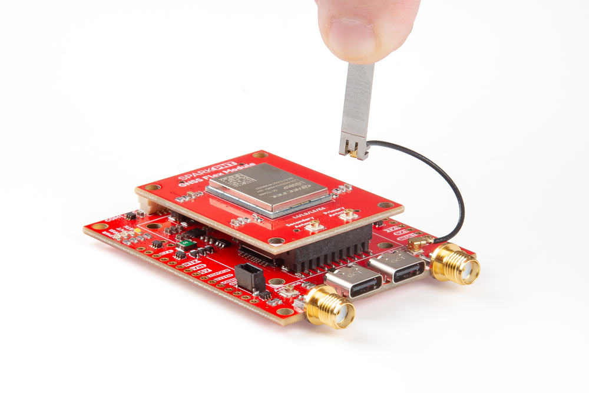
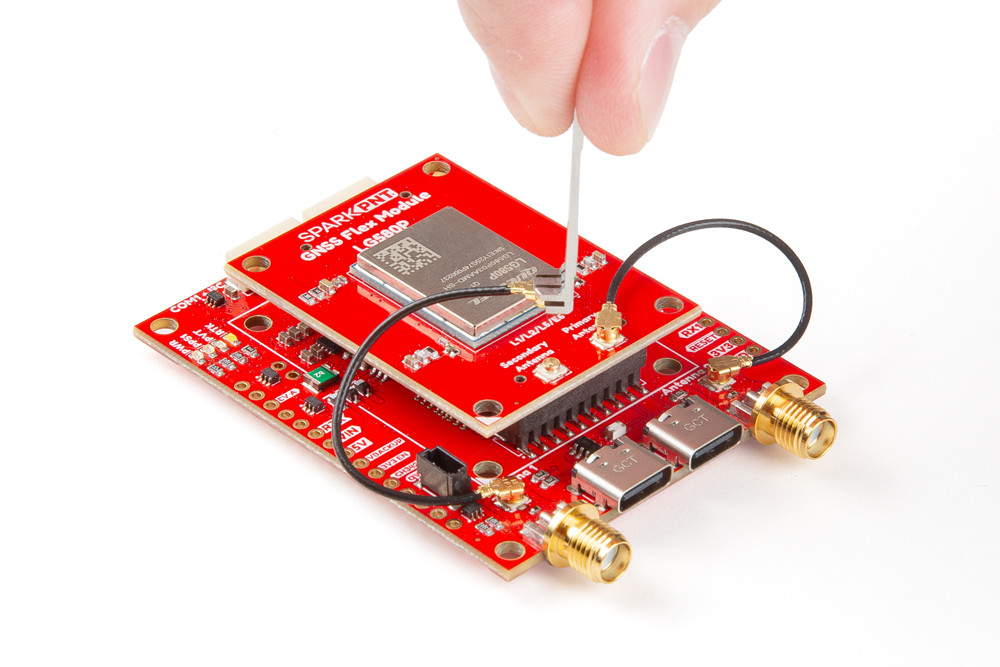

## GNSS Antenna
In order to receive [GNSS](https://en.wikipedia.org/wiki/Satellite_navigation "Global Navigation Satellite System") signals, users will need to connect compatible antennas. For the best performance, we recommend users choose active, L1/L2/L5/L6/L-Band GNSS antennas and utilize a low-loss cables.

???+ warning "Antenna Specifications"
	- Passive antennas are not recommended for the LG580P GNSS receiver.
	- To mitigate the impact of out-of-band signals, utilize an active antenna whose SAW filter is placed in front of the LNA in the internal framework.
		- **DO NOT** select and antenna with the LNA placed in the front.
	- There is no need to inject an external DC voltage for the GNSS antenna. Power is already provided from the LG580P module for the LNA of an active antenna.

!!! tip
	For the best performance, we recommend users choose compatible L1/L2/L5/L6/L-Band GNSS antennas and utilize a low-loss cables. Also, don't forget that GNSS signals are fairly weak and can't penetrate buildings or dense vegetation. The GNSS antennas should have an unobstructed view of the sky.

### U.FL Connectors
GNSS antennas are connected to the U.FL connectors on the GNSS Flex board. For sturdier connections, users have the option to bridging the connection to the SMA connector on a Flex carrier board.

### Primary Antenna
The `Antenna-1` U.FL connector functions as the primary GNSS antenna connection for the LG580P GNSS receiver. The GNSS antenna on this connection will also function as the reference position for any heading computations.

<figure markdown>
[{ width="400" }](./assets/img/hookup_guide/assembly-ufl1.jpg "Click to enlarge")
<figcaption markdown>Attaching an U.FL cable to the GNSS Flex board.</figcaption>
</figure>

### Secondary Antenna
The `Antenna-2` U.FL connector is only utilized for attitude determination by the LG580P GNSS receiver. With a minimum distance of 1m between the antennas and the base length setting configured, users should be able to achieve a heading accuracy of 0.1&deg;.

<figure markdown>
[{ width="400" }](./assets/img/hookup_guide/assembly-ufl2.jpg "Click to enlarge")
<figcaption markdown>Attaching a second U.FL cable to the GNSS Flex board.</figcaption>
</figure>

## GNSS Flex Headers
SparkPNT GNSS Flex modules are *plug-in boards* featuring different GNSS receivers. They are designed to be easily swapped for repairs and pin-compatible for upgrades. The boards come populated with two 2x10 pin, 2mm pitch female headers for connecting to *carrier boards*.

<figure markdown>
[{ width="400" }](./assets/img/hookup_guide/animation-attach_module.gif "Click to enlarge")
<figcaption markdown>Stacking a GNSS Flex module onto a *carrier* board.</figcaption>
</figure>
