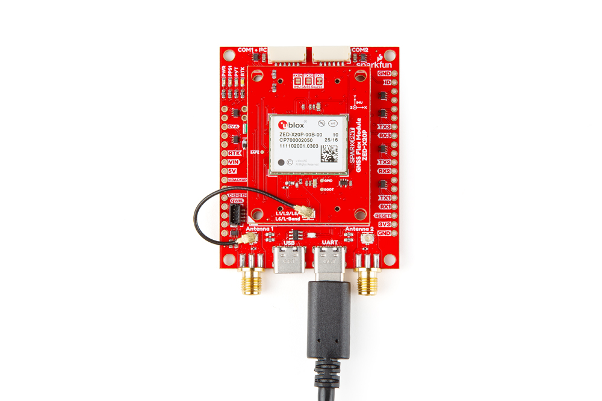
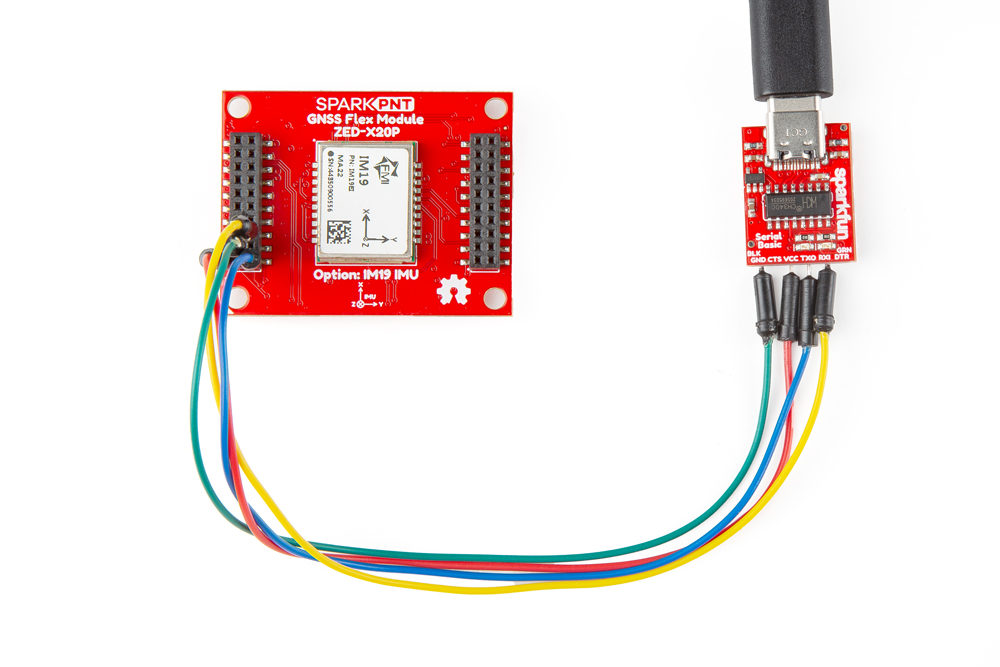
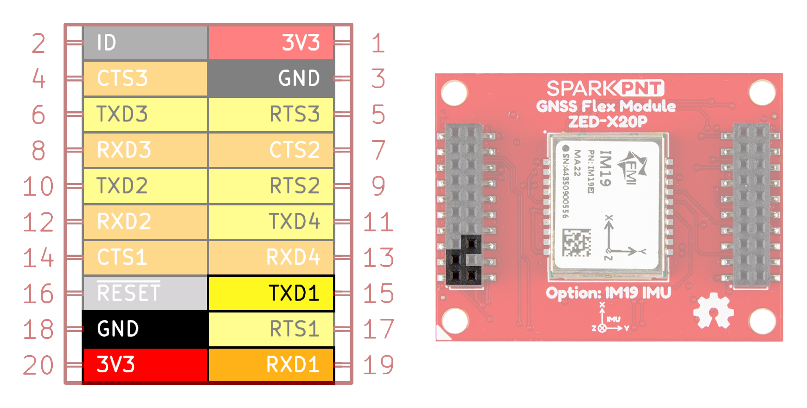

## Hardware Assembly
The simplest method to update the firmware on the ZED-X20P GNSS receiver, is through its `UART1` interface with the u-center 2 software application. Users can either utilize the [GNSS Flex breakout board](../SparkFun_GNSS_Flex_Breakout/index.md) or a [USB-to-serial adapter](https://www.sparkfun.com/sparkfun-serial-basic-breakout-ch340c-and-usb-c.html) to access the `UART1` interface of the ZED-X20P GNSS receiver.

!!! warning "HPG v2.00 Firmware"
	As of HPG v2.02, firmware updates can be performed with either the `UART1`, I^2^C, or SPI interfaces of the ZED-X20P. However, with the original HPG v2.00 firmware, firmware updates could only be performed through the `UART1` interface.

<figure markdown>
[{ width="400" }](./assets/img/hookup_guide/assembly-firmware_update.jpg "Click to enlarge")
<figcaption markdown>Connecting to the `UART1` interface with the Flex breakout board.</figcaption>
</figure>

<figure markdown>
[{ width="400" }](./assets/img/hookup_guide/assembly-firmware_update-alt.jpg "Click to enlarge")
<figcaption markdown>Connecting to the `UART1` interface through the GNSS Flex headers, using a [USB-to-serial adapter](https://www.sparkfun.com/sparkfun-serial-basic-breakout-ch340c-and-usb-c.html).</figcaption>
</figure>

??? tip "GNSS Flex Headers"
	Below, is a table of the pin connections between the `UART1` interface of the GNSS Flex headers and a [USB-to-serial adapter](https://www.sparkfun.com/sparkfun-serial-basic-breakout-ch340c-and-usb-c.html). Additionally, we have provided a diagram of the pin locations on the GNSS Flex header.

	

	

	| GNSS Flex Header Pins | USB-to-Serial Adapter |
	| :----: | :---: |
	| `3V3`  | `3V3` |
	| `GND`  | `GND` |
	| `TXD1` | `RXI` |
	| `RXD1` | `TXO` |

	

	

	<figure markdown>
	[{ width="400" }](./assets/img/hookup_guide/headers-firmware_update.png "Click to enlarge")
	<figcaption markdown>The GNSS Flex header pins for the `UART1` interface of the ZED-X20P GNSS Flex module.</figcaption>
	</figure>

	

	

	!!! note
		The ZED-X20P GNSS receiver requires 3.3V to power the module.

!!! info
	For more information, please reference the [user manual](https://www.u-blox.com/en/info/u-center-2-user-guide#93-updating-firmware).

!!! example "Example - I^2^C Interface"
	For those curious, we have found that it is possible to [update the firmware through the I^2^C interface](https://community.sparkfun.com/t/how-to-update-gnss-flex-phat-zed-x20p-firmware-with-u-center-2/67090/9) of the ZED-X20P GNSS receiver.

## u-center 2 Application
Users will need to [connect to the ZED-X20P GNSS Flex module](https://www.u-blox.com/en/info/u-center-2-user-guide#32-connecting-a-device) in the u-center 2 application. Once connected, select the **Firmware update** tool from the **Tools and Services** panel; then, follow the instructions outlined in the [user manual](https://www.u-blox.com/en/info/u-center-2-user-guide#93-updating-firmware). Otherwise, users can also follow this instructional video from u-blox.

<iframe src="https://www.youtube.com/embed/RonjsBTdW3A" title="Firmware update on u-center 2 (ver. 23.03.)" frameborder="0" allow="accelerometer; autoplay; clipboard-write; encrypted-media; gyroscope; picture-in-picture" allowfullscreen></iframe>
{ .qr width="85" }

!!! info
	For the latest firmware, please check the [u-blox ZED-X20P product page](https://www.u-blox.com/en/product/zed-x20p-module?legacy=Current#Documentation-&-resources).

!!! tip
	If the ZED-X20P is in the safe boot mode, it requires a training sequence to be enabled during the firmware update process.
