<article style="text-align: center;" markdown>
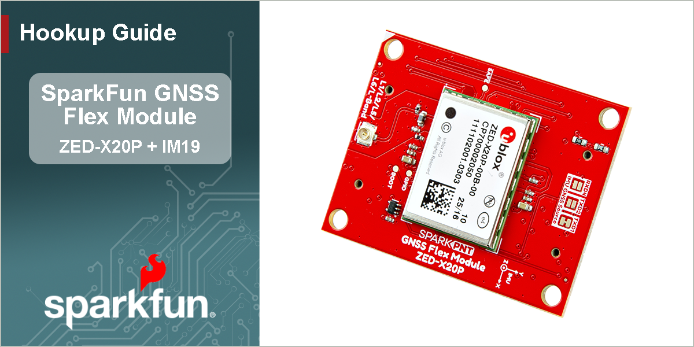{ width="650px" }
</article>

## Introduction

-   <a href="https://www.sparkfun.com/sparkpnt-gnss-flex-module-zed-x20p.html">
	**SparkPNT GNSS Flex Module - ZED-X20P** 
	**SKU:** GPS-29362

	---

	<figure markdown>
	
	</figure></a>

	<article style="text-align: center;" markdown>
	{ .tinyqr }[Purchase from SparkFun :fontawesome-solid-cart-plus:{ .heart }](https://www.sparkfun.com/sparkpnt-gnss-flex-module-zed-x20p.html){ .md-button .md-button--primary }
	</article>

-   <a href="https://www.sparkfun.com/sparkpnt-gnss-flex-module-zed-x20p-im19-imu.html">
	**SparkPNT GNSS Flex Module - ZED-X20P & IM19 IMU** 
	**SKU:** GPS-28997

	---

	<figure markdown>
	
	</figure></a>

	<article style="text-align: center;" markdown>
	{ .tinyqr }[Purchase from SparkFun :fontawesome-solid-cart-plus:{ .heart }](https://www.sparkfun.com/sparkpnt-gnss-flex-module-zed-x20p-im19-imu.html){ .md-button .md-button--primary }
	</article>

-   SparkPNT GNSS Flex modules are plug-in boards featuring different GNSS receivers. They are designed to be easily swapped for repairs and pin-compatible for upgrades. The boards have two 2x10-pin, 2mm pitch female headers connecting to carrier boards. For the ZED-X20P GNSS receiver, these pins will break out the USB, UART (x2), and I^2^C interfaces, along with the PPS and event signals using a standardized pinout. When populated, these pins also break out the two UART interfaces of the IM19 attitude module.

	These SparkPNT GNSS Flex Module combines the powerful u-blox ZED-X20P all-band RTK-capable GNSS receiver with an optional IM19 attitude module, which features an inertial measurement unit (IMU) for tilt compensation or dead reckoning. The ZED-X20P module is an all-band, high precision GNSS receiver that concurrently processes signals from the GPS, Galileo, BeiDou, QZSS, and NavIC constellations across all GNSS frequency bands, including L-band. With positioning algorithms for Real-time Kinematics (RTK), PPP-RTK, and Precise Point Positioning* (PPP) technologies, the module supports standard RTCM corrections for Virtual Reference Stations (VRS) in a Network RTK setup or a local base station setup. Additionally, L-band correction services are natively supported without the need to integrate an external receiver, such as the NEO-D9S.

	With its very high update rate, the ZED-X20P module is ideal for control applications, ensuring smooth and reliable operation. The module also protects system integrity with multi-layered defenses, including a Root of Trust, jamming and spoofing detection, cryptographic authentication of navigation messages through Galileo OSNMA, and more. This represents the highest level of integration in a single-chip receiver for the navigation and robotics markets; in unmanned autonomous vehicles (UAVs), guidance systems, and auto-steering applications.

	???+ info "Optional IM19 Attitude Module"
		The optional, IM19 attitude module from Feyman (FMI) fuses MEMS IMU sensor data and GNSS RTK positioning to deliver high-precision attitude compensated measurements, with roll and pitch accurate to within 0.05 degrees. This kind of superb accuracy has widespread uses in industrial applications such as tilt RTK surveys (where RTK poles need not be held straight vertical as the IM19 can calculate a virtual digital level at any tilt angle), agriculture machine automation, and dead reckoning.

		When configured, fed with the ZED-X20P Pulse-Per-Second signal and NMEA GGA, RMC, and GST messages; once calibrated, the IM19 will output proprietary NMEA messages containing the compensated position and roll, pitch and yaw. By default, the ZED-X20P `UART1` `TX` is linked to the IM19 `UART2` `RX` to carry the required NMEA messages. However, this can be changed via jumper links on the Flex Module, if necessary.

	!!! note
		`*`: Feature is still under development

		The USB interface does not fully comply with industry standards and is not suitable for certification/production use. However, the USB 2.0 FS (full speed, 12 Mbit/s) interface can be used for host communication in development purposes.

	!!! note "GPS `L5` Signals"
		The GPS `L5` signals are currently, considered as *"pre-operational"* and not utilized by default in navigation solutions. However, it is possible override the receiver's configuration to evaluate the GPS `L5` signals. Please refer to the integration manual for more details.

		This is an operational limitation of the satellite/space segment and not an issue of the u-blox product.

## :material-folder-cog: Design Files

<!-- Import the component -->

-   :kicad-primary:{ .enlarge-logo } Design Files

	---

	- :fontawesome-solid-file-pdf: [Schematic](./assets/board_files/schematic.pdf)
	- :material-folder-zip: [KiCad Files](./assets/board_files/kicad_files.zip)
	- :material-rotate-3d: [STEP File](./assets/3d_model/cad_model.step)
	- :fontawesome-solid-file-pdf: [Board Dimensions](./assets/board_files/dimensions.pdf):
		- 1.75" x 1.25" (44.45mm x 31.75mm)

-   <!-- Boxes in tabs -->

	=== "3D Model"
		<article style="text-align: center;" markdown>
		<model-viewer src="../assets/3d_model/web_model.glb" camera-controls poster="../assets/3d_model/poster.png" tone-mapping="neutral" shadow-intensity="2" shadow-softness="0.2" camera-orbit="0deg 75deg 0.103m" field-of-view="25.11deg" style="width: 100%; height: 450px;">
		</model-viewer>

		[Download the `*.step` File](./assets/3d_model/cad_model.step "Click to download"){ .md-button .md-button--primary width="250px" }

		</article>

		???+ tip "Manipulate 3D Model"
			<article style="text-align: center;" markdown>

			| Controls       | Mouse                    | Touchscreen    |
			| :------------- | :----------------------: | :------------: |
			| Zoom           | Scroll Wheel             | 2-Finger Pinch |
			| Rotate         | ++"Left-Click"++ & Drag  | 1-Finger Drag  |
			| Move/Translate | ++"Right-Click"++ & Drag | 2-Finger Drag  |

			</article>

	=== "Dimensions"
		<article style="text-align: center;" markdown>
		[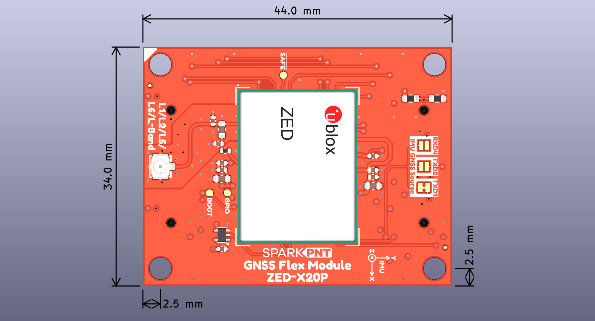{ width="450" }](./assets/board_files/dimensions.png "Click to enlarge")
		<figcaption markdown>Dimensions of the ZED-X20P GNSS Flex module.</figcaption>
		</article>

		???+ tip "Need more measurements?"
			For more information about the board's dimensions, users can download the [KiCad files](./assets/board_files/kicad_files.zip) for this board. These files can be opened in KiCad and additional measurements can be made with the measuring tool.

			!!! info ":octicons-download-16:{ .heart } KiCad - Free Download!"
				KiCad is free, open-source [CAD]("computer-aided design") program for electronics. Click on the button below to download their software. *(\*Users can find out more information about KiCad from their [website](https://www.kicad.org/).)*

				<article style="text-align: center;" markdown>
				[Download :kicad-primary:{ .enlarge-logo }](https://www.kicad.org/download/ "Go to downloads page"){ .md-button .md-button--primary width="250px" }
				</article>

			???+ info ":straight_ruler: Measuring Tool"
				This video demonstrates how to utilize the dimensions tool in KiCad, to include additional measurements:

				<article class="video-500px" style="text-align: center; margin: auto;" markdown>
				<iframe src="https://www.youtube.com/embed/-eXuD8pkCYw" title="KiCad Dimension Tool" frameborder="0" allow="accelerometer; autoplay; clipboard-write; encrypted-media; gyroscope; picture-in-picture" allowfullscreen></iframe>
				{ .qr width="85px" }
				</article>

## Board Layout
The GNSS Flex system is designed around two 2x10-pin, 2mm pitch headers used mate the two types of boards. A standardized pin layout, keeps the ecosystem pin-compatible for upgrades and allows board to be easily swapped for repairs. Depending on the capabilities of the GNSS receiver, these pins will breakout the USB, UART (x4), I^2^C, and SD card interfaces along with any PPS or event signals of the GNSS receiver.

The ZED-X20P GNSS Flex module has the following features:

<figure markdown>
[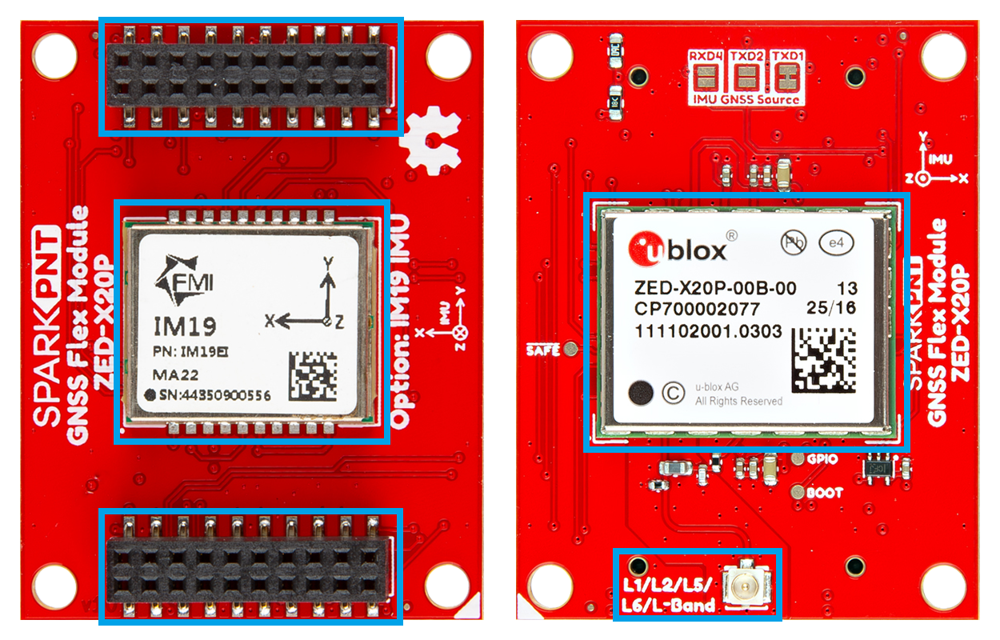{ width="750" }](./assets/img/hookup_guide/layout.png "Click to enlarge")
<figcaption markdown>Layout of the major components on the ZED-X20P GNSS Flex module.</figcaption>
</figure>

1. **ZED-X20P GNSS Receiver**
:	The u-blox ZED-X20P GNSS receiver
1. **GNSS Flex Headers**
:	Two sets of 2x10 pin, 2mm pitch female headers for connecting a GNSS Flex module to *carrier boards*
1. **IM19 IMU** *(optional)*
:	An optional Feyman IM19 attitude module to provide tilt compensation in surveying applications
1. **`Antenna L1/L2/L5/E6` U.FL Connector**
:	An U.FL connector for attaching an external GNSS antenna

## ZED-X20P GNSS Receiver
The centerpiece of this GNSS breakout board is the [ZED-X20P module](./assets/component_documentation/ZED-X20P-00B_DataSheet_UBXDOC-963802114-12690.pdf) from [u-blox](https://www.u-blox.com/en); it features their latest X20 GNSS engine, a successor to their popular F9 engine. The ZED-X20P module is an all-band, high precision GNSS receiver that concurrently processes signals from the GPS, Galileo, BeiDou, QZSS, and NavIC constellations across all GNSS frequency bands, including L-band. With positioning algorithms for Real-time Kinematics (RTK), PPP-RTK, and Precise Point Positioning* (PPP) technologies, the module supports standard RTCM corrections for Virtual Reference Stations (VRS) in a Network RTK setup or a local base station setup. Additionally, L-band correction services are natively supported without the need to integrate an external receiver, such as the NEO-D9S.

With its very high update rate, the ZED-X20P module is ideal for control applications, ensuring smooth and reliable operation. The module also protects system integrity with multi-layered defenses, including a Root of Trust, jamming and spoofing detection, cryptographic authentication of navigation messages through Galileo OSNMA, and more. The module also accommodates users with a diverse choice of interfaces including USB, UART, SPI, and I^2^C.

{ .qr width="85px" }

<article class="video-500px" style="margin: auto;" markdown>
<iframe src="https://www.youtube.com/embed/dRFR38xS2b4" title="u-blox launches the ZED-X20P. Our first all-band, global GNSS receiver." frameborder="0" allow="accelerometer; autoplay; clipboard-write; encrypted-media; gyroscope; picture-in-picture" allowfullscreen></iframe>
</article>

-   <figure markdown>
	[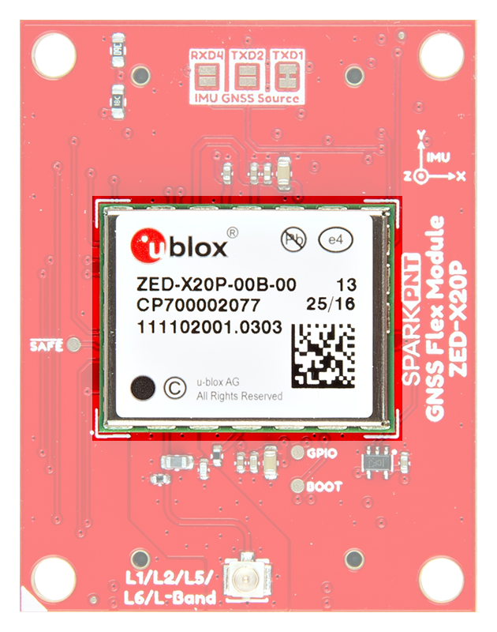{ width="400" }](./assets/img/hookup_guide/ZED-X20P.png "Click to enlarge")
	<figcaption markdown>The ZED-X20P module on the ZED-X20P GNSS Flex module.</figcaption>
	</figure>

!!! note
	`*`: Feature in development

<figure markdown>
[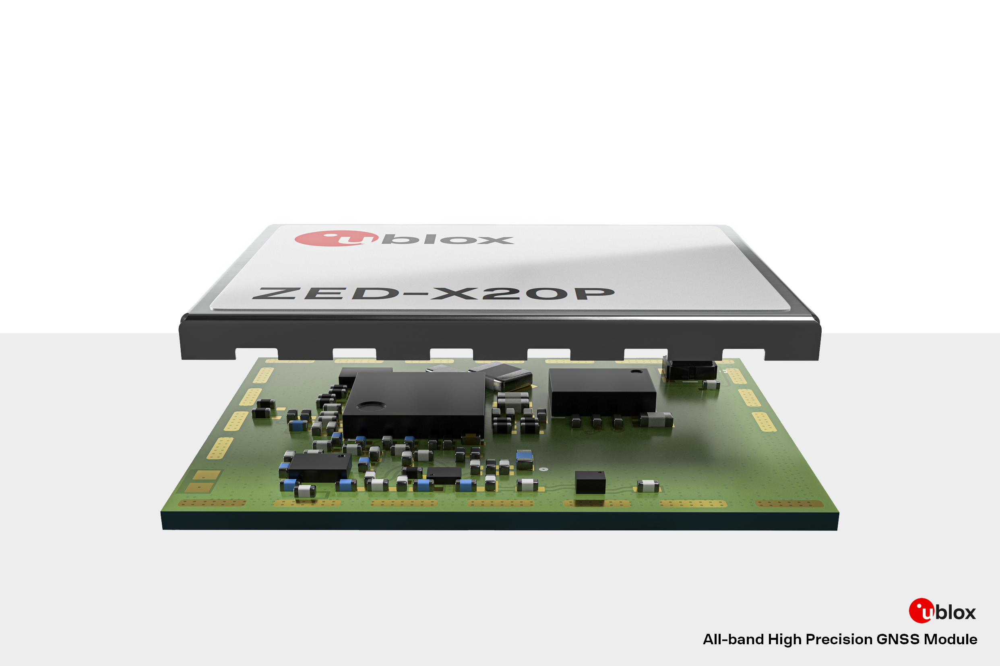{ width="400" }](./assets/img/hookup_guide/ZED-X20P-product-visual.png "Click to enlarge")
<figcaption markdown>Exploded view of the ZED-X20P GNSS receiver.</figcaption>
</figure>

**Features:**

- GNSS Constellations and SBAS Systems:
	- **USA:** GPS + WASS
	- **EU:** Galileo + EGNOS
	- **China:** BDS + BDSDAS
	- **Japan:** QZSS + MSAS
	- **India:** NavIC + GAGAN
- Features
    - Programmable flash memory
    - Carrier phase output
    - Jamming detection
    - Galileo OSNMA
    - Secure boot
- Services:
    - AssistNow
    - PointPerfect
- Interfaces:
    - USB
    - UART x2
    - SPI
    - I^2^C
	- Digital I/O
		- `TIMEPULSE` configurable: 0.25 - 10MHz
		- `EXTINT` input for Wakeup

 

- Supply voltage: 2.7V to 3.6V
- Sensitivity
	- Tracking and Nav.: -167dBm
	- Reacquisition: -160dBm
	- Cold start: -148dBm
	- Hot start: -157dBm
- Operational Limits
	- Dynamics: <4g
	- Altitude: 80,000m
	- Velocity: 500m/s
	- Update Rate: Up to 25Hz
	- Temperature: -40°C to 85°C
- Dynamic Accuracy
	- Velocity: 0.05m/s
	- Heading: 0.3&deg;
- Time to Fix
	- Cold Start: <27s
	- Aided Start: <2s
	- Hot Start: 2s
- Convergence time:
	- RTK: <10s
	- SPARTN: <50s
- Dimensions: 17.0mm x 22.0mm x 2.4mm

### Power Consumption
The power consumption of the ZED-X20P module depends on the GNSS signals enabled and if the module is acquiring or tacking those signals. The table below, lists the average current consumption with a supply voltage of 3.3V.

<article style="text-align: center;" markdown>

| GNSS Signals | Acquisition | Tracking |
| :----------- | :---------: | :------: |
| GPS+GAL+BDS  | 75mA        | 70mA     |
| GPS          | 50mA        | 50mA     |

</article>

!!! tip
	During acquisition, the current consumption may reach up to 85mA; make sure the primary power source can sustain this.

!!! info
	For more information, please refer to the [ZED-X20P Datasheet](./assets/component_documentation/ZED-X20P-00B_DataSheet_UBXDOC-963802114-12690.pdf).

### Frequency Bands
The ZED-X20P module is an all-band, high precision GNSS receiver that concurrently processes signals from the GPS, Galileo, BeiDou, QZSS, and NavIC constellations across all GNSS frequency bands, including L-band. Below, are the frequency bands provided by all the global navigation satellite systems and the ones supported by the ZED-X20P module.

<figure markdown>
[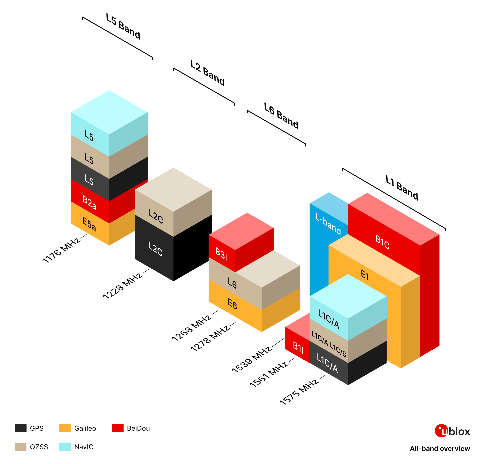{ width="400" }](https://content.u-blox.com/sites/default/files/2025-03/all-band-overview-design.png "Click to enlarge")
<figcaption markdown>The frequency bands supported by the ZED-X20P GNSS receiver.</figcaption>
</figure>

<article style="text-align: center;" markdown>

| Constellation | Frequency Bands            |
| :-----------: | :------------------------- |
| GPS           | L1C/A, L2C, L5             |
| QZSS          | L1C/A, L1C/B*, L2C, L5, L6 |
| GAL           | E1B/C, E5a, E6             |
| BDS           | B1I, B1C, B2a, B3I         |
| NavIC         | L1*, L5                    |
| SBAS          | L1C/A                      |

*The supported frequency bands, organized by constellation.*
</article>

!!! note
	`*`: Feature in development

<figure markdown>
[{ width="800" style="background-color: rgba(255, 255, 255, 0.85); padding: 5px;" }](https://www.tallysman.com/app/uploads/2021/07/Tallysman-GNSS-Frequencies-v8.0_Chart-1-1024x425.png "Click to enlarge")
<figcaption markdown>Frequency bands of the global navigation satellite systems. (Source: [Tallysman](https://www.tallysman.com/gnss-constellations-radio-frequencies-and-signals/))</figcaption>
</figure>

!!! note "Configuration Settings"
	Each GNSS constellations and their signal bands can be enabled or disabled independently, using keys from the `CFG-SIGNAL-*` configuration group; except for the QZSS and SBAS constellation. A GNSS constellation is considered to be enabled when the constellation enable key is set and at least one of the constellation's band keys is enabled. However, the ZED-X20P only supports certain combinations of constellations and bands. For all GNSS constellations, the `L1` band is mandatory even in combination with another frequency band. Any unsupported combinations will be rejected with a `UBX-ACK-NAK` and the warning: `inv sig cfg` will be sent via UBX-INF and NMEA-TXT messages *(if enabled)*.

	??? info "Supported Combinations"

		<article style="text-align: center;" markdown>

		| Constellation key `CFG-SIGNAL-GAL_ENA` | Band key `CFG-SIGNAL-GAL_E1_ENA` | Band key `CFG-SIGNAL-GAL_E5A_ENA` | Band key `CFG-SIGNAL-GAL_E6_ENA` | Constellation enabled? |
		| :---------- | :---------- | :---------- | :---------- | :-: |
		| true (`1`)  | true (`1`)  | true (`1`)  | true (`1`)  | yes |
		| true (`1`)  | true (`1`)  | true (`1`)  | false (`0`) | yes |
		| true (`1`)  | true (`1`)  | false (`0`) | true (`1`)  | yes |
		| true (`1`)  | true (`1`)  | false (`0`) | false (`0`) | yes |
		| true (`1`)  | false (`0`) | true (`1`)  | true (`1`)  | no  |
		| true (`1`)  | false (`0`) | false (`0`) | true (`1`)  | no  |
		| true (`1`)  | false (`0`) | true (`1`)  | false (`0`) | no  |
		| true (`1`)  | false (`0`) | false (`0`) | false (`0`) | no  |
		| false (`0`) | true (`1`)  | true (`1`)  | true (`1`)  | no  |
		| false (`0`) | true (`1`)  | true (`1`)  | false (`0`) | no  |
		| false (`0`) | true (`1`)  | false (`0`) | true (`1`)  | no  |
		| false (`0`) | false (`0`) | true (`1`)  | true (`1`)  | no  |
		| false (`0`) | false (`0`) | false (`0`) | true (`1`)  | no  |
		| false (`0`) | false (`0`) | true (`1`)  | false (`0`) | no  |
		| false (`0`) | true (`1`)  | false (`0`) | false (`0`) | no  |
		| false (`0`) | false (`0`) | false (`0`) | false (`0`) | no  |

		</article>

??? info "What are Frequency Bands?"
	A [frequency band](https://en.wikipedia.org/wiki/Frequency_band) is a section of the [electromagnetic spectrum](https://en.wikipedia.org/wiki/Electromagnetic_spectrum), usually denoted by the range of its upper and lower limits. In the [radio spectrum](https://en.wikipedia.org/wiki/Radio_spectrum), these frequency bands are usually regulated by region, often through a government entity. This regulation prevents the interference of RF communication; and often includes major penalties for any interference with critical infrastructure systems and emergency services.

	<figure markdown>
	[{ width="400" }](https://gssc.esa.int/navipedia/images/c/cf/GNSS_All_Signals.png "Click to enlarge")
	<figcaption markdown>Frequency bands of the global navigation satellite systems. (Source: [ESA](https://gssc.esa.int/navipedia/index.php?title=File:GNSS_All_Signals.png "European Space Agency"))</figcaption>
	</figure>

	However, if the various GNSS constellations share similar frequency bands, then how do they avoid interfering with one another? Without going too far into detail, the image above illustrates the frequency bands of each system with a few characteristics specific to their signals. Wit these characteristics in mind, along with other factors, the chart can help users to visualize how multiple GNSS constellations might co-exist with each other.

	For more information, users may find these articles of interest:

	- [GNSS signal](https://gssc.esa.int/navipedia/index.php/GNSS_signal)
	- [GPS Signal Plan](https://gssc.esa.int/navipedia/index.php?title=GPS_Signal_Plan)
	- [GLONASS Signal Plan](https://gssc.esa.int/navipedia/index.php?title=GLONASS_Signal_Plan)
	- [GALILEO Signal Plan](https://gssc.esa.int/navipedia/index.php?title=GALILEO_Signal_Plan)

### Position Accuracy

The accuracy of the position reported from the ZED-X20P GNSS receiver, can be improved based upon the correction method being employed. Currently, [RTK](https://en.wikipedia.org/wiki/Real-time_kinematic_positioning "Real-Time Kinematic") corrections provide the highest level of accuracy; however, users should be aware of certain limitations of the system:

- RTK technique requires real-time correction data from a reference station or network of base stations.
	- RTK corrections usually come from RTCM messages that are signal specific *(i.e. an RTK network may only provide corrections for specific signals; only `E5b` and not `E5a`)*.
- The range of the base stations will vary based upon the method used to transmit the correction data.
- The reliability of RTK corrections are inherently reduced in [multipath environments](https://en.wikipedia.org/wiki/Multipath_propagation).

<article style="text-align: center;" markdown>

| Correction Method | Horizontal (CEP)         | Vertical (Median)        |
| :---------------- | :----------------------: | :----------------------: |
| PVT               | 1.2m (~3.9')             | 2.0m (~6.6')             |
| SBAS              | 0.6m (~2.0')             | 1.0m (~3.3')             |
| RTK               | **1cm** (~0.39") *+1ppm* | **1cm** (~0.39") *+1ppm* |
| SPARTAN           | <6cm (~2.36")            | <10cm (~3.94")           |

</article>

??? warning "IM19 Attitude Module"
	When configured and calibrated, the IM19 attitude module can fuses IMU sensor and GNSS RTK positioning data to deliver compensated position. The accuracy, displayed in the table below, should also be considered when implemented.

	<article style="text-align: center;" markdown>

	| Tilt Angle       | Accuracy |
	| :--------------: | :------: |
	| 0&deg; - 30&deg; | 1cm      |
	| <60&deg;         | 2cm      |

	</article>

??? info "RTK Corrections"
	To understand how RTK works, users will need a more fundamental understanding of the signal error sources.

	

	-   <a href="https://www.sparkfun.com/news/7533">
		<figure markdown>
		
		</figure>

		---

		**Real-Time Kinematics Explained**</a>

	-   <a href="https://www.sparkfun.com/news/7138">
		<figure markdown>
		
		</figure>

		---

		**What is Correction Data?**</a>

	-   <a href="https://www.septentrio.com/en/learn-more/insights/gnss-corrections-demystified">
		<figure markdown>
		
		</figure>

		---

		**GNSS Corrections Demystified**</a>

	

!!! tip
	For the best performance, we highly recommend that users configure the module to utilize/provide RTK corrections with a compatible L1/L2/L5/L6 GNSS antenna and utilize a low-loss cable.

## IM19 IMU *(Optional)*
The other centerpiece of the GNSS Flex module is an optional [IM19 attitude module](../assets/component_documentation/IM19EI_v1.4.1.pdf) from [Feyman Inc.](http://feymani.com/en/). Users have the option to purchase a board variant that comes populated with the IM19 attitude module, which fuses MEMS IMU sensor data and GNSS RTK positioning to deliver high-precision attitude compensated measurements, with roll and pitch accurate to within 0.05 degrees. This kind of superb accuracy has widespread uses in industrial applications such as tilt RTK surveys (where RTK poles need not be held straight vertical as the IM19 can calculate a virtual digital level at any tilt angle), agriculture machine automation, and dead reckoning.

When configured, fed with the ZED-X20P Pulse-Per-Second signal and NMEA GGA, RMC, and GST messages; once calibrated, the IM19 will output proprietary NMEA messages containing the compensated position and roll, pitch and yaw. By default, the ZED-X20P `UART1` `TX` is linked to the IM19 `UART2` `RX` to carry the required NMEA messages. However, this can be changed via jumper links on the Flex Module, if necessary.

<article class="video-500px" style="text-align: center; margin: auto;" markdown>
<iframe src="https://global.feymani.com/files/im19.mp4" type="video/mp4" title="Feyman Inc - Product Intro for IM19 Module" frameborder="0" allow="accelerometer; clipboard-write; encrypted-media; gyroscope; picture-in-picture" allowfullscreen></iframe>
</article>

-   <figure markdown>
	[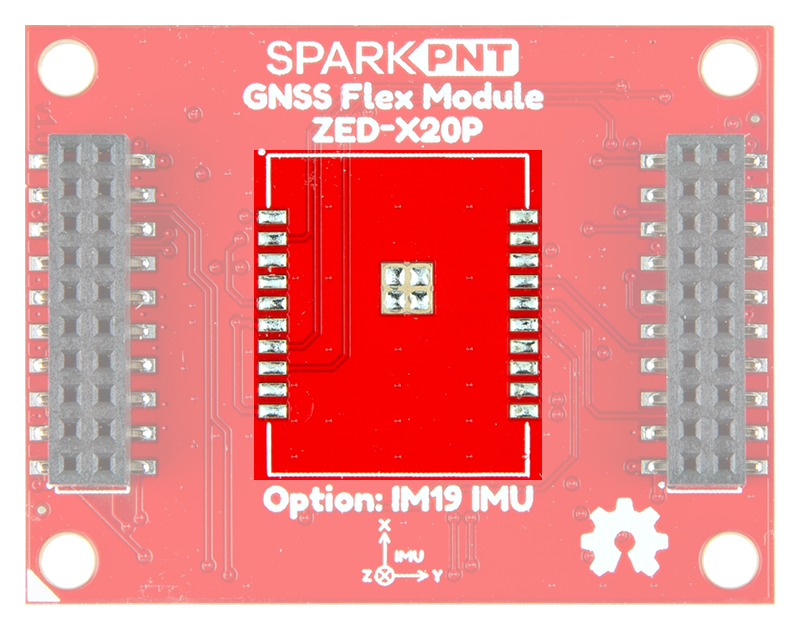{ width="300" }](./assets/img/hookup_guide/no_im19.png "Click to enlarge")
	<figcaption markdown>Without the IM19 attitude module populated on the ZED-X20P GNSS Flex module.</figcaption>
	</figure>

-   <figure markdown>
	[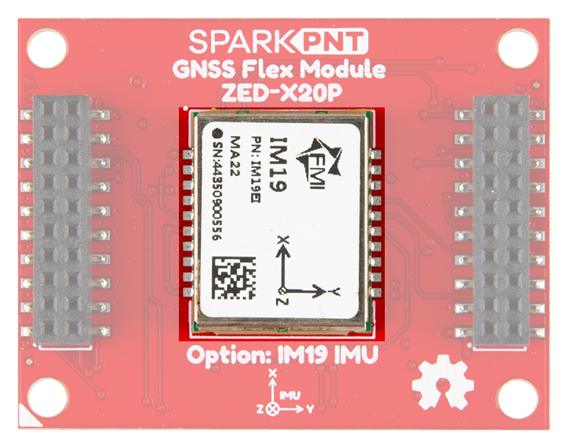{ width="300" }](./assets/img/hookup_guide/im19.png "Click to enlarge")
	<figcaption markdown>The IM19 attitude module populated on the ZED-X20P GNSS Flex module.</figcaption>
	</figure>

**Features:**

- Power: 0.33W
- Data Rate: 100Hz
- IMU Accuracy: &le;1% * D（1&sigma;, vehicle)
- Gyroscope
	- ARW: 0.17&deg;/&radic;(h)
	- Bias Stability: &plusmn;4.5&deg;/h
	- Range: &plusmn;1000&deg;/s

 

- Accelerometer
	- Speed RW: 0.04m/s/&radic;(h)
	- Bias Stability: &plusmn;0.3mg
	- Range: &plusmn;16g
- Roll and Pitch: &le;0.02&deg;（1&sigma;）
- Heading/Yaw: &le;0.2&deg;（1&sigma;）
- Initialization: 1s (95%)
- Self-calibration Technique

!!! info
	Please refer to the hookup guide linked below, for the operation of the IM19 attitude module in tilt-compensation applications:

	<article style="text-align: center;" markdown>
	[IM19 Hookup Guide - Tilt Compensation](../im19.md "Click to navigate"){ .md-button .md-button--primary }
	</article>

### Position Accuracy
When configured and calibrated, the IM19 attitude module can fuses its IMU sensor data with the received GNSS RTK positioning data to deliver a tilt compensated position.

<article style="text-align: center;" markdown>

| Tilt Angle       | Accuracy |
| :--------------: | :------: |
| 0&deg; - 30&deg; | 1cm      |
| <60&deg;         | 2cm      |

</article>

??? warning "ZED-X20P GNSS Receiver"
	The accuracy of the position reported from the ZED-X20P GNSS receiver, can be improved based upon the correction method being employed. Currently, [RTK](https://en.wikipedia.org/wiki/Real-time_kinematic_positioning "Real-Time Kinematic") corrections provide the highest level of accuracy. Its accuracy, displayed in the table below, should also be considered when implemented.

	<article style="text-align: center;" markdown>

	| Correction Method | Horizontal (CEP)     | Vertical (Median)    |
	| :---------------- | :------------------: | :------------------: |
	| PVT               | 1.2m (~3.9')         | 2.0m (~6.6')         |
	| SBAS              | 0.6m (~2.0')         | 1.0m (~3.3')         |
	| RTK               | 1cm (~0.39") *+1ppm* | 1cm (~0.39") *+1ppm* |
	| SPARTAN           | <6cm (~2.36")        | <10cm (~3.94")       |

	</article>

## GNSS Flex Headers
The GNSS Flex system is designed around two 2x10-pin, 2mm pitch headers used mate the two types of boards. A standardized pin layout, keeps the ecosystem pin-compatible for upgrades and allows boards to be easily swapped for repairs. For the ZED-X20P GNSS receiver, these pins will breakout the UART interface along with three of the programmable I/O pins; the LNA enable pin is not broken out and the safe-boot pin is only exposed as a test point on this board.

<!-- Redundant
<figure markdown>
[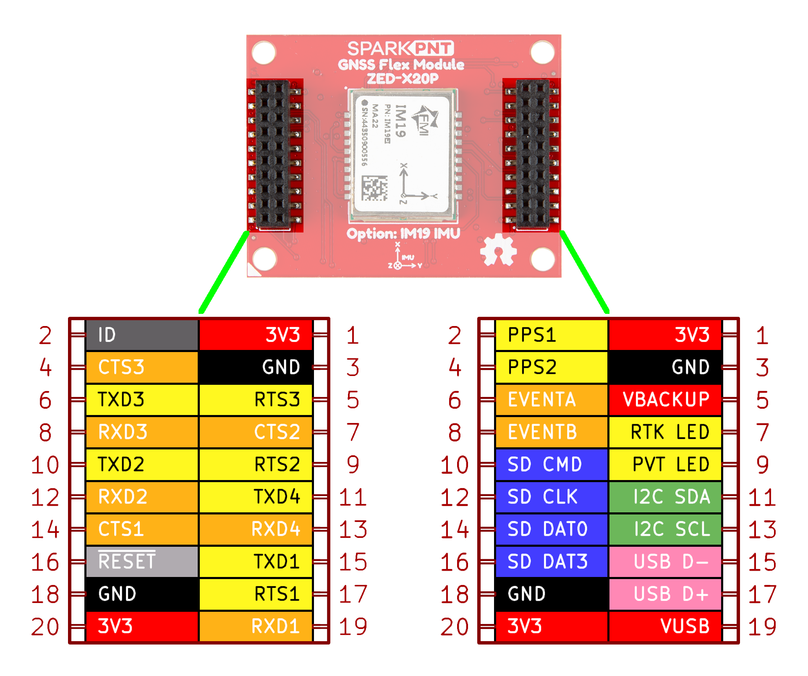{ width="400" }](./assets/img/hookup_guide/pinout-full.png "Click to enlarge")
<figcaption markdown>The peripherals and I/O pins on the ZED-X20P GNSS Flex module.</figcaption>
</figure>
-->

<figure markdown>
[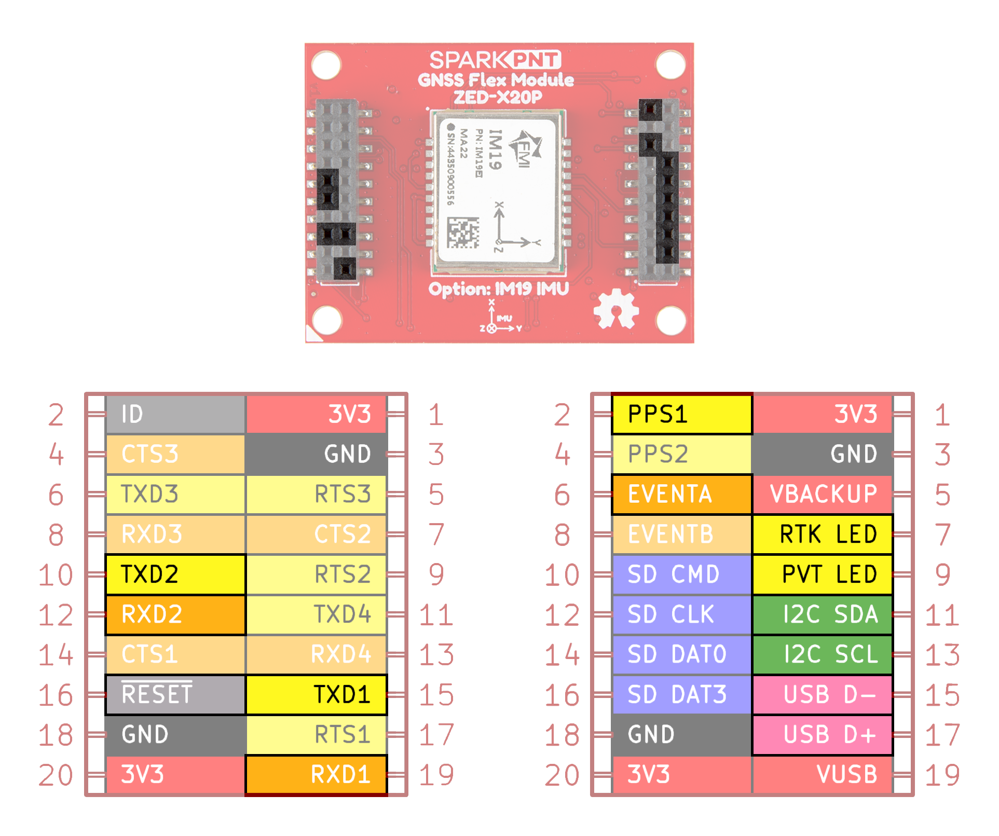{ width="400" }](./assets/img/hookup_guide/headers-zed-x20p.png "Click to enlarge")
<figcaption markdown>The peripherals and I/O pins for the ZED-X20P GNSS receiver.</figcaption>
</figure>

<figure markdown>
[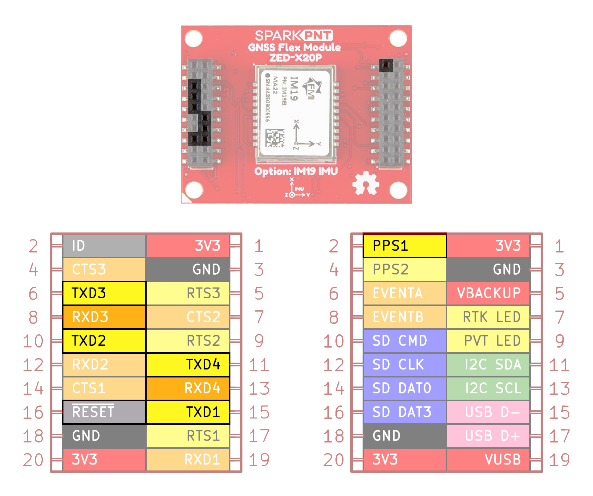{ width="400" }](./assets/img/hookup_guide/headers-im19.png "Click to enlarge")
<figcaption markdown>The peripherals and I/O pins for the IM19 attitude module.</figcaption>
</figure>

Below, are the features that are available from the ZED-X20P GNSS receiver.

<article class="annotate" markdown>
**Supported Interfaces:**

- USB
- UART x2 (1)
- I^2^C
	- Address: **`0x42` (Default)** *(7-bit)*
- 1x External interrupt
- 1x PPS output signal
- 1x RTK Stat pin
- 1x Geo Stat pin
- 1x Reset pin

</article>

1. One of the three UART ports is piped to the IM19 module

!!! note
	All the input pins on the ZED-X20P GNSSS module have internal pull-up resistors; in normal operation, they can be left floating if unused.

Below, are the features that are available from the IM19 attitude module.

<article class="annotate" markdown>

**Supported Interfaces:**

- UART (x2)
- Timing Signal (1)

</article>

1. The timing signal comes from the ZED-X20P GNSS receiver

=== "UART Ports"
	The headers of the GNSS Flex system supports up to four UART ports. On this GNSS Flex module, these are connected to both the GNSS receiver and IM19 attitude module.

	<figure markdown>
	[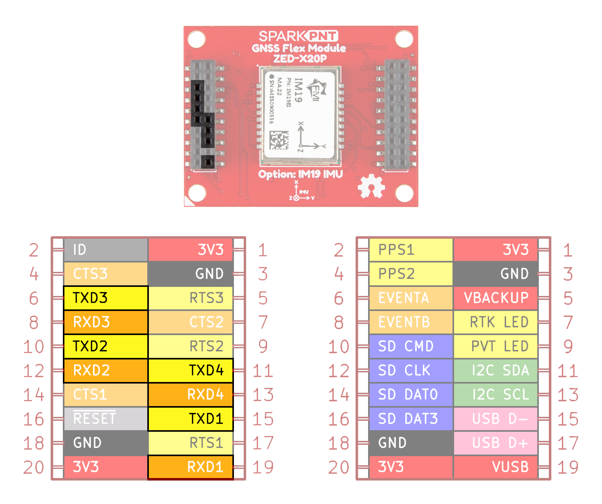{ width="400" }](./assets/img/hookup_guide/headers-uart.png "Click to enlarge")
	<figcaption markdown>The UART ports on the ZED-X20P GNSS Flex module.</figcaption>
	</figure>

	

	

	**ZED-X20P**

	---

	The ZED-X20P GNSS receiver has two UART ports, which can be operated and configured separately.

	<figure markdown>
	[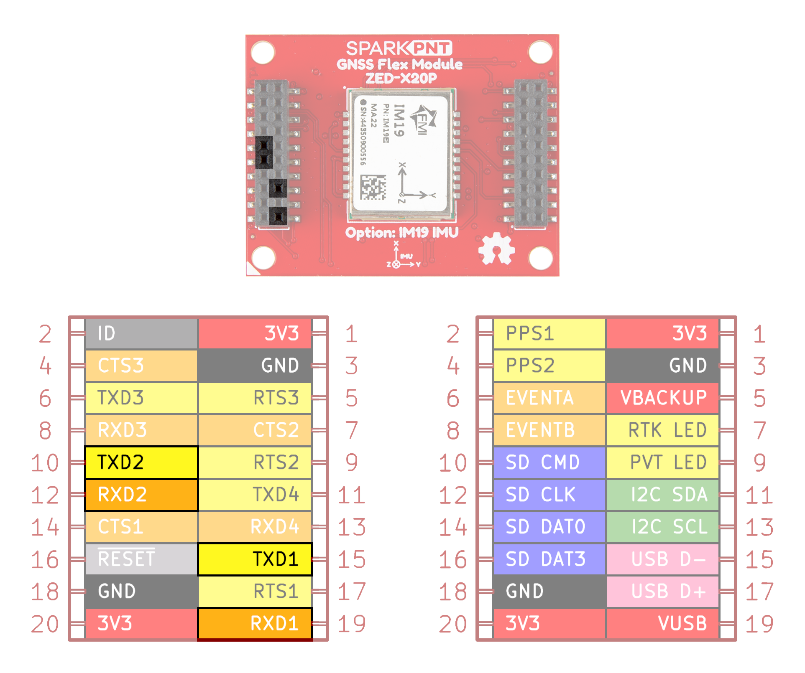{ width="400" }](./assets/img/hookup_guide/headers-uart-zed-x20p.png "Click to enlarge")
	<figcaption markdown>The UART ports from the ZED-X20P on the GNSS Flex module.</figcaption>
	</figure>

	- The `UART1` and `UART2` ports of the ZED-X20P GNSS receiver are broken out to the headers of the GNSS Flex system. These can be used to interact with the ZED-X20P.
	- The `TX` pin of the `UART1` port from the ZED-X20P GNSS receiver is also piped directly to the `RX` pin of the IM19 attitude module's `UART2` port.

	!!! warning
		Firmware updates can only be performed with the `UART1` interface.

	!!! info "Configuration"
		The UART interfaces can be configured with the `CFG-UART*` messages: 

		

		

		- Baudrate: 4800 to 8000000bps *(Default: **38400bps**)*
		- Data Bits: 8
		- Parity: No
		- Stop Bits: 1
		- Flow Control: None
		- Protocols:
			- Input messages: NMEA (GGA, GLL, GSA, GSV, RMC, VTG, and TXT), RTCM, SPARTN, and UBX
			- Output messages: NMEA, RTCM, and UBX

		

		

		| ZED-X20P | Pins of GNSS Flex Headers |
		| :-----: | :------------ |
		| `UART1` | `TXD1`/`RXD1` |
		| `UART2` | `TXD2`/`RXD2` |

		

		

	!!! info "Supported Protocols"
		The UART interfaces support the following protocols:

		- `UART1` Output
			- NMEA protocol with GGA, GLL, GSA, GSV, RMC, VTG, TXT messages are output by default.
			- UBX and RTCM 3.4 protocols are enabled by default, but no output messages are enabled by default.
		- `UART1` Input
			- UBX, NMEA and RTCM 3.4 input protocols are enabled by default.
		- `UART2` Output
			- RTCM 3.4 protocol is enabled by default, but no output messages are enabled by default.
			- NMEA protocol is disabled by default.
		- `UART2` Input
			- NMEA, RTCM 3.4, and SPARTN protocols are enabled by default.

	!!! tip
		A UART `RX` interface will be disabled when more than 100 frame errors are detected during a one-second period. This can happen if the wrong baud rate is used or the UART `RX` pin is grounded. An error message appears when the UART `RX` interface is reenabled at the end of the one-second period.

	

	

	**IM19**

	---

	The IM19 attitude module has two UART ports, which operate separately.

	<figure markdown>
	[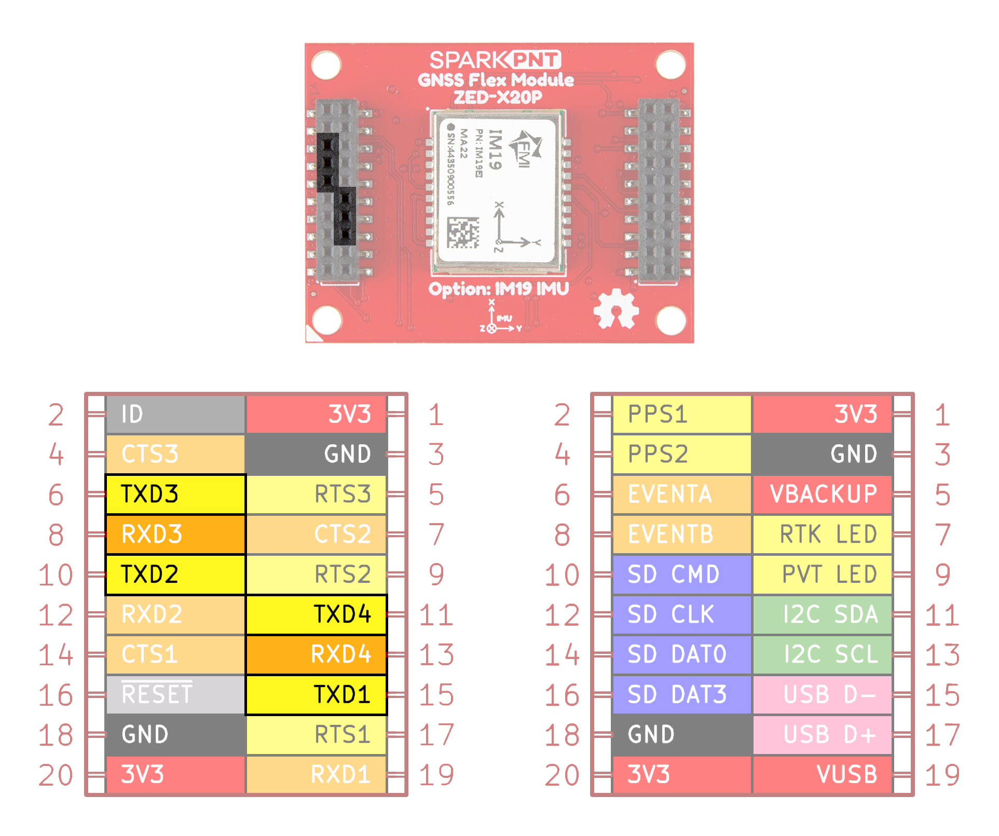{ width="400" }](./assets/img/hookup_guide/headers-uart-im19.png "Click to enlarge")
	<figcaption markdown>The UART ports from the IM19 on the ZED-X20P GNSS Flex module.</figcaption>
	</figure>

	- The `UART1` port of the IM19 module is broken out to the headers of the GNSS Flex system, on pins `TXD3` and `RXD3`. These pins should be used to configure the IM19 module.
	- The `UART2` port of the IM19 module is used to receive GNSS data from the GNSS receiver and output the tilt compensated data.
		- By default, the `RX` pin receives data from the `UART1` port of the ZED-X20P GNSS receiver.
			- Users can [modify the jumpers](#jumpers) on the top of the GNSS Flex module, to utilize the `TXD2` or `RXD4` pins *(of the GNSS Flex headers)* instead.
		- Once IM19 module is configured and calibrated, the `TX` pin outputs the tilt compensated data to the `TXD4` pin on the GNSS Flex headers.

	!!! info "Default Configuration"
		By default, the UART ports are configured with the following settings: 

		

		

		- Baudrate: **115200bps**
		- Data Bits: 8
		- Parity: No
		- Stop Bits: 1
		- Flow Control: None
		- Protocols:
			- AT Commands
			- Proprietary Data Formats
				- MEMS Raw data protocol
				- GNSS Raw data protocol
				- Binary NAVI positioning data protocol

		

		

		| IM19 | Pins of GNSS Flex Headers |
		| :-----: | :------------ |
		| `UART1` | `TXD3`/`RXD3` |
		| `UART2` | `TXD4` |

		

		

	

	

=== "PPS Output"
	The [`PPS1`](https://en.wikipedia.org/wiki/Pulse-per-second_signal "Pulse Per Second") pin is connected to the `TIMEPULSE` output signal from the ZED-X20P GNSS receiver and the `PPS` input for the IM19 attitude module. The period, length, and polarity (rising or falling edge) of the `TIMEPULSE` signal can be configured with the `CFG-TP-*` messages. In order to receive tilt-compensated data from the IM19 attitude module, this pin needs to be configured to provide a timing pulse at the same rate as the PVT solutions.

	<figure markdown>
	[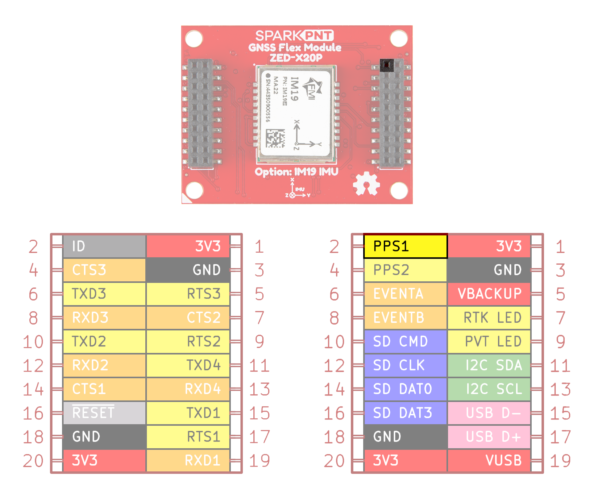{ width="400" }](./assets/img/hookup_guide/headers-pps.png "Click to enlarge")
	<figcaption markdown>The `PPS` signal output on the ZED-X20P GNSS Flex module.</figcaption>
	</figure>

	!!! note
		The `SAFEBOOT_N` and `TIMEPULSE` (`PPS`) pins are internally connected in the ZED-X20P GNSS receiver, by a 1k&ohm; series resistor. When the `SAFEBOOT_N` pin is pulled `LOW` at starup, the ZED-X20P module will enter safeboot mode. Therefore, these pins have no load that could pull them low at startup; otherwise, the receiver will enter its safeboot mode.

=== "I^2^C"
	The ZED-X20P supports a single I^2^C interface. If available, this interface can be accessed through Qwiic connectors on a [GNSS Flex "carrier" board](../carriers.md).

	<figure markdown>
	[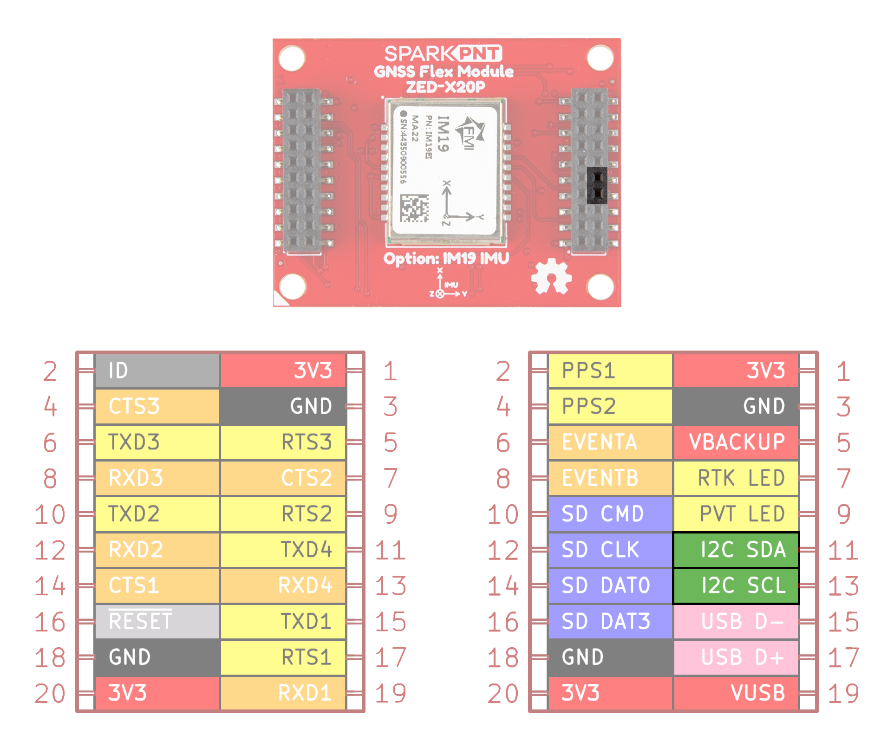{ width="400" }](./assets/img/hookup_guide/headers-i2c.png "Click to enlarge")
	<figcaption markdown>The I^2^C interface on the ZED-X20P GNSS Flex module.</figcaption>
	</figure>

	!!! tip "I2C Address"
		The default I^2^C address for the ZED-X20P GNSS receiver is `0x42` *(7-bit)*. However, this can be altered with the `CFG-I2C-ADDRESS` message.

		- **`0x42` (Default)** *(7-bit: `1000010`)*
		- `0x84` (write)/`0x85` (read)

	!!! info
		For users interested in the specific details about the read and write access for th I^2^C bus, please refer to the [ZED-X20P integration manual](https://www.u-blox.com/sites/default/files/documents/ZED-X20P_IntegrationManual_UBXDOC-963802114-12901.pdf)

	??? tip "What is Qwiic?"

		

		

		<!-- Qwiic Banner -->
		<article style="text-align: center;" markdown>
		[{ width=400 }](https://www.sparkfun.com/qwiic)
		[{ width=400 }](https://www.sparkfun.com/qwiic)
		</article>

		---

		The [Qwiic connect system](https://www.sparkfun.com/qwiic) is a solderless, polarized connection system that allows users to seamlessly daisy chain I^2^C boards together. Play the video, to learn more about the Qwiic connect system or click on the banner above to learn more about [Qwiic products](https://www.sparkfun.com/qwiic).

		

		

		<article class="video-500px" style="text-align: center; margin: auto;" markdown>
		<iframe src="https://www.youtube.com/embed/x0RDEHqFIF8" title="SparkFun's Qwiic Connect System" frameborder="0" allow="accelerometer; encrypted-media; gyroscope; picture-in-picture" allowfullscreen></iframe>
		{ .qr width="85px" }
		</article>

		

		

		!!! info "Features of the Qwiic System"

			=== "No Soldering"

				{ align="left" width="90" }
				{ align="left" width="90" }

				Qwiic cables (4-pin JST) plug easily from development boards to sensors, shields, accessory boards and more, making easy work of setting up a new prototype.

			=== "Polarized Connector"

				{ align="left" width="90" }
				{ align="left" width="90" }

				There's no need to worry about accidentally swapping the SDA and SCL wires on your breadboard. The Qwiic connector is polarized so you know you’ll have it wired correctly every time, right from the start.

				The PCB connector is part number SM04B-SRSS ([Datasheet](https://cdn.sparkfun.com/assets/parts/1/2/2/8/9/Qwiic_Connector_Datasheet.pdf)) or equivalent. The mating connector used on cables is part number SHR04V-S-B or an equivalent *(1mm pitch, 4-pin JST connector)*.

			=== "Daisy Chain-able"

				{ align="left" width="90" }
				{ align="left" width="90" }

				It’s time to leverage the power of the I^2^C bus! Most Qwiic boards will have two or more connectors on them, allowing multiple devices to be connected.

=== "Event"
	The ZED-X20P supports external interrupts through its `EXTINT` pin. This is useful for waking the module up from its standby mode or for timing applications.

	<figure markdown>
	[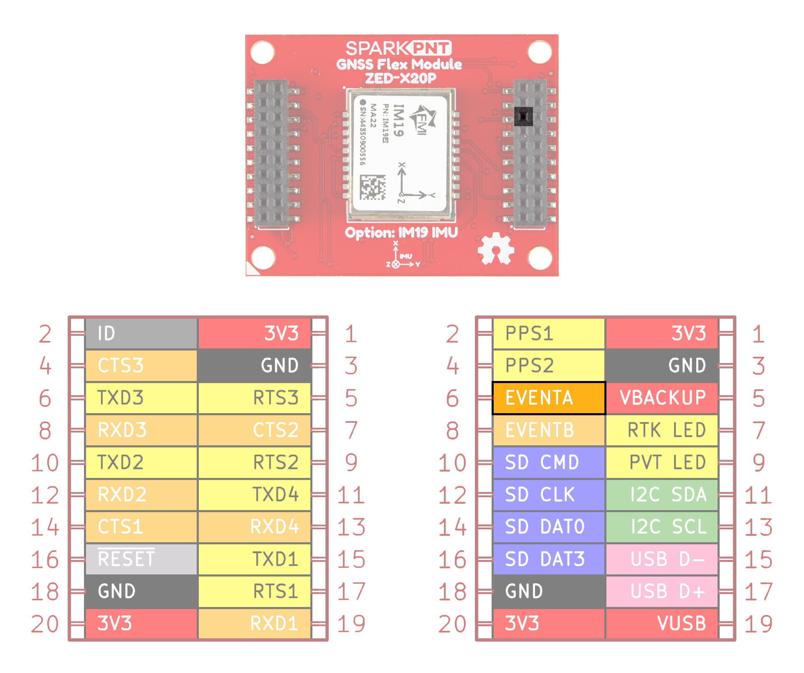{ width="250" }](./assets/img/hookup_guide/headers-event.png "Click to enlarge")
	<figcaption markdown>The `EVENTA` pin on the ZED-X20P GNSS Flex module.</figcaption>
	</figure>

	!!! tip
		All the inputs of the ZED-X20P have internal pull-up resistors in normal operation and can be left open if unused.

=== "Reset"
	The `RESET` pin is connected to the reset pins of the ZED-X20P and IM19 modules.

	- Driving the pin `LOW` for at least 1ms triggers a cold-start reset, clearing the `BBR` content *(receiver configuration, real-time clock (RTC), and GNSS orbit data)* of the ZED-X20P GNSS receiver.
	- Driving the pin `LOW` for at least 100ms triggers a restart of the IM19 attitude module.

	<figure markdown>
	[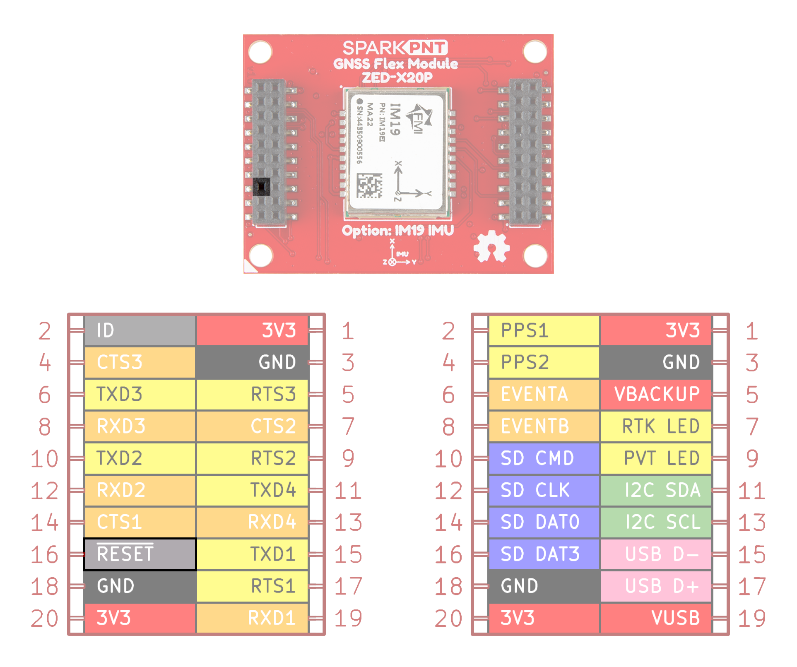{ width="250" }](./assets/img/hookup_guide/headers-reset.png "Click to enlarge")
	<figcaption markdown>The `RESET` pin on the ZED-X20P GNSS Flex module.</figcaption>
	</figure>

	!!! info
		Capacitors should not be placed between `RESET` and `GND`; otherwise, it could trigger a reset on startup.

	!!! tip
		All the inputs of the ZED-X20P have internal pull-up resistors in normal operation and can be left open if unused.

=== "Status Pins"
	The `RTK_STAT` and `GEOFENCE_STAT` signals from the ZED-X20P GNSS receiver are broken out to the `RTK` and `PVT` pins of the GNSS Flex headers.

	<figure markdown>
	[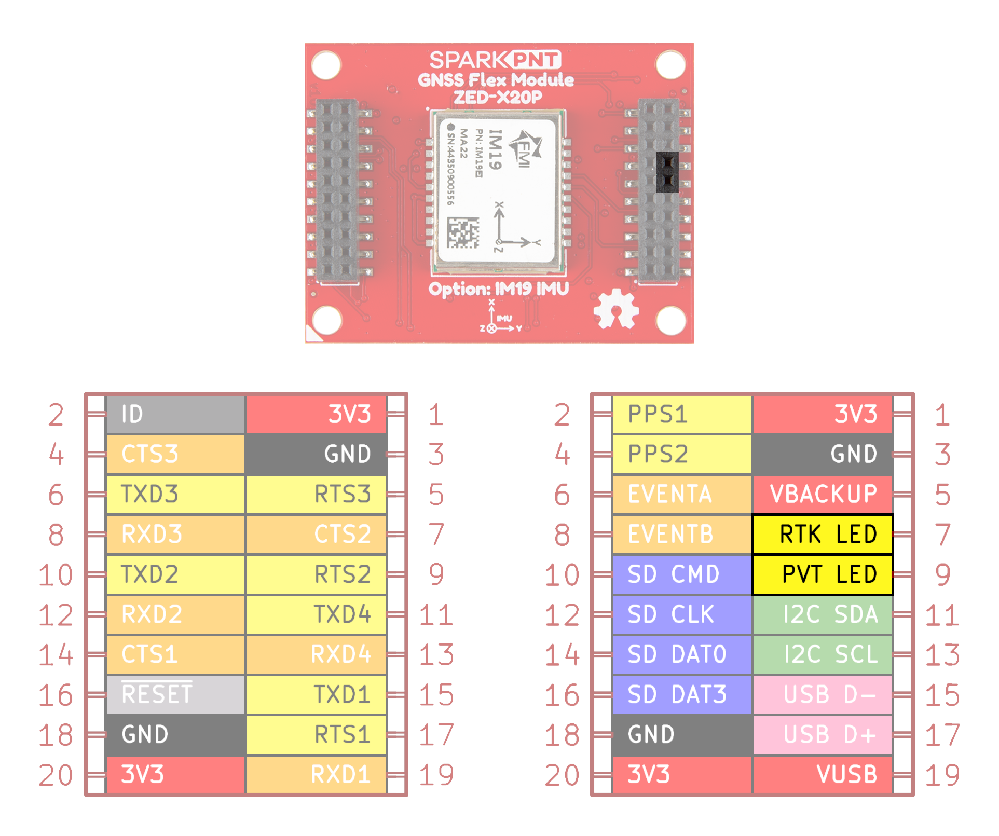{ width="400" }](./assets/img/hookup_guide/headers-leds.png "Click to enlarge")
	<figcaption markdown>The signal pins for the `RTK` and `PVT` indicators on the ZED-X20P GNSS Flex module.</figcaption>
	</figure>

	

	

	**`RTK`**
	:   The `RTK_STAT` signal indicates the RTK positioning status and if a stream of valid correction messages is being received.

		!!! info "Pin State"
			<!-- Inverted -->

			- **`HIGH`** - Indicates that RTK fixed mode has been achieved
			- *Blinking* - Indicates that a valid stream of correction messages is being received and utilized, but no RTK fixed mode has been achieved
			- **`LOW`** - Indicates that no carrier phase solution is available

	

	

	**`PVT`**
	:   The `GEOFENCE_STAT` signal indicates the current geofence status as to whether the receiver is inside any of the active areas. It is possible to configure up to four circular areas as geofence locations. Once configured, the receiver continuously compares its current position with the preset geofenced areas.

		The receiver toggles the assigned pin according to the combined geofence state.

		- **Inside** - The position is inside the geofence with the configured confidence level
		- **Outside** - The position lies outside of the geofence with the configured confidence level
		- **Unknown** - There is no valid position solution or the position uncertainty does not allow for unambiguous state evaluation

		!!! info "Pin State"
			- **`HIGH`** - The `GEOFENCE_STAT` pin is always set to high level when the combined geofence state is unknown
			- **`Low`** - A low level can represent either an inside or outside state based upon the `CFG-GEOFENCE-PINPOL` configuration

	

	

	!!! tip
		All the inputs of the ZED-X20P have internal pull-up resistors in normal operation and can be left open if unused.

## U.FL Connector
Users will need to connect a compatible GNSS antenna to the `L1/L2/L5/L6/L-Band` U.FL connector. The type of antenna used with the ZED-X20P module affects the overall accuracy of the positions calculated by the GNSS receiver.

- Passive antennas are not recommended for the ZED-X20P GNSS receiver.
- There is no need to inject an external DC voltage for the GNSS antenna. Power is already provided from the ZED-X20P module for the LNA of an active antenna.

<figure markdown>
[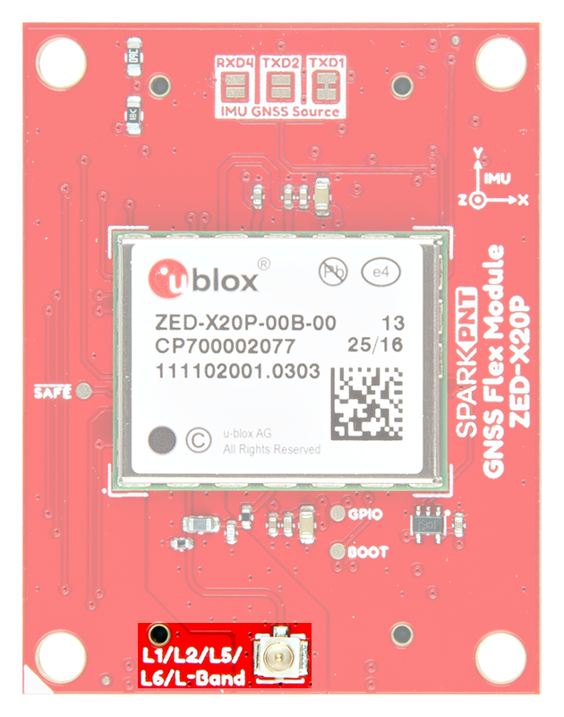{ width="400" }](./assets/img/hookup_guide/ant.png "Click to enlarge")
<figcaption markdown>The U.FL connector to attach an external GNSS antenna to the ZED-X20P GNSS Flex module.</figcaption>
</figure>

!!! tip
	For the best performance, we recommend users choose a compatible L1/L2/L5/L6/L-Band GNSS antenna and utilize a low-loss cable. Also, don't forget that GNSS signals are fairly weak and can't penetrate buildings or dense vegetation. The GNSS antenna should have an unobstructed view of the sky.

## Jumpers
The are three jumpers on top of the ZED-X20P GNSS Flex module that can be modified to change the source of the GNSS data for the IM19 attitude module.

<figure markdown>
[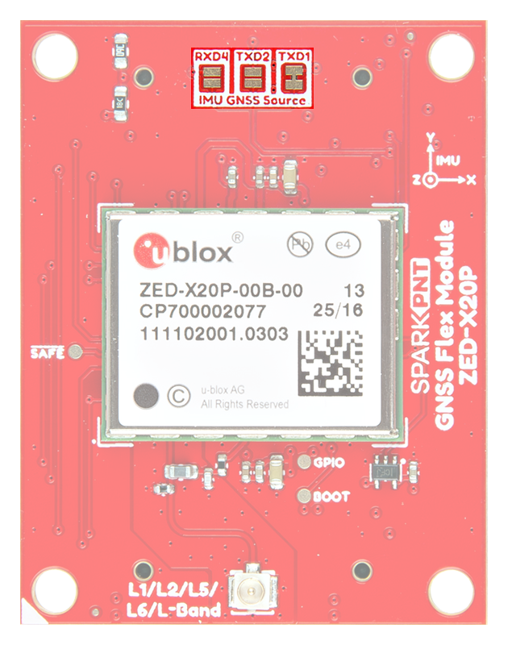{ width="400" }](./assets/img/hookup_guide/jumpers.png "Click to enlarge")
<figcaption markdown>The jumper on the top of the ZED-X20P GNSS Flex module.</figcaption>
</figure>

???+ note "Never modified a jumper before?"
	Check out our <a href="https://learn.sparkfun.com/tutorials/664">Jumper Pads and PCB Traces tutorial</a> for a quick introduction!

	<article class="grid cards" markdown align="center">

	-   <a href="https://learn.sparkfun.com/tutorials/664">
		<figure markdown>
		
		</figure>

		---

		**How to Work with Jumper Pads and PCB Traces**</a>

	</article>

