<article style="text-align: center;" markdown>
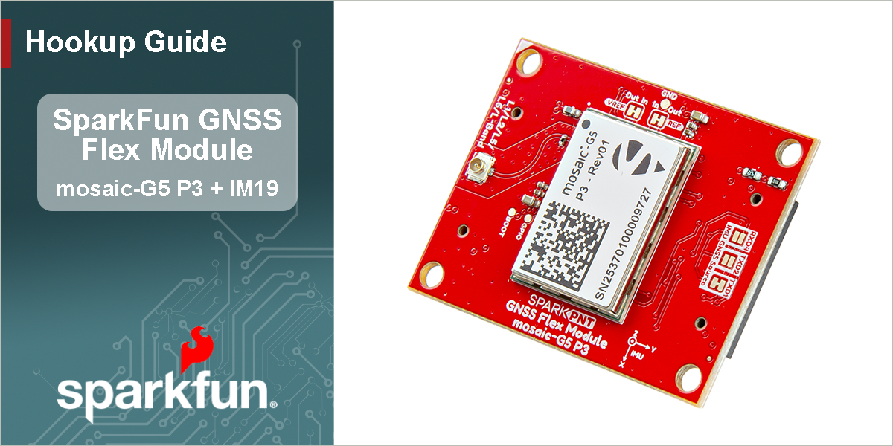{ width="650px" }
</article>

!!! danger "Important: Read Before Use!"
	!!! warning "ESD Sensitivity"
		The mosaic-G5 P3 GNSS receiver is sensitive to [ESD](https://en.wikipedia.org/wiki/Electrostatic_discharge "Electrostatic Discharge"). Use a proper grounding system to make sure that the working surface and the components are at the same electric potential.

		??? info "ESD Precaution"
			As recommended by the manufacturer, we highly recommend that users take the necessary precautions to avoid damaging their module. For example, users can utilize the [iFixit Anti-Static Wrist Strap](https://www.sparkfun.com/ifixit-anti-static-wrist-strap.html).

			<article class="video-500px" style="text-align: center; margin: auto;" markdown>
			{ .qr width="85px" }
			<iframe src="https://www.youtube.com/embed/hrL5J6Q5gX8?si=jOPBat8rzMnL7Uz4&amp;start=26;&amp;end=35;" title="Septentrio: Getting Started Video (playback starts at ESD warning)" frameborder="0" allow="accelerometer; autoplay; clipboard-write; encrypted-media; gyroscope; picture-in-picture" allowfullscreen></iframe>
			</article>

	!!! warning "Active Antenna"
		Never inject an external DC voltage into the GNSS antenna, as it may damage the mosaic-G5 P3 GNSS receiver. For instance, when using a splitter to distribute the antenna signal to several GNSS receivers, make sure that no more than one output of the splitter passes DC. Use [DC-blocks](https://en.wikipedia.org/wiki/DC_block) otherwise.

## Introduction

-   <a href="https://www.sparkfun.com/sparkpnt-gnss-flex-module-mosaic-g5-p3.html">
	**SparkPNT GNSS Flex Module - mosaic-G5 P3** 
	**SKU:** GPS-29209

	---

	<figure markdown>
	
	</figure></a>

	<article style="text-align: center;" markdown>
	{ .tinyqr }[Purchase from SparkFun :fontawesome-solid-cart-plus:{ .heart }](https://www.sparkfun.com/sparkpnt-gnss-flex-module-mosaic-g5-p3.html){ .md-button .md-button--primary }
	</article>

-   <a href="https://www.sparkfun.com/sparkpnt-gnss-flex-module-mosaic-g5-p3-im19-imu.html">
	**SparkPNT GNSS Flex Module - mosaic-G5 P3 & IM19 IMU** 
	**SKU:** GPS-29363

	---

	<figure markdown>
	
	</figure></a>

	<article style="text-align: center;" markdown>
	{ .tinyqr }[Purchase from SparkFun :fontawesome-solid-cart-plus:{ .heart }](https://www.sparkfun.com/sparkpnt-gnss-flex-module-mosaic-g5-p3-im19-imu.html){ .md-button .md-button--primary }
	</article>

-   SparkPNT GNSS Flex modules are plug-in boards featuring different GNSS receivers. They are designed to be easily swapped for repairs and pin-compatible for upgrades. The boards have two 2x10-pin, 2mm pitch female headers connecting to carrier boards. For the mosaic-G5 P3 GNSS receiver, these pins will break out the USB and UART (x2) interfaces, along with the PPS signals, event triggers, and GPIO using a standardized pinout. Additionally, these pins break out the two UART interfaces of the IM19 IMU.

	This SparkPNT GNSS Flex module features the [Septentrio mosaic-G5 P3](https://www.septentrio.com/en/products/gnss-receivers/gnss-receiver-modules/mosaic-x5), a 60% smaller and 40% lower power consumption variant of the mosaic-X5 GNSS receiver, making it ideal for drone and IoT applications. The receiver supports the GPS (USA), GLONASS (Russia), Beidou (China), Galileo (Europe), and QZSS (Japan) GNSS constellations, including regional systems *(i.e. SBAS)*. With its Real-Time Kinematics (RTK) capabilities, the GNSS receiver can achieve a horizontal accuracy of 6mm (~0.25in), vertical accuracy of 1cm (~0.4in), PPS timing resolution of 1.4ns (1.4 billionths of a second), and event trigger accuracy below 3ns. It also features Septentrio's unique [AIM+ technology](https://www.septentrio.com/en/learn-more/advanced-positioning-technology/aim-jamming-protection) for interference mitigation and anti-spoofing, ensuring best-in-class reliability and scalable position accuracy. Users can control and configure the GNSS receiver through a command-line interface (CLI) using the Septentrio Binary Format (SBF), NMEA, and RTCM v3.x protocols. Otherwise, users can also configure the GNSS receiver with Septentrio's [RxTools software application](https://www.septentrio.com/en/products/gps-gnss-receiver-software/rxtools).

	!!! info "Tilt Compensation"
		The IM19 attitude module from Feyman (FMI) fuses MEMS IMU sensor data and GNSS RTK positioning to deliver high-precision attitude compensated measurements, with roll and pitch accurate to within 0.05 degrees. This kind of superb accuracy has widespread uses in industrial applications such as tilt RTK surveys (where RTK poles need not be held straight vertical as the IM19 can calculate a virtual digital level at any tilt angle), agriculture machine automation, and dead reckoning.

		When configured, fed with the mosaic-G5 P3 Pulse-Per-Second signal and NMEA GGA, RMC, and GST messages; once calibrated, the IM19 will output proprietary NMEA messages containing the compensated position and roll, pitch and yaw. By default, the mosaic-G5 P3 `COM4` `TX` is linked to the IM19 `UART2` `RX` to carry the required NMEA messages. However, this can be changed via jumper links on the Flex Module, if necessary.

??? question "Product Comparison: GNSS Products"
	Below is a simple comparison table between our mosaic-X5 and mosaic-G5 GNSS products; and Septentrio's development and evaluation kits:

	

	<table markdown>
	<tr markdown>
		<td markdown></td>
		<th markdown style="text-align:center">
			mosaic-X5 Development Kit 
			

			<figure markdown>
			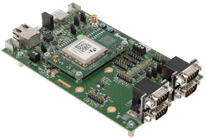{ width="200" }
			</figure>
		</th>
		<th markdown style="text-align:center">
			mosaic-go X5 Evaluation Kit 
			

			<figure markdown>
			{ width="200" }
			</figure>
		</th>
		<th markdown style="text-align:center">
			mosaic-go G5 Evaluation Kit 
			

			<figure markdown>
			{ width="200" }
			</figure>
		</th>
		<th markdown style="text-align:center">
			mosaic-X5 GNSS Breakout 
			

			<figure markdown>
			{ width="200" }
			</figure>
		</th>
		<th markdown style="text-align:center">
			RTK mosaic-X5 
			

			<figure markdown>
			{ width="200" }
			</figure>
		</th>
		<th markdown style="text-align:center">
			SparkPNT RTK Facet mosaic 
			

			<figure markdown>
			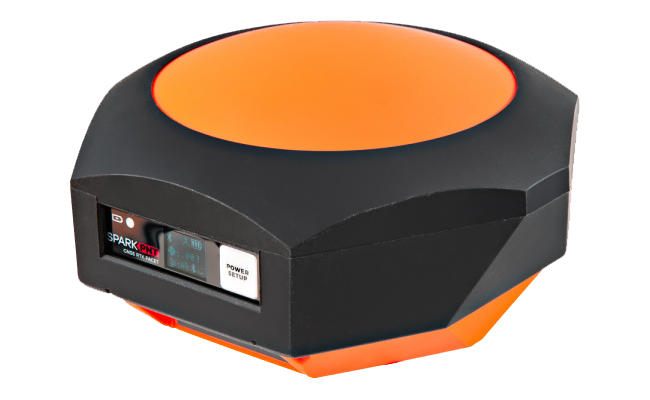{ width="200" }
			</figure>
		</th>
		<th markdown style="text-align:center">
			mosaic-G5 P3 GNSS Breakout 
			

			<figure markdown>
			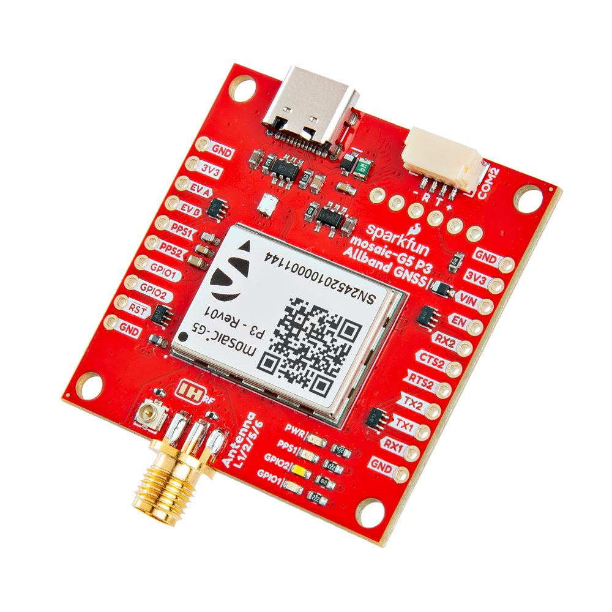{ width="200" }
			</figure>
		</th>
		<th markdown style="text-align:center">
			mosaic-X5 Flex Module 
			

			<figure markdown>
			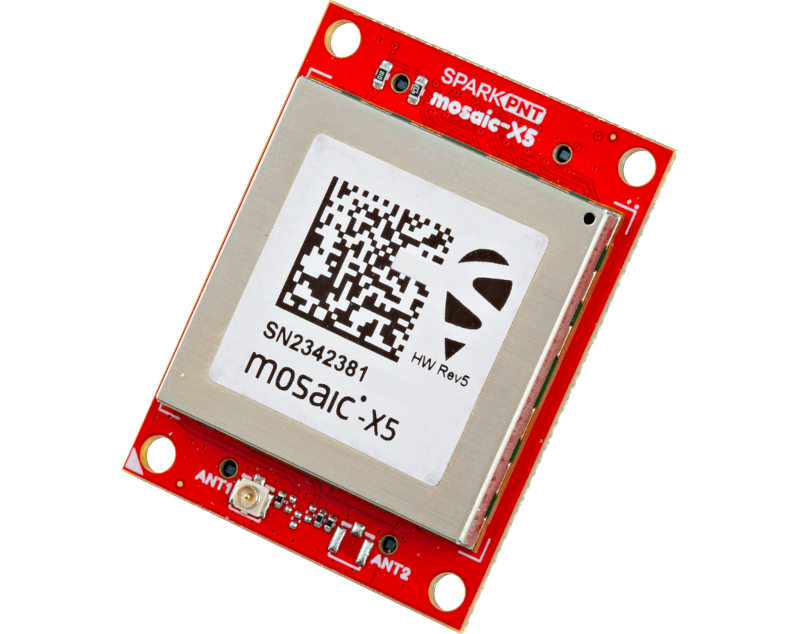{ width="200" }
			</figure>
		</th>
		<th markdown style="text-align:center">
			mosaic-X5 +IM19 Flex Module 
			

			<figure markdown>
			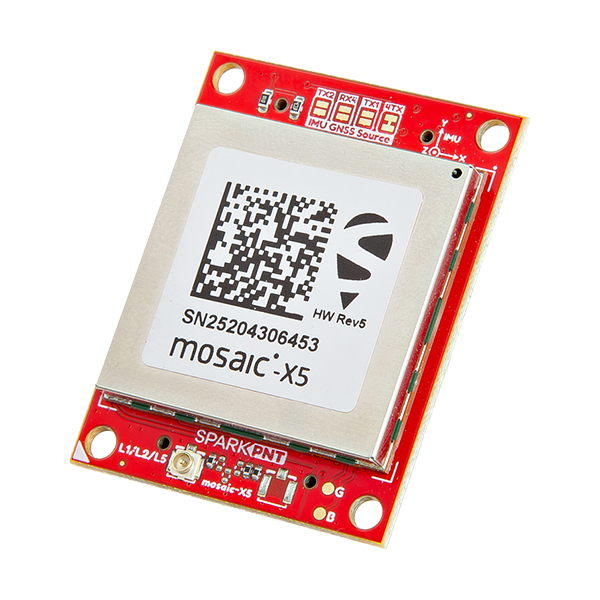{ width="200" }
			</figure>
		</th>
		<th markdown style="text-align:center">
			mosaic-G5 P3 Flex Module 
			+ IM19 IMU *(optional)* 
			

			<figure markdown>
			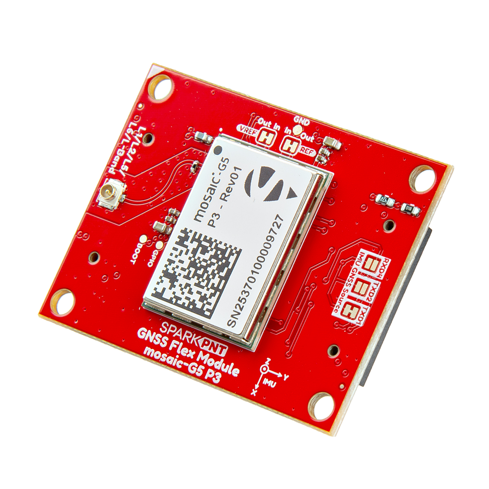{ width="200" }
			</figure>
		</th>
	</tr>
	<tr>
		<td style="vertical-align:middle;">GNSS Antenna</td>
		<td style="text-align:center; vertical-align:middle;">Dual</td>
		<td style="text-align:center">
			1 - X5 
			2 - H
		</td>
		<td style="text-align:center">
			2 - G5 P3* 
			2 - G5 T* 
			2 - G5 P3H
		</td>
		<td style="text-align:center; vertical-align:middle;">1</td>
		<td style="text-align:center; vertical-align:middle;">1</td>
		<td style="text-align:center; vertical-align:middle;">Integrated</td>
		<td style="text-align:center; vertical-align:middle;">1</td>
		<td style="text-align:center; vertical-align:middle;">1*</td>
		<td style="text-align:center; vertical-align:middle;">1*</td>
		<td style="text-align:center; vertical-align:middle;">1</td>
	</tr>
	<tr>
		<td markdown>USB Connector</td>
		<td style="text-align:center">micro-B</td>
		<td style="text-align:center">micro-B</td>
		<td style="text-align:center">Type-C</td>
		<td style="text-align:center">Type-C</td>
		<td style="text-align:center">Type-C</td>
		<td style="text-align:center">Type-C</td>
		<td style="text-align:center">Type-C</td>
		<td style="text-align:center">N/A*</td>
		<td style="text-align:center">N/A*</td>
		<td style="text-align:center">N/A*</td>
	</tr>
	<tr>
		<td style="vertical-align:middle;">Ethernet</td>
		<td style="text-align:center">Yes</td>
		<td style="text-align:center">No</td>
		<td style="text-align:center">No</td>
		<td style="text-align:center">No</td>
		<td style="text-align:center">Yes</td>
		<td style="text-align:center">No</td>
		<td style="text-align:center">No</td>
		<td style="text-align:center">2x10 Header*</td>
		<td style="text-align:center">No</td>
		<td style="text-align:center">No</td>
	</tr>
	<tr>
		<td style="vertical-align:middle;">WiFi</td>
		<td style="text-align:center">No</td>
		<td style="text-align:center">No</td>
		<td style="text-align:center">No</td>
		<td style="text-align:center">No</td>
		<td style="text-align:center">Yes</td>
		<td style="text-align:center">Yes</td>
		<td style="text-align:center">No</td>
		<td style="text-align:center">No</td>
		<td style="text-align:center">No</td>
		<td style="text-align:center">No</td>
	</tr>
	<tr>
		<td style="vertical-align:middle;">COM Ports</td>
		<td style="text-align:center">4</td>
		<td style="text-align:center">2</td>
		<td style="text-align:center">2</td>
		<td style="text-align:center">4</td>
		<td style="text-align:center">
			1 - mosaic-X5 
			1 - ESP32
		</td>
		<td style="text-align:center">
			1 - mosaic-X5 
			1 - ESP32
		</td>
		<td style="text-align:center">2</td>
		<td style="text-align:center">4</td>
		<td style="text-align:center">
			2 - mosaic-X5 
			2 - IM19 IMU
		</td>
		<td style="text-align:center">
			2 - mosaic-G5 
			2 - IM19 IMU*
		</td>
	</tr>
	<tr>
		<td markdown>&micro;SD Card Slot</td>
		<td style="text-align:center">Yes</td>
		<td style="text-align:center">Yes</td>
		<td style="text-align:center">Yes*</td>
		<td style="text-align:center">Yes</td>
		<td style="text-align:center">Yes</td>
		<td style="text-align:center">Yes</td>
		<td style="text-align:center">No</td>
		<td style="text-align:center">2x10 Header*</td>
		<td style="text-align:center">2x10 Header*</td>
		<td style="text-align:center">No</td>
	</tr>
	<tr>
		<td style="vertical-align:middle;">Reset/Log Buttons</td>
		<td style="text-align:center; vertical-align:middle;">Yes</td>
		<td style="text-align:center; vertical-align:middle;">No*</td>
		<td style="text-align:center; vertical-align:middle;">No*</td>
		<td style="text-align:center; vertical-align:middle;">Yes</td>
		<td style="text-align:center; vertical-align:middle;">Yes</td>
		<td style="text-align:center; vertical-align:middle;">Yes</td>
		<td style="text-align:center; vertical-align:middle;">No</td>
		<td style="text-align:center; vertical-align:middle;">No</td>
		<td style="text-align:center; vertical-align:middle;">No</td>
		<td style="text-align:center; vertical-align:middle;">No</td>
	</tr>
	<tr>
		<td style="vertical-align:middle;">Logic-Level</td>
		<td style="text-align:center">
			1.8V 
			3.3V
		</td>
		<td style="text-align:center; vertical-align:middle;">3.3V</td>
		<td style="text-align:center; vertical-align:middle;">3.3V</td>
		<td style="text-align:center; vertical-align:middle;">3.3V</td>
		<td style="text-align:center">
			3.3V 
			5V
		</td>
		<td style="text-align:center; vertical-align:middle;">3.3V</td>
		<td style="text-align:center; vertical-align:middle;">3.3V</td>
		<td style="text-align:center; vertical-align:middle;">3.3V</td>
		<td style="text-align:center; vertical-align:middle;">3.3V</td>
		<td style="text-align:center; vertical-align:middle;">3.3V</td>
	</tr>
	<tr>
		<td markdown>PPS Signal</td>
		<td style="text-align:center">Header Pin</td>
		<td style="text-align:center">6-Pin JST Connector</td>
		<td style="text-align:center">Header Pin</td>
		<td style="text-align:center">SMA Connector</td>
		<td style="text-align:center">Screw Terminal</td>
		<td style="text-align:center">No</td>
		<td style="text-align:center">Header Pin</td>
		<td style="text-align:center">2x10 Header*</td>
		<td style="text-align:center">2x10 Header*</td>
		<td style="text-align:center">2x10 Header*</td>
	</tr>
	<tr>
		<td markdown>Enclosure Material</td>
		<td style="text-align:center; vertical-align:middle;">N/A</td>
		<td style="text-align:center; vertical-align:middle;">Metal</td>
		<td style="text-align:center; vertical-align:middle;">Metal</td>
		<td style="text-align:center; vertical-align:middle;">N/A</td>
		<td style="text-align:center; vertical-align:middle;">Aluminum</td>
		<td style="text-align:center; vertical-align:middle;">Plastic</td>
		<td style="text-align:center; vertical-align:middle;">N/A</td>
		<td style="text-align:center; vertical-align:middle;">N/A</td>
		<td style="text-align:center; vertical-align:middle;">N/A</td>
		<td style="text-align:center; vertical-align:middle;">N/A</td>
	</tr>
	<tr>
		<td style="vertical-align:middle;">Dimensions</td>
		<td style="text-align:center; vertical-align:middle;">N/A</td>
		<td style="text-align:center; vertical-align:middle;">71.0 x 59.0 x 12.0mm ± 1mm</td>
		<td style="text-align:center; vertical-align:middle;">74.0 x 44.0 x 11.4mm</td>
		<td style="text-align:center; vertical-align:middle;">70.9 x 50.8 x 8mm</td>
		<td style="text-align:center">
			180.6 x 101.8 x 41mm 
			<i>Enclosure Only</i>
		</td>
		<td style="text-align:center; vertical-align:middle;"></td>
		<td style="text-align:center; vertical-align:middle;">43.2 x 43.2 x 8mm</td>
		<td style="text-align:center; vertical-align:middle;">44.0 x 34.0 x 10.4mm</td>
		<td style="text-align:center; vertical-align:middle;">44.0 x 34.0 x 10.4mm</td>
		<td style="text-align:center; vertical-align:middle;">44.0 x 34.0 x 8.5mm</td>
	</tr>
	<tr>
		<td style="vertical-align:middle;">Weight</td>
		<td style="text-align:center; vertical-align:middle;">N/A</td>
		<td style="text-align:center; vertical-align:middle;">58g  ± 1g</td>
		<td style="text-align:center; vertical-align:middle;">50g</td>
		<td style="text-align:center; vertical-align:middle;">22.60g</td>
		<td style="text-align:center; vertical-align:middle;">
			415.15g 
			<i>Enclosure Only</i>
		</td>
		<td style="text-align:center; vertical-align:middle;"></td>
		<td style="text-align:center; vertical-align:middle;">11.15g</td>
		<td style="text-align:center; vertical-align:middle;">14.00g</td>
		<td style="text-align:center; vertical-align:middle;">15.25g</td>
		<td style="text-align:center; vertical-align:middle;">
			- IMU: 9.20g 
			+ IMU: 10.95g
		</td>
	</tr>

	</table>

	

	!!! note "mosaic-go Evaluation Kits"
		- For the mosaic-X5 and mosaic-H, the reset pin is exposed on 4-pin JST connector and the log pin is connected to the latch pin of the SD card slot.
		- For the mosaic-G5 P3/T/H, the reset pin is exposed on a header pin. There is no log pin, data logging must be enabled through a command set. Logging to internal disk (`DSK1`) is only for debugging purposes, feature is prone to [data gaps during operation](https://customersupport.septentrio.com/s/article/mosaic-G5-logging-data-on-G5).

	!!! note "mosaic-G5 P3 GNSS Flex Modules"
		SparkPNT GNSS Flex modules are modular, *plug-in* boards that utilize a *carrier* board to access the pins of the GNSS Flex headers.

		- The [GNSS only variant](https://www.sparkfun.com/sparkpnt-gnss-flex-module-mosaic-g5-p3.html) of the SparkPNT GNSS Flex module that only includes the mosaic-G5 P3 GNSS receiver; without populating the IM19 IMU.
		- The [IMU variant](https://www.sparkfun.com/sparkpnt-gnss-flex-module-mosaic-g5-p3-im19-imu.html) of the SparkPNT GNSS Flex module includes the IM19 IMU for RTK tilt-compensation applications with the mosaic-G5 P3.

## Design Files

<!-- Import the component -->

-   :kicad-primary:{ .enlarge-logo } Design Files

	---

	- :fontawesome-solid-file-pdf: [Schematic](./assets/board_files/schematic.pdf)
	- :material-folder-zip: [KiCad Files](./assets/board_files/kicad_files.zip)
	- :material-rotate-3d: [STEP File](./assets/3d_model/cad_model.step)
	- :fontawesome-solid-file-pdf: [Board Dimensions](./assets/board_files/dimensions.pdf):
		- 1.75" x 1.25" (44.45mm x 31.75mm)

-   <!-- Boxes in tabs -->

	=== "3D Model"
		<article style="text-align: center;" markdown>
		<model-viewer src="../assets/3d_model/web_model.glb" camera-controls poster="../assets/3d_model/poster.png" tone-mapping="neutral" shadow-intensity="2" shadow-softness="0.2" camera-orbit="0deg 75deg 0.103m" field-of-view="25.11deg" style="width: 100%; height: 450px;">
		</model-viewer>

		[Download the `*.step` File](./assets/3d_model/cad_model.step "Click to download"){ .md-button .md-button--primary width="250px" }

		</article>

		???+ tip "Manipulate 3D Model"
			<article style="text-align: center;" markdown>

			| Controls       | Mouse                    | Touchscreen    |
			| :------------- | :----------------------: | :------------: |
			| Zoom           | Scroll Wheel             | 2-Finger Pinch |
			| Rotate         | ++"Left-Click"++ & Drag  | 1-Finger Drag  |
			| Move/Translate | ++"Right-Click"++ & Drag | 2-Finger Drag  |

			</article>

	=== "Dimensions"
		<article style="text-align: center;" markdown>
		[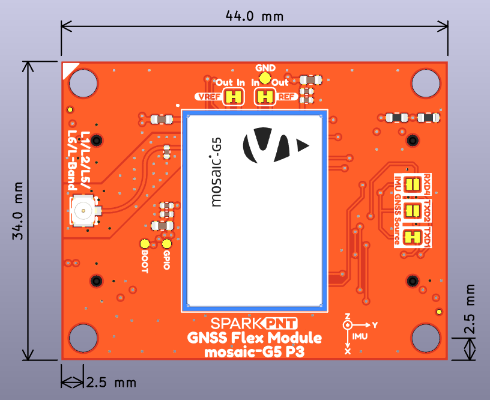{ width="450" }](./assets/board_files/dimensions.png "Click to enlarge")
		<figcaption markdown>Dimensions of the mosaic-G5 P3 GNSS breakout board.</figcaption>
		</article>

		???+ tip "Need more measurements?"
			For more information about the board's dimensions, users can download the [KiCad files](./assets/board_files/kicad_files.zip) for this board. These files can be opened in KiCad and additional measurements can be made with the measuring tool.

			!!! info ":octicons-download-16:{ .heart } KiCad - Free Download!"
				KiCad is free, open-source [CAD]("computer-aided design") program for electronics. Click on the button below to download their software. *(\*Users can find out more information about KiCad from their [website](https://www.kicad.org/).)*

				<article style="text-align: center;" markdown>
				[Download :kicad-primary:{ .enlarge-logo }](https://www.kicad.org/download/ "Go to downloads page"){ .md-button .md-button--primary width="250px" }
				</article>

			???+ info ":straight_ruler: Measuring Tool"
				This video demonstrates how to utilize the dimensions tool in KiCad, to include additional measurements:

				<article class="video-500px" style="text-align: center; margin: auto;" markdown>
				<iframe src="https://www.youtube.com/embed/-eXuD8pkCYw" title="KiCad Dimension Tool" frameborder="0" allow="accelerometer; autoplay; clipboard-write; encrypted-media; gyroscope; picture-in-picture" allowfullscreen></iframe>
				{ .qr width="85" }
				</article>

## Board Layout
The GNSS Flex system is designed around two 2x10-pin, 2mm pitch headers used to mate the two types of boards. A standardized pin layout, keeps the ecosystem pin-compatible for upgrades and allows boards to be easily swapped for repairs. Depending on the capabilities of the GNSS receiver, these pins will breakout the USB, UART (x4), I^2^C, and SD card interfaces along with any PPS or event signals of the GNSS receiver.

The mosaic-G5 P3 Flex module has the following features:

<figure markdown>
[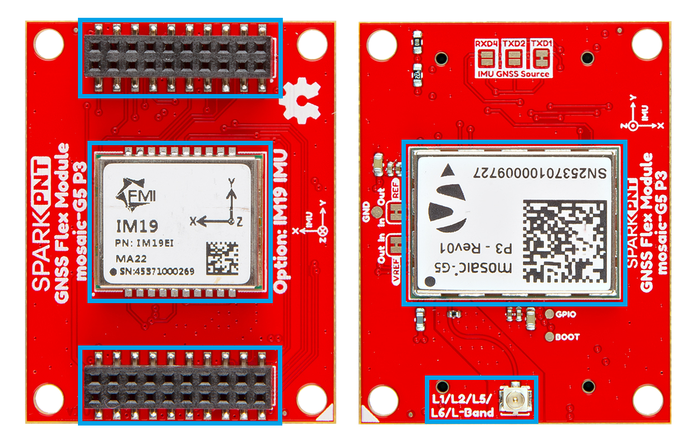{ width="750" }](./assets/img/hookup_guide/layout.png "Click to enlarge")
<figcaption markdown>Layout of the major components on the mosaic-G5 P3 GNSS Flex module.</figcaption>
</figure>

1. **[mosaic-G5 P3 GNSS Receiver](#mosaic-g5-p3)**
:   The Septentrio mosaic-G5 P3 GNSS receiver
1. **[GNSS Flex Headers](#gnss-flex-headers)**
:   Two sets of 2x10 pin, 2mm pitch female headers for connecting a GNSS Flex module to *carrier boards*
1. **[IM19 IMU](#im19-imu-optional)** *(optional)*
:   An optional Feyman IM19 attitude module to provide tilt compensation in surveying applications
1. **[`L1/L2/L5/L6/L-Band` U.FL Connector](#ufl-connector)**
:   An U.FL connector for attaching an external GNSS antenna

## :fontawesome-solid-microchip:&nbsp; mosaic-G5 P3
The centerpiece of the mosaic-G5 P3 GNSS Flex module, is the [mosaic-G5 P3 GNSS receiver](./assets/component_documentation/mosaic-g5_hardware_manual_v1.1.1.pdf) from [Septentrio](https://www.septentrio.com/en). Their mosaic-G5 P3 modules are low-power, multi-band, multi-constellation GNSS receivers capable of delivering centimeter-level precision in a small form factor without compromising on performance. They provide strong positioning reliability in challenging environments and are tailored for applications such as delivery or light show drones. It also features Septentrio's unique [AIM+ technology](https://www.septentrio.com/en/learn-more/advanced-positioning-technology/aim-resilient-and-secure-gnss/gps-receivers) for interference mitigation and anti-spoofing, which ensures their best-in-class reliability and scalable position accuracy.

<article class="video-500px" style="margin: auto;" markdown>
<iframe src="https://www.youtube.com/embed/3VzVxTTvF5Q" title="Septentrio mosaic range: high-accuracy GNSS receivers for drones &amp; robotics" frameborder="0" allow="accelerometer; autoplay; clipboard-write; encrypted-media; gyroscope; picture-in-picture" allowfullscreen></iframe>
{ .qr }
</article>

-   <figure markdown>
	[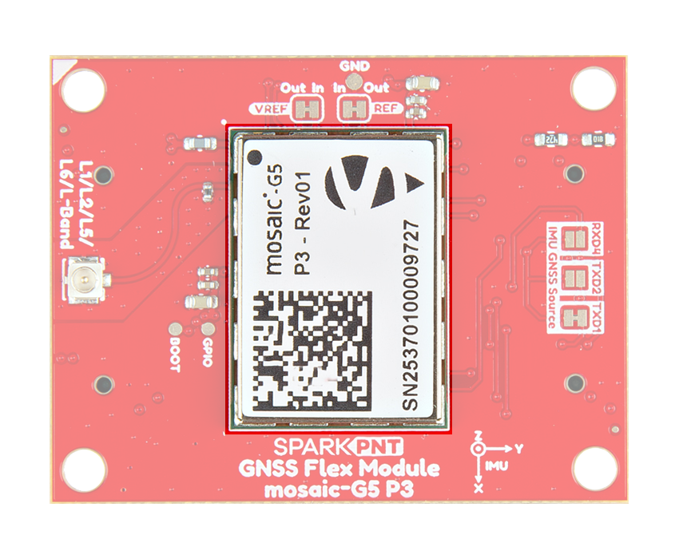{ width="400" }](./assets/img/hookup_guide/mosaic-G5_P3.png "Click to enlarge")
	<figcaption markdown>The mosaic-G5 P3 GNSS receiver on the mosaic-G5 P3 GNSS Flex module.</figcaption>
	</figure>

**Features:**

- Operating Voltage: **3.135 - 3.465V**
- GNSS Support
	- GPS: `L1C/A`, `L1C`, `L2C`, `L2PY`, `L5`
	- GLONASS: `L1CA`, `L2CA`, `L2P`, `L3 CDMA`
	- Beidou: `B1I`, `B1C`, `B2a`, `B2b`, `B2I`, `B3I`
	- Galileo: `E1`, `E5a`, `E5b`, `E6`
	- QZSS: `L1C/A`, `L1 C/B`, `L2C`, `L5`, `L6`
- Time to Fix
	- Cold Start: < 35s
	- Warm: < 10s
	- Reacquisition: 1s
- Position Accuracy
	<article style="text-align: center;" markdown>

	| Correction | Horizontal                             | Vertical                     |
	| :--------- | :------------------------------------: | :--------------------------: |
	| RTK        | **0.6cm** *(&plusmn;0.5ppm)* ~0.25" | 1cm *(&plusmn;1ppm)* ~.4" |
	| DGNSS      | 40cm ~1.3'                          | 70cm ~2.3'                |
	| Standalone | 1.2m ~4'                            | 1.9m ~6.2'                |

	</article>

 

- Update Rate: 20Hz
- Latency: < 10ms
- Event Accuracy: < 3ns
- Interfaces:
	- UART (x2)
	- USB device (2.0, HS)
	- GPIO user programmable (x2)
	- Event markers (x2)
	- Configurable PPS out (x2)
- Protocols:
	- Septentrio Binary Format (SBF)
	- NMEA 0183, v2.3, v3.03, V4.0
	- RTCM v3.x (MSM included)
- Antenna Specifications
	- Preamplification Range: 15-50dB
	- Bias Voltage: 3.0 - 5.5V
	- 789 Hardware Channels
- Operating Temperature: -40 - 85&deg;C
- Package Size: 16.4mm x 22.8mm x 2.4mm
- Weight: 2.2g

!!! tip
	The capabilities of each receiver is defined by a the optional features that are enabled. The capabilities of the receiver depend on a combination of the hardware model and version, the firmware version, and the set of permissions enabled for the optional features. Permissions are further explained in **Section 1.17** of the [firmware manual](./assets/component_documentation/firmware/v1.0.1/mosaic-G5%20Firmware%20v1.0.1%20Reference%20Guide.pdf). The command `getReceiverCapabilities` will list the receiver's capabilities. Otherwise, using RxControl (go to **Help** > **Receiver Interface** > **Permitted Capabilities**).

### Power Consumption
The power consumption of the mosaic-G5 P3 GNSS receiver depends on the GNSS signals enabled and the positioning mode. The table below, lists the average power consumption for common configurations. The current listed, is based on a supply voltage of 3.3V.

<article style="text-align: center;" markdown>

| GNSS Signals | Power (mW) | Current (mA) |
| :----------- | :--------: | :----------: |
| GPS/GLONASS L1/L2 | 440 | 133 |
| All signals from all GNSS constellations | 570 | 173 |
| All signals from all GNSS constellations +L-band | 670 | 203 |

*Source: [mosaic-G5 P3 Hardware Manual](./assets/component_documentation/mosaic-g5_hardware_manual_v1.1.1.pdf)*
</article>

### Frequency Bands
The mosaic GNSS receivers are multi-band, multi-constellation GNSS receivers. Below, are charts illustrating the frequency bands utilized by all the global navigation satellite systems and the ones supported by the mosaic-G5 P3 GNSS receiver.

<figure markdown>
[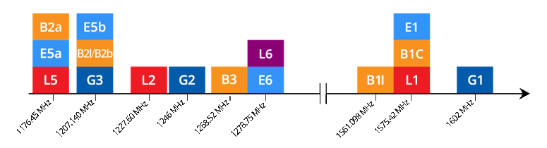{ width="650" }](./assets/img/hookup_guide/frequency_bands.png "Click to enlarge")
<figcaption markdown>The frequency bands supported by the mosaic-G5 P3 GNSS receiver.</figcaption>
</figure>

<figure markdown>
[{  width="800" style="background-color: rgba(255, 255, 255, 0.85); padding: 5px;" }](https://www.tallysman.com/app/uploads/2021/07/Tallysman-GNSS-Frequencies-v8.0_Chart-1-1024x425.png "Click to enlarge")
<figcaption markdown>Frequency bands of the global navigation satellite systems. (Source: [Tallysman](https://www.tallysman.com/gnss-constellations-radio-frequencies-and-signals/))</figcaption>
</figure>

!!! info
	For a comparison of the frequency bands supported by the mosaic GNSS receivers, refer to section **3.1** of the [hardware manual](./assets/component_documentation/mosaic-g5_hardware_manual_v1.1.1.pdf).

	??? info "What are Frequency Bands?"
		A [frequency band](https://en.wikipedia.org/wiki/Frequency_band) is a section of the [electromagnetic spectrum](https://en.wikipedia.org/wiki/Electromagnetic_spectrum), usually denoted by the range of its upper and lower limits. In the [radio spectrum](https://en.wikipedia.org/wiki/Radio_spectrum), these frequency bands are usually regulated by region, often through a government entity. This regulation prevents the interference of RF communication; and often includes major penalties for any interference with critical infrastructure systems and emergency services.

		<figure markdown>
		[{ width="400" }](https://gssc.esa.int/navipedia/images/c/cf/GNSS_All_Signals.png "Click to enlarge")
		<figcaption markdown>Frequency bands of the global navigation satellite systems. (Source: [ESA](https://gssc.esa.int/navipedia/index.php?title=File:GNSS_All_Signals.png "European Space Agency"))</figcaption>
		</figure>

		However, if the various GNSS constellations share similar frequency bands, then how do they avoid interfering with one another? Without going too far into detail, the image above illustrates the frequency bands of each system with a few characteristics specific to their signals. Wit these characteristics in mind, along with other factors, the chart can help users to visualize how multiple GNSS constellations might co-exist with each other.

		For more information, users may find these articles of interest:

		- [GNSS signal](https://gssc.esa.int/navipedia/index.php/GNSS_signal)
		- [GPS Signal Plan](https://gssc.esa.int/navipedia/index.php?title=GPS_Signal_Plan)
		- [GLONASS Signal Plan](https://gssc.esa.int/navipedia/index.php?title=GLONASS_Signal_Plan)
		- [GALILEO Signal Plan](https://gssc.esa.int/navipedia/index.php?title=GALILEO_Signal_Plan)

### Position Accuracy

The accuracy of the position reported from the mosaic-G5 P3 GNSS receiver, can be improved based upon the correction method being employed. Currently, [RTK](https://en.wikipedia.org/wiki/Real-time_kinematic_positioning "Real-Time Kinematic") corrections provide the highest level of accuracy; however, users should be aware of certain limitations of the system:

- RTK technique requires real-time correction data from a reference station or network of base stations.
	- RTK corrections are signal specific *(i.e. an RTK network might provide corrections on only `E5b` and not `E5a`)*.
- The range of the base stations will vary based upon the RTK method being employed.
- The reliability of RTK corrections are inherently reduced in [multipath environments](https://en.wikipedia.org/wiki/Multipath_propagation). However, with Septentrio's multipath mitigation technology ([APME+](https://www.septentrio.com/en/learn-more/Advanced-positioning-technology/gnss-technology/multipath-mitigation-technology "A-Posteriori Multipath Estimation")) on the mosaic-G5 P3, these errors are significantly reduced when compared to multipath mitigation techniques that modify the correlators in the tracking channels.

<article style="text-align: center;" markdown>

| Correction                                                                                    | Horizontal                             | Vertical                     |
| :-------------------------------------------------------------------------------------------- | :------------------------------------: | :--------------------------: |
| [RTK](https://en.wikipedia.org/wiki/Real-time_kinematic_positioning "Real-Time Kinematic")    | **0.6cm** *(&plusmn;0.5ppm)* ~0.25" | 1cm *(&plusmn;1ppm)* ~.4" |
| [DGNSS](https://en.wikipedia.org/wiki/Differential_GPS "Differential GNSS")                   | 40cm ~1.3'                          | 70cm ~2.3'                |
| Standalone                                                                                    | 1.2m ~4'                            | 1.9m ~6.2'                |

</article>

??? info "RTK Corrections"
	To understand how RTK works, users will need a more fundamental understanding of the signal error sources.

	

	-   <a href="https://www.sparkfun.com/news/7533">
		<figure markdown>
		
		</figure>

		---

		**Real-Time Kinematics Explained**</a>

	-   <a href="https://www.sparkfun.com/news/7138">
		<figure markdown>
		
		</figure>

		---

		**What is Correction Data?**</a>

	-   <a href="https://www.septentrio.com/en/learn-more/insights/gnss-corrections-demystified">
		<figure markdown>
		
		</figure>

		---

		**GNSS Corrections Demystified**</a>

	

!!! tip
	For the best performance, we highly recommend that users configure the GNSS receiver to utilize/provide RTK corrections with a compatible L1/L2/L5/L6 (All-band) GNSS antenna and utilize a low-loss cable.

## IM19 IMU *(Optional)*
The other centerpiece of the GNSS Flex module is the [IM19 attitude module](../assets/component_documentation/IM19EI_v1.4.1.pdf) from [Feyman Inc.](http://feymani.com/en/), which fuses MEMS sensor and GNSS RTK positioning data to deliver high-precision attitude measurement, with roll and pitch accurate to within 0.05 degrees. This kind of superb accuracy has widespread uses in industrial applications such as tilt RTK surveys (where RTK poles need not be held straight vertical as the IM19 can calculate a virtual digital level at any tilt angle), agriculture machine automation, and dead reckoning.

When configured, fed with the Pulse-Per-Second signal and NMEA GGA, RMC, and GST messages from the GNSS receiver; once calibrated, the IM19 will output proprietary NMEA messages containing the compensated position and roll, pitch and yaw. By default, the mosaic-G5 P3 `UART1` `TX` pin is linked to the IM19 `UART2` `RX` pin to carry the required NMEA messages. However, this can be changed via [jumpers](#jumpers) on the Flex Module, if necessary.

<article class="video-500px" style="text-align: center; margin: auto;" markdown>
<iframe src="https://global.feymani.com/files/im19.mp4" type="video/mp4" title="Feyman Inc - Product Intro for IM19 Module" frameborder="0" allow="accelerometer; clipboard-write; encrypted-media; gyroscope; picture-in-picture" allowfullscreen></iframe>
</article>

-   <figure markdown>
	[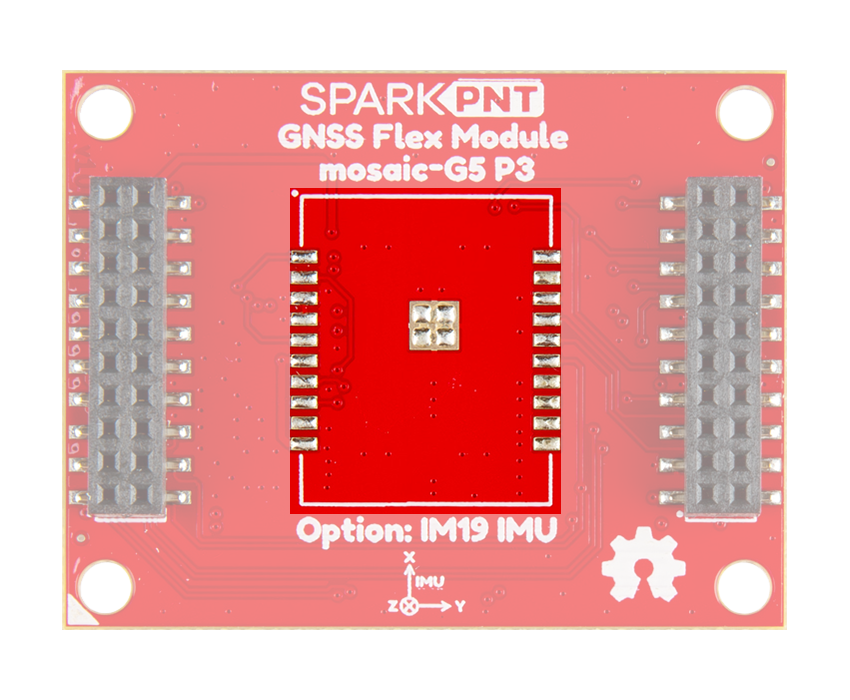{ width="300" }](./assets/img/hookup_guide/no_im19.png "Click to enlarge")
	<figcaption markdown>Without the IM19 attitude module populated on the mosaic-G5 P3 GNSS Flex module.</figcaption>
	</figure>

-   <figure markdown>
	[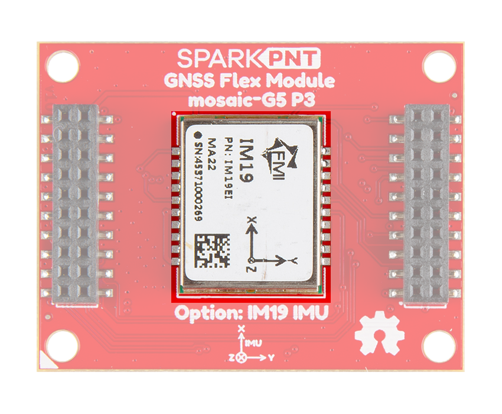{ width="300" }](./assets/img/hookup_guide/im19.png "Click to enlarge")
	<figcaption markdown>The IM19 attitude module populated on the mosaic-G5 P3 & IM19 GNSS Flex module.</figcaption>
	</figure>

**Features:**

- Power: 0.33W
- Data Rate: 100Hz
- IMU Accuracy: &le;1% * D（1&sigma;, vehicle)
- Gyroscope
	- ARW: 0.17&deg;/&radic;(h)
	- Bias Stability: &plusmn;4.5&deg;/h
	- Range: &plusmn;1000&deg;/s

 

- Accelerometer
	- Speed RW: 0.04m/s/&radic;(h)
	- Bias Stability: &plusmn;0.3mg
	- Range: &plusmn;16g
- Roll and Pitch: &le;0.02&deg;（1&sigma;）
- Heading/Yaw: &le;0.2&deg;（1&sigma;）
- Initialization: 1s (95%)
- Self-calibration Technique

!!! info
	Please refer to the hookup guide linked below, for the operation of the IM19 attitude module in tilt-compensation applications:

	<article style="text-align: center;" markdown>
	[IM19 Hookup Guide - Tilt Compensation](../im19.md "Click to navigate"){ .md-button .md-button--primary }
	</article>

### Position Accuracy
When configured and calibrated, the IM19 attitude module can fuses its IMU sensor data with the received GNSS RTK positioning data to deliver a tilt compensated position.

<article style="text-align: center;" markdown>

| Tilt Angle       | Accuracy |
| :--------------: | :------: |
| 0&deg; - 30&deg; | 1cm      |
| <60&deg;         | 2cm      |

</article>

??? warning "mosaic-G5 P3 GNSS receiver"
	The accuracy of the position reported from the mosaic-G5 P3 GNSS receiver, can be improved based upon the correction method being employed. Currently, [RTK](https://en.wikipedia.org/wiki/Real-time_kinematic_positioning "Real-Time Kinematic") corrections provide the highest level of accuracy. Its accuracy, displayed in the table below, should also be considered when implemented.

	<article style="text-align: center;" markdown>

	| Correction                                                                                    | Horizontal                             | Vertical                     |
	| :-------------------------------------------------------------------------------------------- | :------------------------------------: | :--------------------------: |
	| [RTK](https://en.wikipedia.org/wiki/Real-time_kinematic_positioning "Real-Time Kinematic")    | **0.6cm** *(&plusmn;0.5ppm)* ~0.25" | 1cm *(&plusmn;1ppm)* ~.4" |
	| [DGNSS](https://en.wikipedia.org/wiki/Differential_GPS "Differential GNSS")                   | 40cm ~1.3'                          | 70cm ~2.3'                |
	| Standalone                                                                                    | 1.2m ~4'                            | 1.9m ~6.2'                |

	</article>

## GNSS Flex Headers
The GNSS Flex system is designed around two 2x10-pin, 2mm pitch headers used mate the two types of boards. A standardized pin layout, keeps the ecosystem pin-compatible for upgrades and allows boards to be easily swapped for repairs. For the mosaic-G5 P3 GNSS receiver, these pins will breakout the USB and UART (x2) interfaces along with two configurable PPS signals, two event signals, and two GPIO from the GNSS receiver.

<!-- Redundant
<figure markdown>
[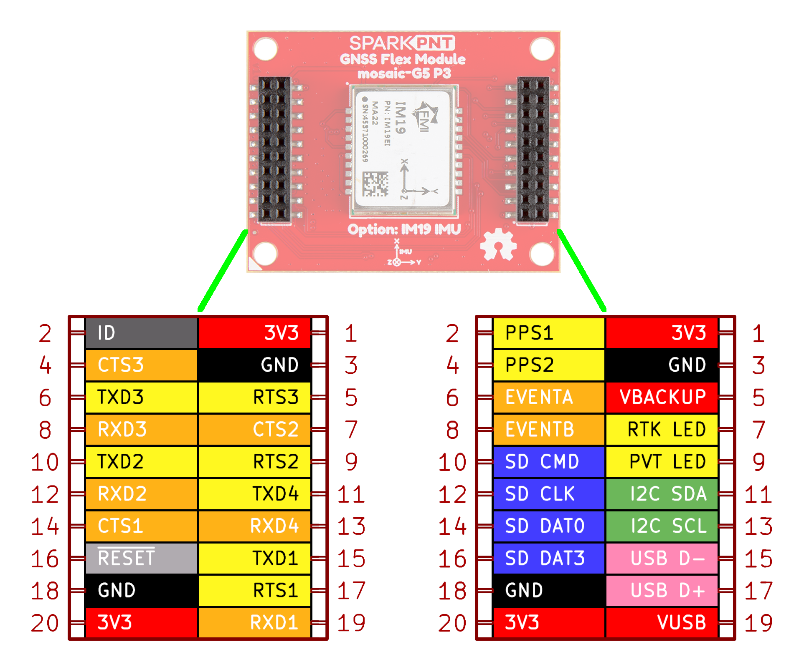{ width="400" }](./assets/img/hookup_guide/pinout-full.png "Click to enlarge")
<figcaption markdown>The peripherals and I/O pins on the mosaic-G5 P3 & IM19 GNSS Flex module.</figcaption>
</figure>
 -->

<figure markdown>
[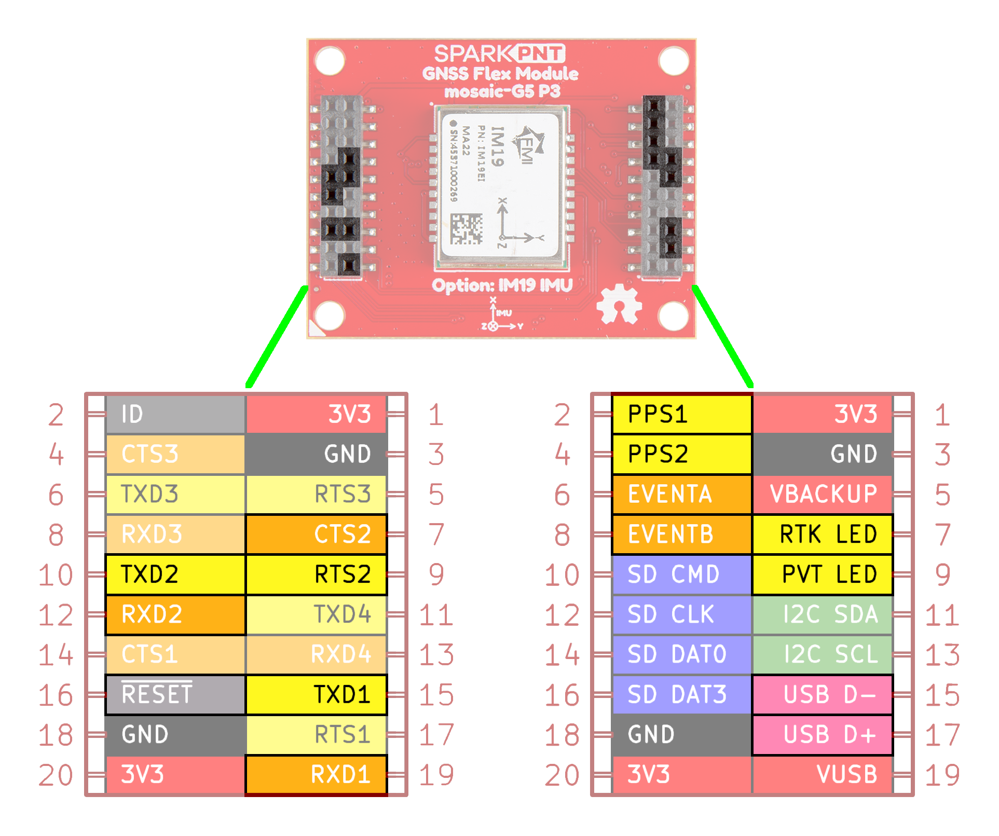{ width="400" }](./assets/img/hookup_guide/headers-gnss.png "Click to enlarge")
<figcaption markdown>The peripherals and I/O pins for the mosaic-G5 P3 GNSS receiver.</figcaption>
</figure>

Below, are the features that are available from the mosaic-G5 P3 GNSS receiver.

<article class="annotate" markdown>

**Supported Interfaces:**

- USB device (2.0, HS)
- 2x UART (LVTTL, up to 4 Mbps) (1)
- 2x GPIO user programmable
- 2x Event markers
- 2x Configurable PPS out (2)

</article>

1. One of the two UART ports is piped to the IM19 module
1. One of the two PPS signals is amplified and piped to the IM19 module

<figure markdown>
[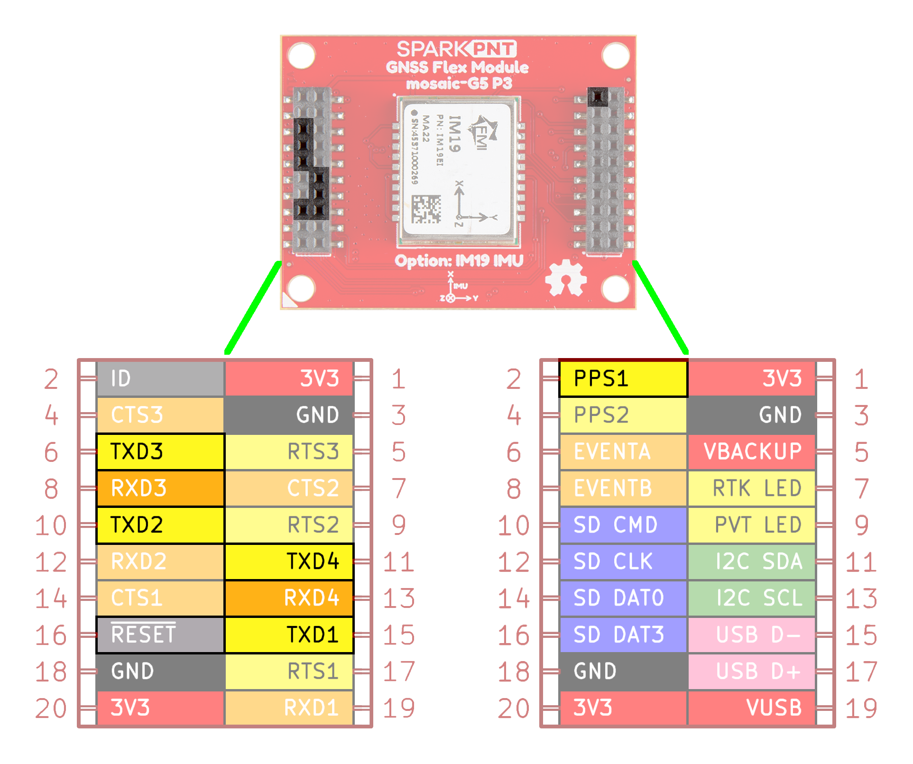{ width="400" }](./assets/img/hookup_guide/headers-im19.png "Click to enlarge")
<figcaption markdown>The peripherals and I/O pins for the IM19 attitude module.</figcaption>
</figure>

Below, are the features that are available from the IM19 attitude module.

<article class="annotate" markdown>

**Supported Interfaces:**

- UART (x2)
- Timing Signal (1)

</article>

1. The timing signal is amplified from the mosaic-G5 P3 GNSS receiver

=== "USB Interface"
	For most users, this will be the primary interface for the mosaic-G5 P3 GNSS receiver.

	<figure markdown>
	[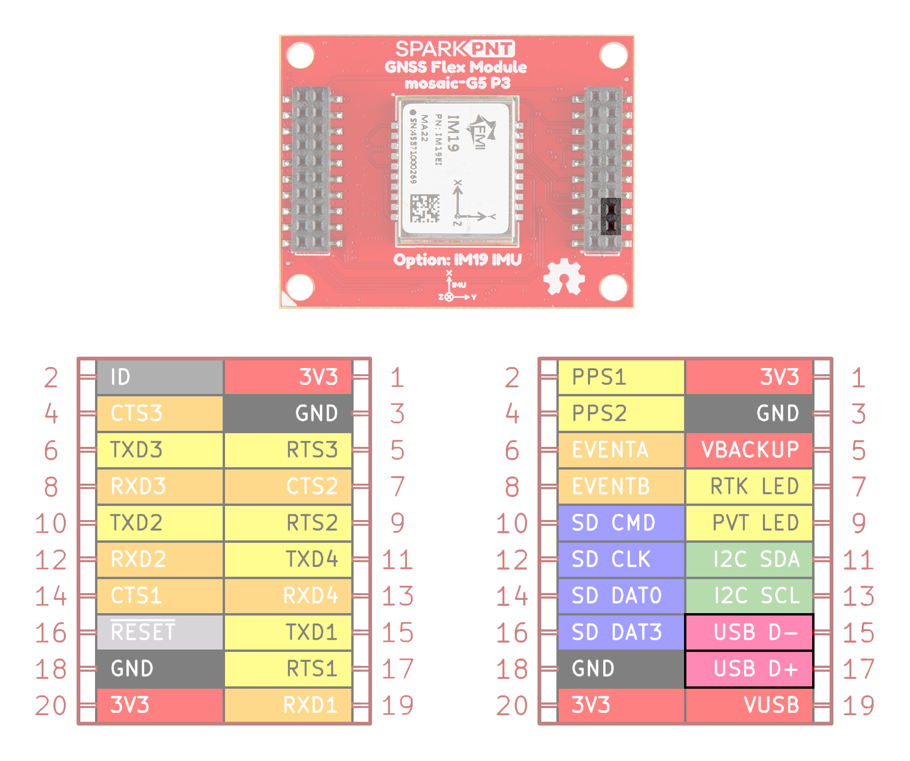{ width="400" }](./assets/img/hookup_guide/headers-usb.png "Click to enlarge")
	<figcaption markdown>USB interface on the mosaic-G5 P3 GNSS Flex module.</figcaption>
	</figure>

	!!! info
		When a GNSS receiver is initially connected to a computer, two virtual `COM` ports are emulated. These can be used as standard `COM` ports to communicate with the GNSS receiver.

=== "UART Ports"
	The headers of the GNSS Flex system supports up to four UART ports. On this GNSS Flex module, these are connected to both the GNSS receiver and IM19 attitude module as shown in the table below.

	

	

	<figure markdown>

	| mosaic-G5 P3 | IM19         | Pins of GNSS Flex Headers |
	| :----------: | :----------: | :------------ |
	| `UART1`      | ----         | `TXD1`/`RXD1` |
	| `UART2`      | ----         | `TXD2`/`RXD2` |
	| ----         | `UART1`      | `TXD3`/`RXD3` |
	| ----         | `UART2 - TX` | `TXD4`        |
	| ----         | `UART2 - RX` | `TXD1`        |

	<figcaption markdown>The default UART port connections between the mosaic-G5 P3, IM19, and GNSS Flex header pins.</figcaption>
	</figure>

	

	

	<figure markdown>
	[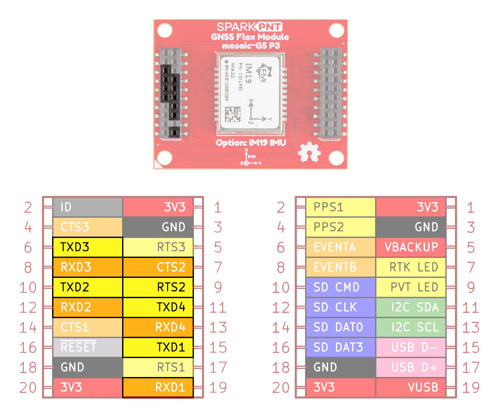{ width="400" }](./assets/img/hookup_guide/headers-uart.png "Click to enlarge")
	<figcaption markdown>The UART ports on the mosaic-G5 P3 & IM19 GNSS Flex module.</figcaption>
	</figure>

	

	

	

	

	**mosaic-G5 P3**

	---

	The mosaic-G5 P3 GNSS receiver has two UART ports, which can be operated and configured separately.

	<figure markdown>
	[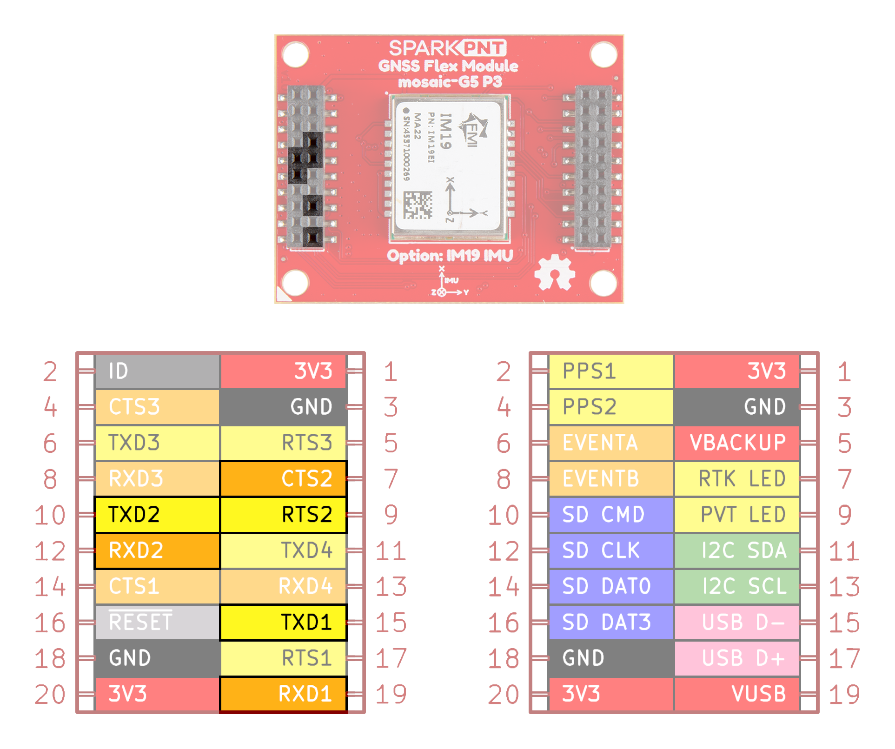{ width="400" }](./assets/img/hookup_guide/headers-uart-gnss.png "Click to enlarge")
	<figcaption markdown>The UART ports from the mosaic-G5 P3 on the GNSS Flex module.</figcaption>
	</figure>

	- The `UART1` and `UART2` ports of the mosaic-G5 P3 GNSS receiver are broken out to the headers of the GNSS Flex system, on pins `TXD1`/`RXD1` and `TXD2`/`RXD2`/`RTS2`/`CTS2` respectively.
		- These can be used to interact with the GNSS receiver.
		- Only the `UART2` port supports flow control pins, which are disabled by default.
	- By default, the `TX` pin of the `UART1` port from the mosaic-G5 P3 GNSS receiver is also piped directly to the `RX` pin of the IM19 attitude module's `UART2` port.

	!!! info "Default Configuration"
		By default, the UART ports are configured with the following settings:

		- Baudrate: **115200bps**
		- Data Bits: 8
		- Parity: No
		- Stop Bits: 1
		- Flow Control: None
		- Protocols:
			- Septentrio Binary Format (SBF)
			- NMEA 0183, v2.3, v3.03, V4.0
			- RTCM v3.x (MSM included)

	
		<article style="text-align: center;" markdown>

		| mosaic-G5 P3 | Pins of GNSS Flex Headers |
		| :-----: | :------------ |
		| `UART1` | `TXD1`/`RXD1` |
		| `UART2` | `TXD2`/`RXD2` |

		</article>

	!!! tip
		The COM port settings are set with the `setCOMSettings` command.

	

	

	**IM19**

	---

	The IM19 attitude module has two UART ports, which operate separately; and are available from the headers pins of the GNSS Flex module. To provide an accurate tilt compensated position, the IM19 attitude module also requires a [PPS signal](#pps-output) that corresponds with the GNSS solutions.

	<figure markdown>
	[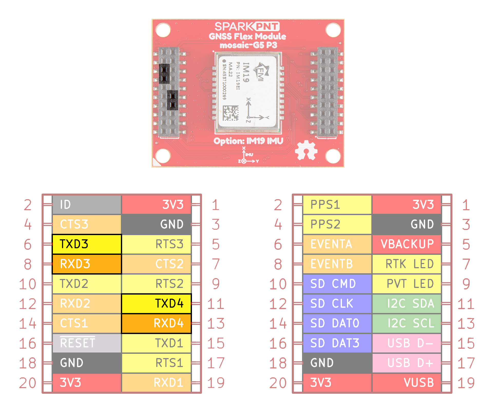{ width="400" }](./assets/img/hookup_guide/headers-uart-im19.png "Click to enlarge")
	<figcaption markdown>The UART ports from the IM19 on the GNSS Flex module.</figcaption>
	</figure>

	- The `UART1` port of the IM19 module is broken out to the headers of the GNSS Flex system, on pins `TXD3` and `RXD3`.
		- These pins should be used to configure the IM19 module.
	- The `UART2` port of the IM19 module is used to receive RTK data from the GNSS receiver and output the tilt compensated data.
		- `RX` - By default, receives data from the `UART1` port of the mosaic-G5 P3 GNSS receiver.
		- `TX` - Outputs the tilt compensated data to the `TXD4` pin on the GNSS Flex headers, once IM19 module is configured and calibrated.

	!!! info "Default Configuration"
		By default, the UART ports are configured with the following settings: 

		- Baudrate: **115200bps**
		- Data Bits: 8
		- Parity: No
		- Stop Bits: 1
		- Flow Control: None
		- Protocols:
			- AT Commands
			- Proprietary Data Formats
				- MEMS Raw data protocol
				- GNSS Raw data protocol
				- Binary NAVI positioning data protocol

		<article style="text-align: center;" markdown>

		| IM19 IMU | Pins of GNSS Flex Headers |
		| :------: | :------------ |
		| `UART1`  | `TXD3`/`RXD3` |
		| `UART2 - TX` | `TXD4`    |
		| `UART2 - RX` | `TXD1`    |

		</article>

	

	

	!!! tip "IM19 - Alternate Inputs"
		Users can [modify the jumpers](#jumpers) on the top of the GNSS Flex module, to utilize the `TX` pin from the `UART2` port of the mosaic-G5 P3 GNSS receiver *(i.e. `TXD2` pin)*; or the `RXD4` pin of the GNSS Flex headers instead.

=== "PPS Output"
	From the mosaic-G5 P3, the [PPS](https://en.wikipedia.org/wiki/Pulse-per-second_signal "Pulse Per Second") output signal's logic-level is 1.8V, but we have added a buffer to bumped up the signal's logic-level to 3.3V. The signal is then connected to the IM19 attitude module and `PPS1` pin of the GNSS Flex module. In order to receive tilt-compensated data from the IM19 attitude module, this pin needs to be configured to provide a timing pulse at the same rate as the PVT solutions.

	The 3.3V [PPS](https://en.wikipedia.org/wiki/Pulse-per-second_signal "Pulse Per Second") signals can be access through the `PPSx` pins. The polarity, frequency, and pulse width of these signals can be configured with the `setPPSParameters` and `setPPS2Parameters` commands.

	

	

	<figure markdown>
	[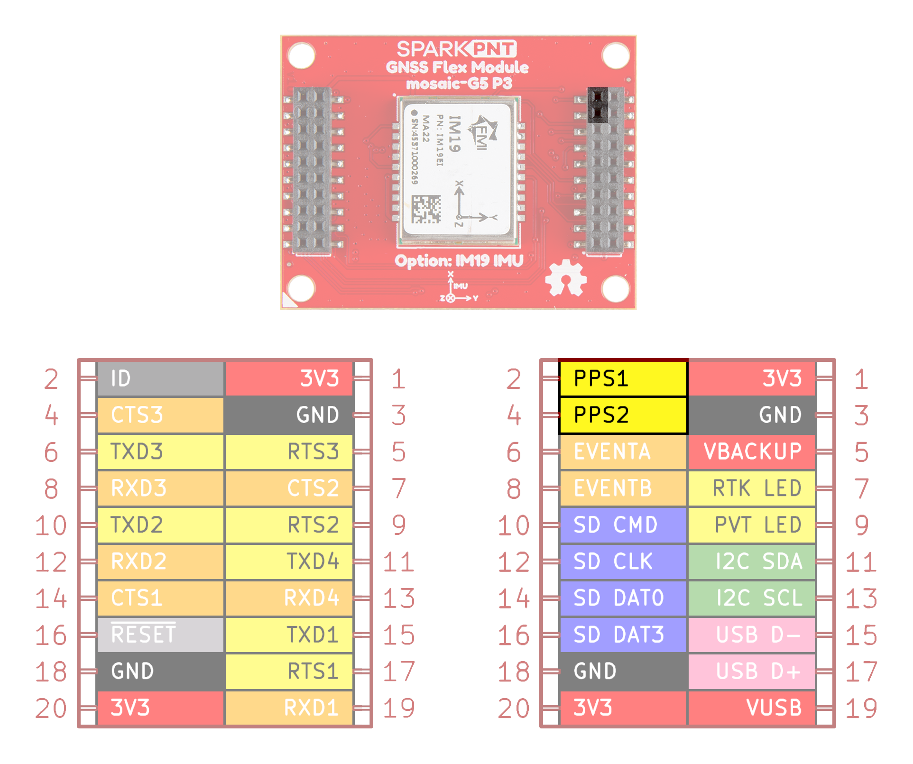{ width="400" }](./assets/img/hookup_guide/headers-pps.png "Click to enlarge")
	<figcaption markdown>The `PPS` signal output on the mosaic-G5 P3 GNSS Flex module.</figcaption>
	</figure>

	

	

	!!! info
		During module startup, these pins are first in high-Z mode for about 1s. Then they are driven low for another second before being driven to the intended user-selected level about 2s after powering up the module.

	!!! tip "GPIO Pins"
		It is possible to use these pins as general-purpose I/O pins, but their maximum current limited to 8mA.

	

	

=== "GPIO Pins"
	The mosaic-G5 P3 GNSS receiver features two general purpose I/O pins. These pins have a maximum output current of 16 mA and pulled-up by default. The function (level or LED status indicator) of these pins can be programmed with the `setGPIO1Mode` and `setGPIO2Mode` commands.

	

	

	<figure markdown>
	[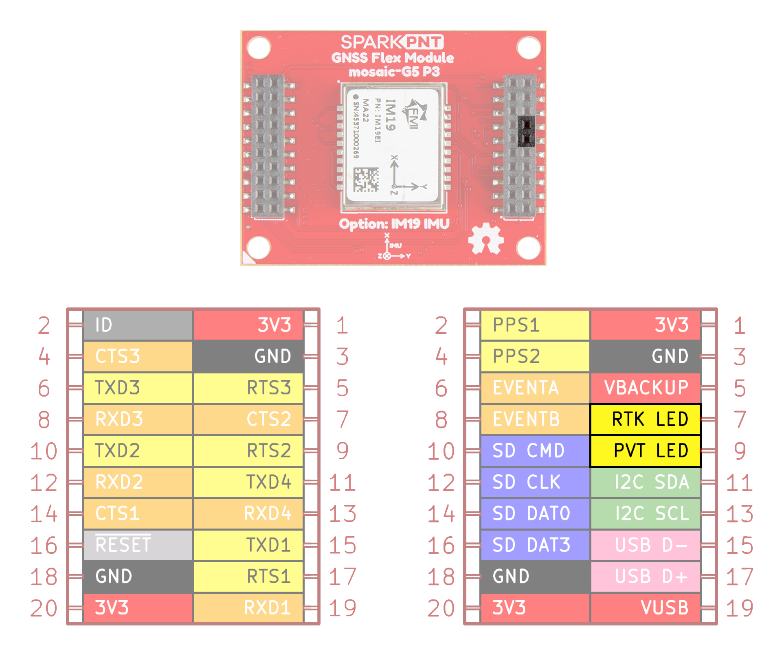{ width="400" }](./assets/img/hookup_guide/gpio.png "Click to enlarge")
	<figcaption markdown>The GPIO pins on the mosaic-G5 P3 GNSS Flex module.</figcaption>
	</figure>

	

	

	Along with its polarity, the output signal from these pins can be used to indicate one of the following status modes:

	- `PVTLED`: LED lights when a PVT solution is available.
	- `RTKLED`: LED is off if the PVT is not in RTK mode, blinks in float RTK and is solid on in fixed RTK.
	- `TRACKLED`: Tracked satellite indicator.

		??? info "LED Behavior"
			| LED Behaviour | Number of Satellites in Tracking |
			| :------------ | :------------------------------- |
			| Blinks fast and continuously *(10 times per second)* | 0 |
			| Blinks once, then pauses    | 1-2 |
			| Blinks twice, then pauses   | 3-4 |
			| Blinks 3 times, then pauses | 5-6 |
			| Blinks 4 times, then pauses | 7-8 |
			| Blinks 5 times, then pauses | 9+  |

	- `DIFFCORRLED`: Differential correction indicator.
		- In rover PVT mode, this LED reports the number of satellites for which differential corrections have been provided in the last received differential correction message (RTCM or CMR).

			??? info "LED Behavior"
				| LED Behaviour | Number of Satellites w/ Corrections |
				| :------------ | :---------------------------------- |
				| LED Off | No differential correction message received |
				| Blinks fast and continuously *(10 times per second)* | 0 |
				| Blinks once, then pauses    | 1-2 |
				| Blinks twice, then pauses   | 3-4 |
				| Blinks 3 times, then pauses | 5-6 |
				| Blinks 4 times, then pauses | 7-8 |
				| Blinks 5 times, then pauses | 9+  |

		- If the corrections are received from geostationary satellites over the L-band, the LED will be on for about 1 second, then blink fast twice.

	!!! info
		By default, these pins are configured in input mode with pull-up. Also, for about 2 seconds after powering or resetting the module, these pins are in input mode (pulled up) regardless of the user configuration stored in the boot configuration file.

	

	

=== "Event Pins"
	The mosaic-G5 P3 GNSS receiver features two event input pins, which can be used to time tag external events with a time resolution of 3ns. Use the `setEventParameters` command to configure these pins. This is useful for waking the module up from its standby mode or for timing applications.

	

	

	<figure markdown>
	[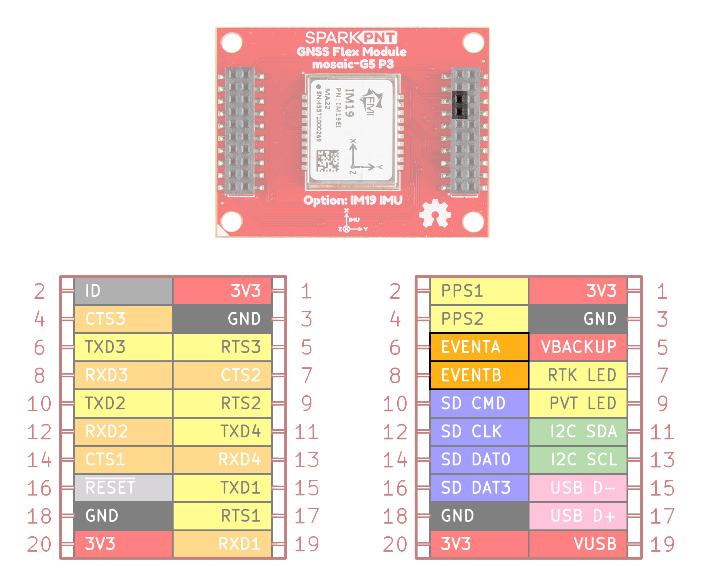{ width="250" }](./assets/img/hookup_guide/headers-event.png "Click to enlarge")
	<figcaption markdown>The event pins on the mosaic-G5 P3 GNSS Flex module.</figcaption>
	</figure>

	

	

	!!! tip
		To properly detect event triggers:

		- There must be a minimum of 5ms between two events on the same `EVENTx` pin
		- There must be no more than 20 events in any interval of 100ms, on all the `EVENTx` pins

	

	

## U.FL Connector
Users will need to connect a compatible GNSS antenna to the `L1/L2/L5/L6/L-Band` U.FL connector. The type of antenna used with the mosaic-G5 P3 module affects the overall accuracy of the positions calculated by the GNSS receiver.

- Passive antennas are not recommended for the mosaic-G5 P3 GNSS receiver.
- There is no need to inject an external DC voltage for the GNSS antenna. Power is already provided from the mosaic-G5 P3 module for the LNA of an active antenna.

	!!! danger
		Never inject an external DC voltage into the SMA connector for the GNSS antenna, as it may damage the mosaic-G5 P3 GNSS receiver. For instance, when using a splitter to distribute the antenna signal to several GNSS receivers, make sure that no more than one output of the splitter passes DC. Use [DC-blocks](https://en.wikipedia.org/wiki/DC_block) otherwise.

<figure markdown>
[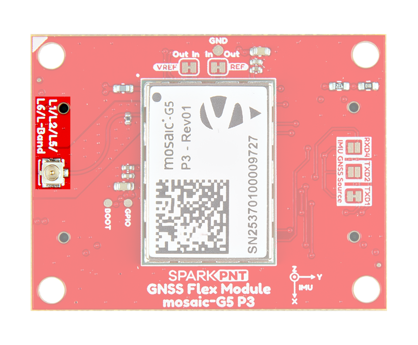{ width="400" }](./assets/img/hookup_guide/ant.png "Click to enlarge")
<figcaption markdown>The U.FL connector to attach an external GNSS antenna to the mosaic-G5 P3 GNSS Flex module.</figcaption>
</figure>

!!! tip
	For the best performance, we recommend users choose a compatible L1/L2/L5/L6/L-Band GNSS antenna and utilize a low-loss cable. Also, don't forget that GNSS signals are fairly weak and can't penetrate buildings or dense vegetation. The GNSS antenna should have an unobstructed view of the sky.

!!! info
	This input is DC-biased and ESD-protected, so an active antenna can directly be connected without additional components. The `VANT` pin of the GNSS receiver provides external power for an active antenna. By default, this supply voltage is configured at **3.3V**.

	- An active antenna often features a [LNA](https://en.wikipedia.org/wiki/Low-noise_amplifier "low-noise amplifier"). This allows the GNSS receiver to boost the signal received by the GNSS receiver without degrading the [SNR](https://en.wikipedia.org/wiki/Signal-to-noise_ratio Signal-to-noise ratio).
	- The more bands an antenna supports, the greater the performance.
		- Faster acquisition time.
		- Access and support for the `L5` GPS band can potentially mitigate multi-path errors.
		- Supporting more frequency bands, allows a GNSS receiver to be less susceptible to jamming and spoofing.

	There are other key parameters related to an antenna that can make or break the signal reception from the satellites. These include, but are not limited to the operation frequency, gain, polarization, efficiency and overall loss.

## Jumpers
There are five jumpers on the top of the board that can be used to easily modify the hardware connections on the board.

???+ note "Never modified a jumper before?"
	Check out our <a href="https://learn.sparkfun.com/tutorials/664">Jumper Pads and PCB Traces tutorial</a> for a quick introduction!

	<article class="grid cards" markdown align="center">

	-   <a href="https://learn.sparkfun.com/tutorials/664">
		<figure markdown>
		
		</figure>

		---

		**How to Work with Jumper Pads and PCB Traces**</a>

	</article>

<figure markdown>
[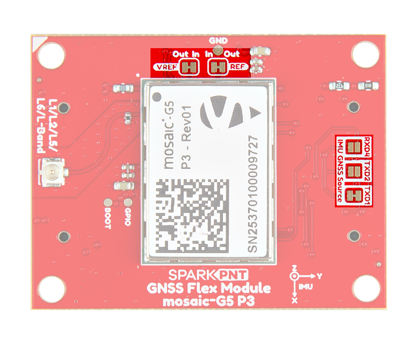{ width="400" }](./assets/img/hookup_guide/jumpers.png "Click to enlarge")
<figcaption markdown>The jumpers on the mosaic-G5 P3 GNSS Flex module.</figcaption>
</figure>

- `IMU GNSS Source`
:   These three jumpers can be modified to change the source of the GNSS data for the IM19 attitude module.

	- `RXD4` - An alternate connection to the GNSS Flex header's `RXD4` pin.
	- `TXD2` - An alternate connection to the `UART2` `TX` pin of the mosaic-G5 P3 GNSS receiver.
	- `TXD1` - The default connection to the `UART1` `TX` pin of the mosaic-G5 P3 GNSS receiver.

<figure markdown>
[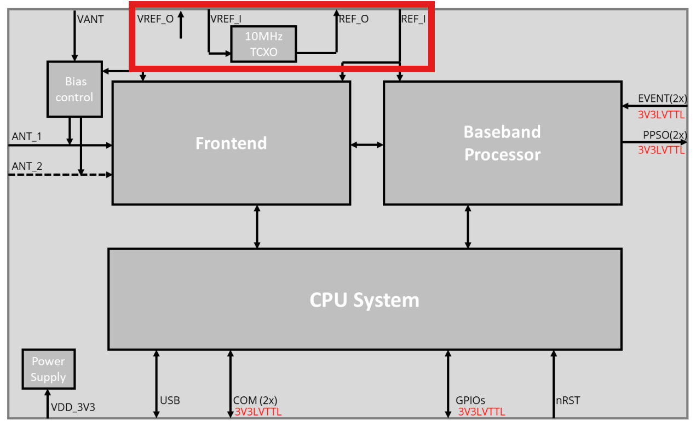{ width="400" }](./assets/img/hookup_guide/jumpers-signals.png "Click to enlarge")
<figcaption markdown>The signals from the mosaic-G5 P3 GNSS receiver to the `VREF` and `REF` jumpers on the board.</figcaption>
</figure>

- `VREF` - Controls the reference voltage for the internal TXCO
	- `In` - Voltage input for the internal TXCO
	- `Out` - Reference voltage to power the internal TXCO
- `REF` - Controls the reference clock signal
	- `In` - Reference clock signal input
	- `Out` - 10-MHz signal from the internal TCXO

