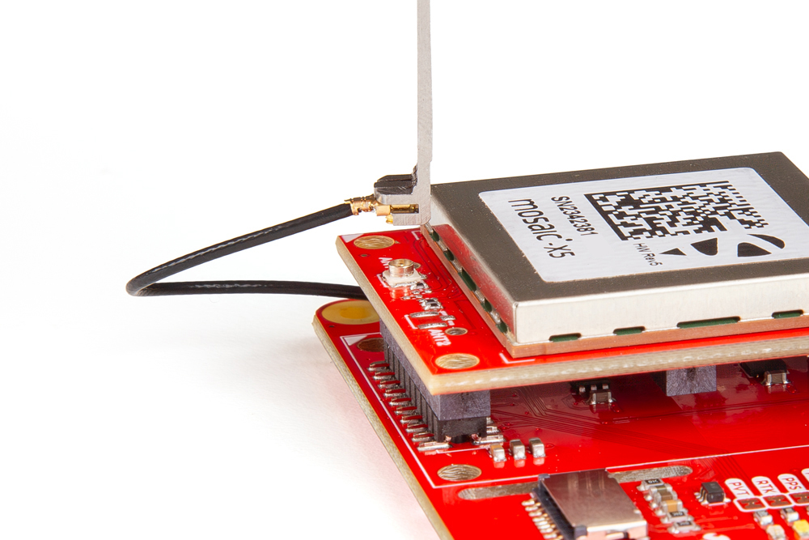
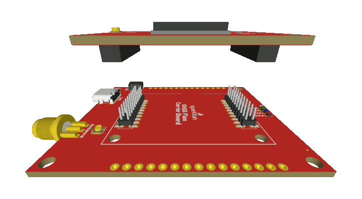

!!! danger "Important: Read Before Use!"
	!!! warning "ESD Sensitivity"
		The mosaic-X5 module is sensitive to [ESD](https://en.wikipedia.org/wiki/Electrostatic_discharge "Electrostatic Discharge"). Use a proper grounding system to make sure that the working surface and the components are at the same electric potential.

		??? info "ESD Precaution"
			As recommended by the manufacturer, we highly recommend that users take the necessary precautions to avoid damaging their module.

			- The mosaic-X5 GNSS Flex module features ESD protection on the USB-C connector and breakout's I/O:
				- USB data lines
				- I/O PTH pads
				- JST connector's pins
			- The mosaic-X5 module features internal ESD protection to the `ANT_1` antenna input.

			

			

			

			{ .qr width=100 }
			<article class="video-500px">
			<iframe src="https://www.youtube.com/embed/hrL5J6Q5gX8?si=jOPBat8rzMnL7Uz4&amp;start=26;&amp;end=35;" title="Septentrio: Getting Started Video (playback starts at ESD warning)" frameborder="0" allow="accelerometer; autoplay; clipboard-write; encrypted-media; gyroscope; picture-in-picture" allowfullscreen></iframe>
			</article>
			

			

			-   <a href="https://www.sparkfun.com/products/25572">
				<figure markdown>
				
				</figure>		

				---

				**iFixit Anti-Static Wrist Strap** 
				TOL-25572</a>

			

	!!! warning "Active Antenna"
		Never inject an external DC voltage into the SMA connector for the GPS antenna, as it may damage the mosaic-X5 module. For instance, when using a splitter to distribute the antenna signal to several GNSS receivers, make sure that no more than one output of the splitter passes DC. Use [DC-blocks](https://en.wikipedia.org/wiki/DC_block) otherwise.

		??? info
			A 3 - 5.5V DC voltage can be applied to the main antenna from the `VANT` pin, obviating the need for an external antenna supply or [bias-tee](https://en.wikipedia.org/wiki/Bias_tee).

## GNSS Antenna
In order to receive [GNSS](https://en.wikipedia.org/wiki/Satellite_navigation "Global Navigation Satellite System") signals, users will need to connect a compatible antenna. For the best performance, we recommend users choose an active, L1/L2/L5/L6 GNSS antenna and utilize a low-loss cable.

### U.FL Connector
GNSS antennas are connected to the U.FL connector on the GNSS Flex board. For sturdier connections, users have the option to bridging the connection to the SMA connector on a Flex carrier board.

<figure markdown>
[{ width="400" }](./assets/img/hookup_guide/assembly-ufl.jpg "Click to enlarge")
<figcaption markdown>Attaching an U.FL cable to the GNSS Flex board.</figcaption>
</figure>

## GNSS Flex Headers
SparkPNT GNSS Flex modules are *plug-in boards* featuring different GNSS receivers. They are designed to be easily swapped for repairs and pin-compatible for upgrades. The boards come populated with two 2x10 pin, 2mm pitch female headers for connecting to *carrier boards*.

<figure markdown>
[{ width="400" }](./assets/img/hookup_guide/animation-attach_module.gif "Click to enlarge")
<figcaption markdown>Stacking a GNSS Flex module onto a *carrier* board.</figcaption>
</figure>
