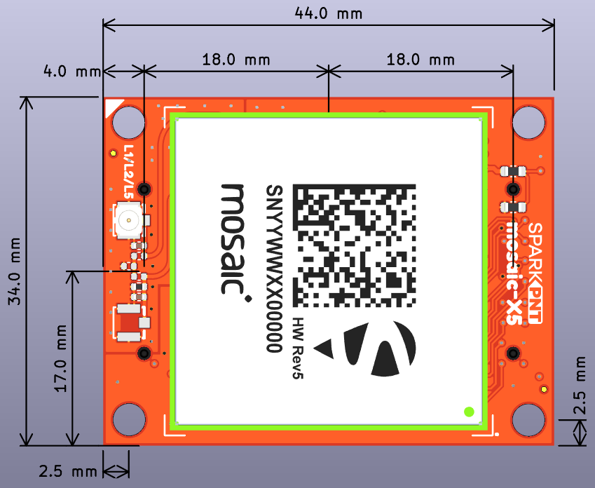
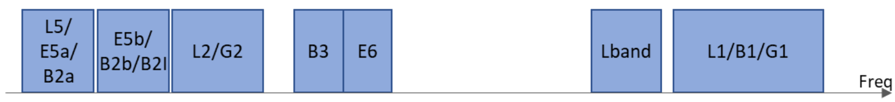

!!! danger
	!!! warning "ESD Sensitivity"
		The mosaic-X5 module is sensitive to [ESD](https://en.wikipedia.org/wiki/Electrostatic_discharge "Electrostatic Discharge"). Use a proper grounding system to make sure that the working surface and the components are at the same electric potential.

		??? info "ESD Precaution"
			As recommended by the manufacturer, we highly recommend that users take the necessary precautions to avoid damaging their module. For example, users can utilize the [iFixit Anti-Static Wrist Strap](https://www.sparkfun.com/ifixit-anti-static-wrist-strap.html).

			

			{ .qr width=100 }
			<iframe src="https://www.youtube.com/embed/hrL5J6Q5gX8?si=jOPBat8rzMnL7Uz4&amp;start=26;&amp;end=35;" title="Septentrio: Getting Started Video (playback starts at ESD warning)" frameborder="0" allow="accelerometer; autoplay; clipboard-write; encrypted-media; gyroscope; picture-in-picture" allowfullscreen></iframe>
			

	!!! warning "Active Antenna"
		Never inject an external DC voltage with the GNSS antenna, as it may damage the mosaic-X5 module. For instance, when using a splitter to distribute the antenna signal to several GNSS receivers, make sure that no more than one output of the splitter passes DC. Use [DC-blocks](https://en.wikipedia.org/wiki/DC_block) otherwise.

## Introduction
This SparkPNT GNSS Flex module features the [Septentrio mosaic-X5](https://www.septentrio.com/en/products/gnss-receivers/gnss-receiver-modules/mosaic-x5), a compact, ultra-low power, multi-band, multi-constellation, high-precision GNSS receiver. The receiver supports the GPS (USA), GLONASS (Russia), Beidou (China), Galileo (Europe), and NavIC (India) constellations, including regional systems *(i.e. SBAS and QZSS)*. With its [**Real Time Kinematics**](https://learn.sparkfun.com/tutorials/813) (RTK) capabilities, the module can achieve a horizontal accuracy of 6mm (~0.25in), vertical accuracy of 1cm (~0.4in) using RTK, and timing precision of 5ns (5 billionths of a second). It also features Septentrio's unique [AIM+ technology](https://www.septentrio.com/en/learn-more/advanced-positioning-technology/aim-jamming-protection) for interference mitigation and anti-spoofing, ensuring best-in-class reliability and scalable position accuracy.

The mosaic-X5 is a sophisticated module with an internal web server that can be utilized with any web browser. On the GNSS Flex module, the web server is accessed through either the USB data pins from the standard GNSS Flex headers; or the Ethernet PHY of the mosaic-X5, which is broken out on an third 2x10 pin, 2mm pitch female header. To guide users through the configuration options, Septentrio provides dozens of [video tutorials](https://www.youtube.com/@SeptentrioGNSS/videos) about the web interface.

For the users who prefer a command-line interface, Septentrio has you covered. Users can still control and configure the mosaic-X5 module through a CLI, which is useful for scenarios such as production line testing *(in fact, that is how we test this board)* or remote access.

??? question "mosaic-X5 Product Comparison"
	Below is a simple comparison table between our mosaic-X5 GNSS products and Septentrio's development and evaluation kits:

	

	<table markdown>
	<tr markdown>
	<td></td>
	<th markdown style="text-align:center">
		mosaic-X5 Development Kit 
		

		<figure markdown>
		{ width="200" }
		</figure>
	</th>
	<th markdown style="text-align:center">
		mosaic-go Evaluation Kit 
		

		<figure markdown>
		{ width="200" }
		</figure>
	</th>
	<th markdown style="text-align:center">
		mosaic-X5 GNSS Breakout 
		

		<figure markdown>
		{ width="200" }
		</figure>
	</th>
	<th markdown style="text-align:center">
		RTK mosaic-X5 
		

		<figure markdown>
		{ width="200" }
		</figure>
	</th>
	<th markdown style="text-align:center">
		mosaic-X5 Flex Module 
		

		<figure markdown>
		{ width="200" }
		</figure>
	</th>
	</tr>
	<tr>
		<td style="vertical-align:middle;">GNSS Antenna</td>
		<td style="text-align:center; vertical-align:middle;">Dual</td>
		<td style="text-align:center">
			Single (mosaic-X5) 
			Dual (mosaic-H)
		</td>
		<td style="text-align:center; vertical-align:middle;">Single</td>
		<td style="text-align:center; vertical-align:middle;">Single</td>
		<td style="text-align:center; vertical-align:middle;">Single</td>
	</tr>
	<tr>
		<td>USB Connector</td>
		<td style="text-align:center">micro-B</td>
		<td style="text-align:center">micro-B</td>
		<td style="text-align:center">Type-C</td>
		<td style="text-align:center">Type-C</td>
		<td style="text-align:center">N/A*</td>
	</tr>
	<tr>
		<td style="vertical-align:middle;">Ethernet</td>
		<td style="text-align:center; vertical-align:middle;">
			Yes 
			<i>10/100 Base-T</i>
		</td>
		<td style="text-align:center; vertical-align:middle;">No</td>
		<td style="text-align:center; vertical-align:middle;">No</td>
		<td style="text-align:center">
			Yes 
			<i>10/100 Base-T</i>
		</td>
		<td style="text-align:center; vertical-align:middle;">2x10 Header*</td>
	</tr>
	<tr>
		<td style="vertical-align:middle;">WiFi</td>
		<td style="text-align:center; vertical-align:middle;">No</td>
		<td style="text-align:center; vertical-align:middle;">No</td>
		<td style="text-align:center; vertical-align:middle;">No</td>
		<td style="text-align:center">
			Yes - Network Bridge 
			<i>10 Base-T</i>
		</td>
		<td style="text-align:center; vertical-align:middle;">No</td>
	</tr>
	<tr>
		<td style="vertical-align:middle;">COM Ports</td>
		<td style="text-align:center">4</td>
		<td style="text-align:center">2</td>
		<td style="text-align:center">4</td>
		<td style="text-align:center">
			1 - mosaic-X5 
			1 - ESP32
		</td>
		<td style="text-align:center">4</td>
	</tr>
	<tr>
		<td>&micro;SD Card Slot</td>
		<td style="text-align:center">Yes</td>
		<td style="text-align:center">Yes</td>
		<td style="text-align:center">Yes</td>
		<td style="text-align:center">Yes</td>
		<td style="text-align:center">2x10 Header*</td>
	</tr>
	<tr>
		<td style="vertical-align:middle;">Reset/Log Buttons</td>
		<td style="text-align:center; vertical-align:middle;">Yes</td>
		<td style="text-align:center; vertical-align:middle;">No*</td>
		<td style="text-align:center; vertical-align:middle;">Yes</td>
		<td style="text-align:center; vertical-align:middle;">Yes</td>
		<td style="text-align:center; vertical-align:middle;">No</td>
	</tr>
	<tr>
		<td style="vertical-align:middle;">Logic-Level</td>
		<td style="text-align:center">
			1.8V 
			3.3V
		</td>
		<td style="text-align:center; vertical-align:middle;">3.3V</td>
		<td style="text-align:center; vertical-align:middle;">3.3V</td>
		<td style="text-align:center">
			3.3V 
			5V
		</td>
		<td style="text-align:center; vertical-align:middle;">3.3V</td>
	</tr>
	<tr>
		<td>PPS Signal</td>
		<td style="text-align:center">Header Pin</td>
		<td style="text-align:center">6-Pin JST Connector</td>
		<td style="text-align:center">SMA Connector</td>
		<td style="text-align:center">Screw Terminal</td>
		<td style="text-align:center">2x10 Header*</td>
	</tr>
	<tr>
		<td>Enclosure Material</td>
		<td style="text-align:center; vertical-align:middle;">N/A</td>
		<td style="text-align:center; vertical-align:middle;">Metal</td>
		<td style="text-align:center; vertical-align:middle;">N/A</td>
		<td style="text-align:center; vertical-align:middle;">Aluminum</td>
		<td style="text-align:center; vertical-align:middle;">N/A</td>
	</tr>
	<tr>
		<td style="vertical-align:middle;">Dimensions</td>
		<td style="text-align:center; vertical-align:middle;">N/A</td>
		<td style="text-align:center; vertical-align:middle;">71 x 59 x 12mm ± 1mm</td>
		<td style="text-align:center; vertical-align:middle;">70.9 x 50.8 x 8mm</td>
		<td style="text-align:center">
			180.6 x 101.8 x 41mm 
			<i>Enclosure Only</i>
		</td>
		<td style="text-align:center; vertical-align:middle;"></td>
	</tr>
	<tr>
		<td style="vertical-align:middle;">Weight</td>
		<td style="text-align:center; vertical-align:middle;">N/A</td>
		<td style="text-align:center; vertical-align:middle;">58g  ± 1g</td>
		<td style="text-align:center; vertical-align:middle;">22.6g</td>
		<td style="text-align:center">
			415.15g 
			<i>Enclosure Only</i>
		</td>
		<td style="text-align:center; vertical-align:middle;"></td>
	</tr>
	
	</table>
	
	

	!!! note "mosaic-go Evaluation Kit"
		The reset pin is exposed on 4-pin JST connector and the log pin is connected to the latch pin of the SD card slot.

	!!! note "mosaic-5 Flex Module"
		SparkPNT GNSS Flex modules are modular, *plug-in* boards that utilize a *carrier* board to access the pins of the GNSS Flex headers.

## Design Files

<!-- Import the component -->

-   :kicad-primary:{ .enlarge-logo } Design Files

	---

	- :fontawesome-solid-file-pdf: [Schematic](./assets/board_files/schematic.pdf)
	- :material-folder-zip: [KiCad Files](./assets/board_files/kicad_files.zip)
	- :material-rotate-3d: [STEP File](./assets/3d_model/cad_model.step)
	- :fontawesome-solid-file-pdf: [Board Dimensions](./assets/board_files/dimensions.pdf):

-   <!-- Boxes in tabs -->

	=== "3D Model"
		<article style="text-align: center;" markdown>
		<model-viewer src="../assets/3d_model/web_model.glb" camera-controls poster="../assets/3d_model/poster.png" tone-mapping="neutral" shadow-intensity="2" shadow-softness="0.2" camera-orbit="0deg 75deg 0.103m" field-of-view="25.11deg" style="width: 100%; height: 450px;">
		</model-viewer>

		[Download the `*.step` File](./assets/3d_model/cad_model.step "Click download"){ .md-button .md-button--primary width="250px" }

		</article>

		???+ tip "Manipulate 3D Model"
			<article style="text-align: center;" markdown>

			| Controls       | Mouse                    | Touchscreen    |
			| :------------- | :----------------------: | :------------: |
			| Zoom           | Scroll Wheel             | 2-Finger Pinch |
			| Rotate         | ++"Left-Click"++ & Drag  | 1-Finger Drag  |
			| Move/Translate | ++"Right-Click"++ & Drag | 2-Finger Drag  |

			</article>

	=== "Dimensions"
		<article style="text-align: center;" markdown>
		[{ width="450" }](./assets/board_files/dimensions.png "Click to enlarge")
		<figcaption markdown>
		Dimensions of the mosaic-X5 GNSS Flex module.
		</figcaption>
		</article>

		???+ tip "Need more measurements?"
			For more information about the board's dimensions, users can download the [KiCad files](./assets/board_files/kicad_files.zip) for this board. These files can be opened in KiCad and additional measurements can be made with the measuring tool.

			!!! info ":octicons-download-16:{ .heart } KiCad - Free Download!"
				KiCad is free, open-source [CAD]("computer-aided design") program for electronics. Click on the button below to download their software. *(\*Users can find out more information about KiCad from their [website](https://www.kicad.org/).)*

				<article style="text-align: center;" markdown>
				[Download :kicad-primary:{ .enlarge-logo }](https://www.kicad.org/download/ "Go to downloads page"){ .md-button .md-button--primary width="250px" }
				</article>

	
			???+ info ":straight_ruler: Measuring Tool"
				This video demonstrates how to utilize the dimensions tool in KiCad, to include additional measurements:

				<article style="text-align: center;" markdown>
				<article class="video-500px">
				<iframe src="https://www.youtube.com/embed/-eXuD8pkCYw" title="KiCad Dimension Tool" frameborder="0" allow="accelerometer; autoplay; clipboard-write; encrypted-media; gyroscope; picture-in-picture" allowfullscreen></iframe>
				</article>
				{ .qr }
				</article>

## Board Layout
The GNSS Flex system is designed around two 2x10-pin, 2mm pitch headers used to mate the two types of boards. A standardized pin layout, keeps the ecosystem pin-compatible for upgrades and allows boards to be easily swapped for repairs. Depending on the capabilities of the GNSS receiver, these pins will breakout the USB, UART (x4), I2C, and SD card interfaces along with any PPS or event signals of the GNSS receiver.

The mosaic-X5 GNSS Flex module has the following features:

<figure markdown>
[{ width="750" }](./assets/img/hookup_guide/layout.png "Click to enlarge")
<figcaption markdown>Layout of the major components on the mosaic-X5 GNSS Flex module.</figcaption>
</figure>

1. **mosaic-X5 GNSS Receiver**
:	The Septentrio mosaic-X5 GNSS receiver
1. **GNSS Flex Headers**
:	Two sets of 2x10 pin, 2mm pitch female headers for connecting a GNSS Flex module to *carrier boards*
1. **Ethernet PHY Header**
:	A 2x10 pin, 2mm pitch female header that breaks out the Ethernet PHY pins of the mosaic-X5
1. **`ANT1` U.FL Connector**
:	An U.FL connector for attaching an external GNSS antenna

## mosaic-X5 Module
The centerpiece of the mosaic-X5 GNSS Flex module, is the [mosaic-X5 module](./assets/component_documentation/mosaic_hardware_manual_v1.9.0.pdf) from [Septentrio](https://www.septentrio.com/en). Their mosaic modules are low-power, multi-band, multi-constellation GNSS receivers capable of delivering centimeter-level precision at high update rates. The modules also feature Septentrio's unique [AIM+ technology](https://www.septentrio.com/en/learn-more/advanced-positioning-technology/aim-resilient-and-secure-gnss/gps-receivers) for interference mitigation and anti-spoofing, which ensures their best-in-class reliability and scalable position accuracy.

<article style="text-align: center;" markdown>
{ .qr width=100 }
<article class="video-500px">
<iframe src="https://www.youtube.com/embed/Co8hrVeklAA" title="Septentrio: Mosaic - GNSS / GPS module receiver range" frameborder="0" allow="accelerometer; autoplay; clipboard-write; encrypted-media; gyroscope; picture-in-picture" allowfullscreen></iframe>
</article>
</article>

-   <figure markdown>
	[{ width="400" }](./assets/img/hookup_guide/mosaic-X5.png "Click to enlarge")
	<figcaption markdown>The mosaic-X5 module on the mosaic-X5 GNSS Flex module.</figcaption>
	</figure>

**Features:**

- Operating Voltage: **3.135 - 3.465V**
- Operating Temperature: -40 - 85&deg;C
- GNSS Support
	- GPS: L1C/A, L1PY, L2C, L2P, L5
	- GLONASS: L1CA, L2CA, L2P, L3 CDMA
	- Beidou: B1I, B1C, B2a, B2b, B2I, B3
	- Galileo: E1, E5a, E5b, E5 AltBoc, E6
	- QZSS: L1C/A, L1 C/B, L2C, L5
	- Navic: L5
	- SBAS: Egnos, WA
- Antenna Specifications
	- Preamplification Range: 15-50dB
	- Bias Voltage: 3.0 - 5.5V
	- 448 Hardware Channels
- Update Rate: 100Hz
- Latency: < 10ms

 

- Time to Fix
	- Cold Start: < 45s
	- Warm: < 20s
	- Reacquisition: 1s
- Timing Precision: 5ns
- Position Accuracy

	<article style="text-align: center;" markdown>

	| Correction | Horizontal                             | Vertical                     |
	| :--------- | :------------------------------------: | :--------------------------: |
	| RTK        | **0.6cm** *(&plusmn;0.5ppm)* ~0.25" | 1cm *(&plusmn;1ppm)* ~.4" |
	| DGNSS      | 40cm ~1.3'                          | 70cm ~2.3'                |
	| SBAS       | 60cm ~2'                            | 80cm ~2.6'                |
	| Standalone | 1.2m ~4'                            | 1.9m ~6.2'                |

	</article>

!!! info
	The mosaic-X5 has three power modes: **Active**, **Standby**, and **Off** *(see the **[Power Modes](#power-modes)** section)*.

### Power Modes
The mosaic-X5 module operates in three different power states.

- Off - The module is completely turned off
	- When transitioning to the **Off** state from **Active**, recent data may not be lost and not logged to the external SD card
- Standby - The module is in a low-power consumption mode (1)
	- The module power consumption in standby is <5mW
	- The `PMIC_ON_REQ` pin is driven `LOW`
	- The `MODULE_RDY` pin is in a `LOW`
	- Monitors the state of the `ONOFF` pin *(Not available)*
- Active - The module is operating with all functions active
	- On power up, the module restarts in the configuration stored in the boot configuration file
	- The `PMIC_ON_REQ` pin is driven `HIGH`
	- The `MODULE_RDY` pin is in a `HIGH` (2)

1. Essentially, the same state as **Off**; except in the transition to the **Standby** mode, before the module shuts down:
	- All logging tasks are terminated
	- The SD card is unmounted
	- The `PMIC_ON_REQ` pin is driven `LOW`
1. Level becomes `HIGH` about 300ms after powering up, reset, or waking up from standby

!!! info
	By default, the board is hardwired to operate only in the **Active** and **Off** modes.

	*For more information on the power management of the mosaic-X5 module, please refer to sections **3.4**, **3.5**, **4.1**, and **4.13** of the [hardware manual](./assets/component_documentation/mosaic_hardware_manual_v1.9.0.pdf).*

??? Tip "Enabling **Standby** Mode"
	Users can enable **Standby** mode on the mosaic-X5, by modifying the `V_BATT` jumper *(see the **[Jumpers](#jumpers)** section)* and providing an external power source for the `V_BATT` pin *(3.3V)*. However, because the `ONOFF` pin isn't exposed users will need to power cycle the board to return to the **Active** state.

??? tip "Drive Current - `PMIC_ON_REQ`/`MODULE_RDY`"
	The drive current on the `PMIC_ON_REQ` and `MODULE_RDY` pins is low. Enough to be read by a digital pin on a microcontroller, but not high enough to drive an LED.

#### Power Consumption
The power consumption of the mosaic-X5 module depends on the GNSS signals enabled and the positioning mode. The table below, lists the average power consumption for common configurations. The current listed, is based on a supply voltage of 3.3V.

<article style="text-align: center;" markdown>

| GNSS Signals | Positioning Mode | Power (mW) | Current (mA) |
| :----------- | :--------------- | :--------: | :----------: |
| GPS L1 C/A | Stand-Alone (1Hz) | 550 | 167 |
| GPS L1/L2 | RTK (1Hz) | 670 | 203 |
| GPS/GLONASS L1/L2 | RTK (1Hz) | 695 | 211 |
| GPS/GLONASS L1/L2+GALILEO L1/E5a +BeiDou B1C/B2a | RTK (1Hz) | 850 | 258 |
| GPS/GLONASS L1/L2+GALILEO L1/E5a +BeiDou B1C/B2a | RTK (100 Hz) | 930 | 282 |
| GPS/GLONASS L1/L2 + L-band | PPP (1Hz) | 760 | 230 |
| All signals from all GNSS constellations | Static (1Hz) | 910 | 276 |
| All signals from all GNSS constellations +L-band | Static(1Hz) | 980 | 297 |
| All signals from all GNSS constellations +L-band | Static (100Hz) | 1080 | 327 |

*Source: [mosaic-X5 Hardware Manual](./assets/component_documentation/mosaic_hardware_manual_v1.9.0.pdf)*

</article>

### Frequency Bands
The mosaic modules are multi-band, multi-constellation GNSS receivers. Below, are charts illustrating the frequency bands utilized by all the global navigation satellite systems and the ones supported by the mosaic-X5 module.

<figure markdown>
[{ width="650" }](./assets/img/hookup_guide/frequency_bands.png "Click to enlarge")
<figcaption markdown>The frequency bands supported by the mosaic-X5 GNSS receiver.</figcaption>
</figure>

<figure markdown>
[{ width="800" }](https://www.tallysman.com/app/uploads/2021/07/Tallysman-GNSS-Frequencies-v8.0_Chart-1-1024x425.png "Click to enlarge")
<figcaption markdown>Frequency bands of the global navigation satellite systems. (Source: [Tallysman](https://www.tallysman.com/gnss-constellations-radio-frequencies-and-signals/))</figcaption>
</figure>

!!! info
	For a comparison of the frequency bands supported by the mosaic modules, refer to section **3.1** of the [hardware manual](./assets/component_documentation/mosaic_hardware_manual_v1.9.0.pdf).

	??? info "What are Frequency Bands?"
		A [frequency band](https://en.wikipedia.org/wiki/Frequency_band) is a section of the [electromagnetic spectrum](https://en.wikipedia.org/wiki/Electromagnetic_spectrum), usually denoted by the range of its upper and lower limits. In the [radio spectrum](https://en.wikipedia.org/wiki/Radio_spectrum), these frequency bands are usually regulated by region, often through a government entity. This regulation prevents the interference of RF communication; and often includes major penalties for any interference with critical infrastructure systems and emergency services.

		<figure markdown>
		[{ width="400" }](https://gssc.esa.int/navipedia/images/c/cf/GNSS_All_Signals.png "Click to enlarge")
		<figcaption markdown>Frequency bands of the global navigation satellite systems. (Source: [ESA](https://gssc.esa.int/navipedia/index.php?title=File:GNSS_All_Signals.png "European Space Agency"))</figcaption>
		</figure>

		However, if the various GNSS constellations share similar frequency bands, then how do they avoid interfering with one another? Without going too far into detail, the image above illustrates the frequency bands of each system with a few characteristics specific to their signals. Wit these characteristics in mind, along with other factors, the chart can help users to visualize how multiple GNSS constellations might co-exist with each other.

		For more information, users may find these articles of interest:

		- [GNSS signal](https://gssc.esa.int/navipedia/index.php/GNSS_signal)
		- [GPS Signal Plan](https://gssc.esa.int/navipedia/index.php?title=GPS_Signal_Plan)
		- [GLONASS Signal Plan](https://gssc.esa.int/navipedia/index.php?title=GLONASS_Signal_Plan)
		- [GALILEO Signal Plan](https://gssc.esa.int/navipedia/index.php?title=GALILEO_Signal_Plan)

### Position Accuracy

The accuracy of the position reported from the mosaic-X5 module, can be improved based upon the correction method being employed. Currently, [RTK](https://en.wikipedia.org/wiki/Real-time_kinematic_positioning "Real-Time Kinematic") corrections provide the highest level of accuracy; however, users should be aware of certain limitations of the system:

- RTK technique requires real-time correction data from a reference station or network of base stations.
	- RTK corrections are signal specific *(i.e. an RTK network might provide corrections on only `E5b` and not `E5a`)*.
- The range of the base stations will vary based upon the RTK method being employed.
- The reliability of RTK corrections are inherently reduced in [multipath environments](https://en.wikipedia.org/wiki/Multipath_propagation). However, with Septentrio's multipath mitigation technology ([APME+](https://www.septentrio.com/en/learn-more/Advanced-positioning-technology/gnss-technology/multipath-mitigation-technology "A-Posteriori Multipath Estimation")) on the mosaic-X5, these errors are significantly reduced when compared to multipath mitigation techniques that modify the correlators in the tracking channels.

<article style="text-align: center;" markdown>

| Correction                                                                                    | Horizontal                             | Vertical                     |
| :-------------------------------------------------------------------------------------------- | :------------------------------------: | :--------------------------: |
| [RTK](https://en.wikipedia.org/wiki/Real-time_kinematic_positioning "Real-Time Kinematic")    | **0.6cm** *(&plusmn;0.5ppm)* ~0.25" | 1cm *(&plusmn;1ppm)* ~.4" |
| [DGNSS](https://en.wikipedia.org/wiki/Differential_GPS "Differential GNSS")                   | 40cm ~1.3'                          | 70cm ~2.3'                |
| [SBAS](https://en.wikipedia.org/wiki/GNSS_augmentation "Satellite-Based Augmentation System") | 60cm ~2'                            | 80cm ~2.6'                |
| Standalone                                                                                    | 1.2m ~4'                            | 1.9m ~6.2'                |

</article>

??? info "RTK Corrections"
	To understand how RTK works, users will need a more fundamental understanding of the signal error sources.

	

	-   <a href="https://www.sparkfun.com/news/7533">
		<figure markdown>
		
		</figure>

		---

		**Real-Time Kinematics Explained**</a>

	-   <a href="https://www.sparkfun.com/news/7138">
		<figure markdown>
		
		</figure>

		---

		**What is Correction Data?**</a>

	-   <a href="https://www.septentrio.com/en/learn-more/insights/gnss-corrections-demystified">
		<figure markdown>
		
		</figure>

		---

		**GNSS Corrections Demystified**</a>

	

!!! tip
	For the best performance, we highly recommend that users configure the module to utilize/provide RTK corrections with a compatible L1/L2/L5/L6 GNSS antenna and utilize a low-loss cable.

## GNSS Flex Headers
The GNSS Flex system is designed around two 2x10-pin, 2mm pitch headers used mate the two types of boards. A standardized pin layout, keeps the ecosystem pin-compatible for upgrades and allows boards to be easily swapped for repairs. For the mosaic-X5 GNSS receiver, these pins will breakout the USB, UART (x4), and SD card interfaces along with a configurable PPS signal, two event signals, and two LED status indication signals from the GNSS receiver.

<figure markdown>
[{ width="400" }](./assets/img/hookup_guide/pinout-full.png "Click to enlarge")
<figcaption markdown>The peripherals and I/O pins on the mosaic-X5 GNSS Flex module.</figcaption>
</figure>

<article class="annotate" markdown>
Below, are the features that are available from the mosaic-X5 GNSS receiver.

**Supported Interfaces:**

- 4x UART (LVTTL, up to 4 Mbps)
- *Ethernet (RMII/MDIO), 10/100 Mbps* (1)
- USB device (2.0, HS)
- SDIO (mass storage)
- ~~2x GPIO user programmable~~ (2)
- 2x LED outputs
- 2x Event markers
- 1x Configurable PPS out

</article>

1. Broken out on the extra middle header
1. Not available on the mosaic-X5 GNSS Flex module.

=== "USB"
	For most users, this will be the primary interface for the mosaic-X5 module.

	<figure markdown>
	[{ width="400" }](./assets/img/hookup_guide/headers-usb.png "Click to enlarge")
	<figcaption markdown>USB-C connector on the mosaic-X5 GNSS Flex module.</figcaption>
	</figure>

	

	- When a module is initially connected to a computer, the board will initialize as a USB mass storage device.
		- For Windows PCs, the USB driver (1) can be installed from the mass storage device or the RxTools software suite.
		- When the SD card is mounted, this drive will contain the contents of the SD card that is inserted on the board.
	- Once the USB driver is installed:
		- Two virtual `COM` ports are emulated, which can be used as standard `COM` ports to access the receiver.
		- This interface will support Ethernet-over-USB.
			- By default, the receiver is not allowed to access the Internet over USB.
			- The IP address allocated to the Ethernet-over-USB interface is `192.168.3.1`.
				- The IP address cannot be changed; therefore, only single receiver should be connected to your computer at a time.

	

	1. On Linux, the standard Linux CDC-ACM driver is suitable.

=== "UART Ports"
	The mosaic-X5 has four UARTs ports, which can be operated and configured separately.

	<figure markdown>
	[{ width="400" }](./assets/img/hookup_guide/headers-uart.png "Click to enlarge")
	<figcaption markdown>The UART ports on the mosaic-X5 GNSS Flex module.</figcaption>
	</figure>

	

	
	- `COM` ports 1-3 feature flow control pins, which are disabled by default.
	- These ports also support a point-to-point protocol server, by which it can accept TCP/IP connections over a serial link.

	

	!!! info "Default Configuration"
		By default, the UART ports are configured with the following settings: 

		- Baudrate: 115200bps
		- Data Bits: 8
		- Parity: No
		- Stop Bits: 1
		- Flow Control: None

=== "PPS Output"
	From the module, the [PPS](https://en.wikipedia.org/wiki/Pulse-per-second_signal "Pulse Per Second") output signal's logic-level is 1.8V. However, for the convenience of users, we have added a buffer and bumped up the signal's logic-level to 3.3V on the mosaic-X5 GNSS Flex module.

	<figure markdown>
	[{ width="400" }](./assets/img/hookup_guide/headers-pps.png "Click to enlarge")
	<figcaption markdown>The `PPS` signal's output on the mosaic-X5 GNSS Flex module.</figcaption>
	</figure>

	???+ tip "Use Case"
		- Users could use this signal in conjunction with the event pins to synchronize two mosaic-X5 modules with each other.
		- Users could use this signal to create their own **Stratum 0** source for the [NTP](https://en.wikipedia.org/wiki/Network_Time_Protocol "Network Time Protocol") on a primary time server.

=== "Data Logging"
	The data logging functionality of the board can be configured through the software/web interfaces.

	

	

	
	<figure markdown>
	[{ width="400" }](./assets/img/hookup_guide/headers-sd_card.png "Click to enlarge")
	<figcaption markdown>The data logging peripherals on the mosaic-X5 GNSS Flex module.</figcaption>
	</figure>

	

	

	!!! success "Initial Configuration"
		Before data logging can occur, it is necessary to create a *logging stream* from the **Logging** tab of the web interface or using the **RxTools** software suite. Streams can contain NMEA or SBF (Septentrio Binary Format) data; SBF can contain RTCM and/or RINEX.

	!!! info "SD Card Specifications"
		The mosaic-X5 module is only compatible with SD cards of up to 32GB, formatted with a `FAT32` file system.

	!!! info "Standby Mode"
		When Standby mode is initialized, the module terminates all running processes and unmounts the external SD card to avoid any log file corruption *(see the **[Power Modes](#power-modes)** section)*.

	

	

=== "LED Outputs"
	The mosaic-X5 module features two general purpose, output LED pins. These pins have a maximum output current of 10 mA and output impedance of 20&ohm;.

	<figure markdown>
	[{ width="400" }](./assets/img/hookup_guide/headers-led.png "Click to enlarge")
	<figcaption markdown>The LED pins on the mosaic-X5 GNSS Flex module.</figcaption>
	</figure>

=== "Event Triggers"
	The mosaic-X5 module features two general purpose, event input pins. These pins can be used to time tag external events with a time resolution of 20ns.

	<figure markdown>
	[{ width="400" }](./assets/img/hookup_guide/headers-event.png "Click to enlarge")
	<figcaption markdown>The event pins on the mosaic-X5 GNSS Flex module.</figcaption>
	</figure>

	???+ tip
		For example, these pins can be used in conjunction with the PPS output signal for time syncing.

## Extra Header
In addition to the GNSS Flex headers, an extra 2x10 pin, 2mm pitch female header is populated between them. This header breaks out the Ethernet PHY interface, along with a few other operation indication signals.

<figure markdown>
[{ width="400" }](./assets/img/hookup_guide/headers-misc.png "Click to enlarge")
<figcaption markdown>The JST connector on the mosaic-X5 GNSS Flex module.</figcaption>
</figure>

- **RMII Interface**
:	The module supports an Ethernet PHY through its RMII interface. An up-to-date list of supported PHY's can be found in [Septentrio’s Knowledge Base](https://customersupport.septentrio.com/s/article/which-ethernet-phy-does-mosaic-support).
- **`PMIC_ON` Pin**
:	The state of `PMIC` pin indicates when the subsystems are energized and ready *(see the [**Power Modes**](#power-modes) section)*.
- **`READY` Pin**
:	The `RDY` pin indicates the operational mode of the mosaic-X5 module *(see the [**Power Modes**](#power-modes) section)*. The level is high when module is operating, and low when in standby or reset.
- **`ON_OFF` Pin**
:	The `RDY` pin indicates the operational mode of the mosaic-X5 module *(see the [**Power Modes**](#power-modes) section)*. The level is high when module is operating, and low when in standby or reset.

## U.FL Connector
Users will need to connect a compatible GPS antenna to the `ANT1` U.FL connector. The type of antenna used with the mosaic-X5 module affects the overall accuracy of the positions calculated by the GNSS receiver.

- An active antenna often features a [LNA](https://en.wikipedia.org/wiki/Low-noise_amplifier "low-noise amplifier"). This allows the module to boost the signal received by the GNSS module without degrading the [SNR](https://en.wikipedia.org/wiki/Signal-to-noise_ratio Signal-to-noise ratio).
- The more bands an antenna supports, the greater the performance.
	- Faster acquisition time.
	- Access and support for the `L5` GPS band can potentially mitigate multi-path errors.
	- Supporting more frequency bands, allows a GNSS receiver to be less susceptible to jamming and spoofing.

!!! tip
	For the best performance, we recommend users choose a compatible L1/L2/L5/L6 GNSS antenna and utilize a low-loss cable.

There are some key parameters related to an antenna that can make or break the signal reception from the satellites. These include the operation frequency, gain, polarization, efficiency and overall loss.

<figure markdown>
[{ width="400" }](./assets/img/hookup_guide/ant-ufl.png "Click to enlarge")
<figcaption markdown>The U.FL connector to attach an external GNSS antenna to the mosaic-X5 GNSS Flex module.</figcaption>
</figure>

!!! info
	The `VANT` pin provides **3.3V** of external power for an active antenna.

	!!! danger
		Never inject an external DC voltage into the SMA connector for the GPS antenna, as it may damage the mosaic-X5 module. For instance, when using a splitter to distribute the antenna signal to several GNSS receivers, make sure that no more than one output of the splitter passes DC. Use [DC-blocks](https://en.wikipedia.org/wiki/DC_block) otherwise.

## Jumpers
There are two jumpers on the back of the board that can be used to easily modify the hardware connections on the board.

<figure markdown>
[{ width="400" }](./assets/img/hookup_guide/jumpers.png "Click to enlarge")
<figcaption markdown>The jumpers on the back of the mosaic-X5 GNSS Flex module.</figcaption>
</figure>

???+ note "Never modified a jumper before?"
	Check out our <a href="https://learn.sparkfun.com/tutorials/664">Jumper Pads and PCB Traces tutorial</a> for a quick introduction!

	<article class="grid cards" markdown align="center">

	-   <a href="https://learn.sparkfun.com/tutorials/664">
		<figure markdown>
		
		</figure>

		---

		**How to Work with Jumper Pads and PCB Traces**</a>

	</article>

- `2V8`
:	This jumper can be cut to disconnect power to the internal 10MHz TXCO.
- `REF`
:	This jumper can be cut to disconnect the 10MHz reference signal from the internal TXCO.

<figure markdown>
[{ width="400" }](./assets/img/hookup_guide/jumpers-signals.png "Click to enlarge")
<figcaption markdown>The signals from the mosaic-X5 module to the jumpers on the board.</figcaption>
</figure>

