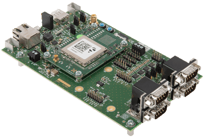
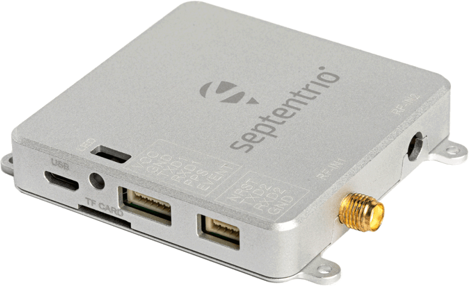
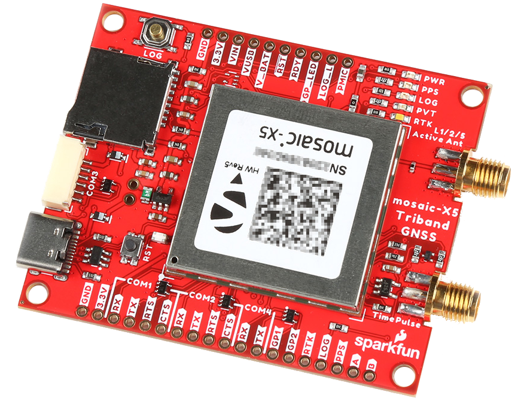
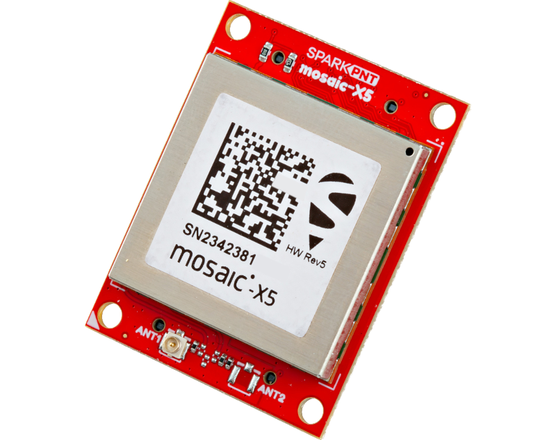

!!! danger
	!!! warning "ESD Sensitivity"
		The mosaic-X5 module is sensitive to [ESD](https://en.wikipedia.org/wiki/Electrostatic_discharge "Electrostatic Discharge"). Use a proper grounding system to make sure that the working surface and the components are at the same electric potential.

		??? info "ESD Precaution"
			As recommended by the manufacturer, we highly recommend that users take the necessary precautions to avoid damaging their module. For example, users can utilize the [iFixit Anti-Static Wrist Strap](https://www.sparkfun.com/ifixit-anti-static-wrist-strap.html).

			

			<iframe src="https://www.youtube.com/embed/hrL5J6Q5gX8?si=jOPBat8rzMnL7Uz4&amp;start=26;&amp;end=35;" title="Septentrio: Getting Started Video (playback starts at ESD warning)" frameborder="0" allow="accelerometer; autoplay; clipboard-write; encrypted-media; gyroscope; picture-in-picture" allowfullscreen></iframe>
			

	!!! warning "Active Antenna"
		Never inject an external DC voltage with the GNSS antenna, as it may damage the mosaic-X5 module. For instance, when using a splitter to distribute the antenna signal to several GNSS receivers, make sure that no more than one output of the splitter passes DC. Use [DC-blocks](https://en.wikipedia.org/wiki/DC_block) otherwise.

# Introduction
SparkPNT GNSS Flex modules are *plug-in boards* featuring different GNSS receivers. They are designed to be easily swapped for repairs and pin-compatible for upgrades. The boards come populated with two 2x10 pin, 2mm pitch female headers for connecting to *carrier boards*. Depending on the capabilities of the GNSS receiver, these pins breakout the UART (x4), I2C, and SD card interfaces along with any PPS or event signals, using a standardized pin out.

This SparkPNT GNSS Flex module features the [Septentrio mosaic-X5](https://www.septentrio.com/en/products/gnss-receivers/gnss-receiver-modules/mosaic-x5), a compact, ultra-low power, multi-band, multi-constellation, high-precision GNSS receiver. The receiver supports the GPS (USA), GLONASS (Russia), Beidou (China), Galileo (Europe), and NavIC (India) constellations, including regional systems *(i.e. SBAS and QZSS)*. With its [**Real Time Kinematics**](https://learn.sparkfun.com/tutorials/813) (RTK) capabilities, the module can achieve a horizontal accuracy of 6mm (~0.25in), vertical accuracy of 1cm (~0.4in) using RTK, and timing precision of 5ns (5 billionths of a second). It also features Septentrio's unique [AIM+ technology](https://www.septentrio.com/en/learn-more/advanced-positioning-technology/aim-jamming-protection) for interference mitigation and anti-spoofing, ensuring best-in-class reliability and scalable position accuracy.

The mosaic-X5 is a sophisticated module with an internal web server that can be utilized with any web browser. On the GNSS Flex module, the web server is accessed through either the USB data pins from the standard GNSS Flex headers; or the Ethernet PHY of the mosaic-X5, which is broken out on an third 2x10 pin, 2mm pitch female header. To guide users through the configuration options, Septentrio provides dozens of [video tutorials](https://www.youtube.com/@SeptentrioGNSS/videos) about the web interface.

For the users who prefer a command-line interface, Septentrio has you covered. Users can still control and configure the mosaic-X5 module through a CLI, which is useful for scenarios such as production line testing *(in fact, that is how we test this board)* or remote access.

???+ question "Product Comparison"
	Below is a simple comparison table between our mosaic-X5 GNSS products and Septentrio's development and evaluation kits:

	

	<table markdown>
	<tr markdown>
	<td></td>
	<th markdown style="text-align:center">
		mosaic-X5 Development Kit 
		

		<figure markdown>
		{ width="200" }
		</figure>
	</th>
	<th markdown style="text-align:center">
		mosaic-go Evaluation Kit 
		

		<figure markdown>
		{ width="200" }
		</figure>
	</th>
	<th markdown style="text-align:center">
		mosaic-X5 GNSS Breakout 
		

		<figure markdown>
		{ width="200" }
		</figure>
	</th>
	<th markdown style="text-align:center">
		RTK mosaic-X5 
		

		<figure markdown>
		{ width="200" }
		</figure>
	</th>
	<th markdown style="text-align:center">
		mosaic-X5 Flex Module 
		

		<figure markdown>
		{ width="200" }
		</figure>
	</th>
	</tr>
	<tr>
		<td style="vertical-align:middle;">GNSS Antenna</td>
		<td style="text-align:center; vertical-align:middle;">Dual</td>
		<td style="text-align:center">
			Single (mosaic-X5) 
			Dual (mosaic-H)
		</td>
		<td style="text-align:center; vertical-align:middle;">Single</td>
		<td style="text-align:center; vertical-align:middle;">Single</td>
		<td style="text-align:center; vertical-align:middle;">Single</td>
	</tr>
	<tr>
		<td>USB Connector</td>
		<td style="text-align:center">micro-B</td>
		<td style="text-align:center">micro-B</td>
		<td style="text-align:center">Type-C</td>
		<td style="text-align:center">Type-C</td>
		<td style="text-align:center">N/A*</td>
	</tr>
	<tr>
		<td style="vertical-align:middle;">Ethernet</td>
		<td style="text-align:center; vertical-align:middle;">
			Yes 
			<i>10/100 Base-T</i>
		</td>
		<td style="text-align:center; vertical-align:middle;">No</td>
		<td style="text-align:center; vertical-align:middle;">No</td>
		<td style="text-align:center">
			Yes 
			<i>10/100 Base-T</i>
		</td>
		<td style="text-align:center; vertical-align:middle;">2x10 Header*</td>
	</tr>
	<tr>
		<td style="vertical-align:middle;">WiFi</td>
		<td style="text-align:center; vertical-align:middle;">No</td>
		<td style="text-align:center; vertical-align:middle;">No</td>
		<td style="text-align:center; vertical-align:middle;">No</td>
		<td style="text-align:center">
			Yes - Network Bridge 
			<i>10 Base-T</i>
		</td>
		<td style="text-align:center; vertical-align:middle;">No</td>
	</tr>
	<tr>
		<td style="vertical-align:middle;">COM Ports</td>
		<td style="text-align:center">4</td>
		<td style="text-align:center">2</td>
		<td style="text-align:center">4</td>
		<td style="text-align:center">
			1 - mosaic-X5 
			1 - ESP32
		</td>
		<td style="text-align:center">4</td>
	</tr>
	<tr>
		<td>&micro;SD Card Slot</td>
		<td style="text-align:center">Yes</td>
		<td style="text-align:center">Yes</td>
		<td style="text-align:center">Yes</td>
		<td style="text-align:center">Yes</td>
		<td style="text-align:center">2x10 Header*</td>
	</tr>
	<tr>
		<td style="vertical-align:middle;">Reset/Log Buttons</td>
		<td style="text-align:center; vertical-align:middle;">Yes</td>
		<td style="text-align:center; vertical-align:middle;">No*</td>
		<td style="text-align:center; vertical-align:middle;">Yes</td>
		<td style="text-align:center; vertical-align:middle;">Yes</td>
		<td style="text-align:center; vertical-align:middle;">No</td>
	</tr>
	<tr>
		<td style="vertical-align:middle;">Logic-Level</td>
		<td style="text-align:center">
			1.8V 
			3.3V
		</td>
		<td style="text-align:center; vertical-align:middle;">3.3V</td>
		<td style="text-align:center; vertical-align:middle;">3.3V</td>
		<td style="text-align:center">
			3.3V 
			5V
		</td>
		<td style="text-align:center; vertical-align:middle;">3.3V</td>
	</tr>
	<tr>
		<td>PPS Signal</td>
		<td style="text-align:center">Header Pin</td>
		<td style="text-align:center">6-Pin JST Connector</td>
		<td style="text-align:center">SMA Connector</td>
		<td style="text-align:center">Screw Terminal</td>
		<td style="text-align:center">2x10 Header*</td>
	</tr>
	<tr>
		<td>Enclosure Material</td>
		<td style="text-align:center; vertical-align:middle;">N/A</td>
		<td style="text-align:center; vertical-align:middle;">Metal</td>
		<td style="text-align:center; vertical-align:middle;">N/A</td>
		<td style="text-align:center; vertical-align:middle;">Aluminum</td>
		<td style="text-align:center; vertical-align:middle;">N/A</td>
	</tr>
	<tr>
		<td style="vertical-align:middle;">Dimensions</td>
		<td style="text-align:center; vertical-align:middle;">N/A</td>
		<td style="text-align:center; vertical-align:middle;">71 x 59 x 12mm ± 1mm</td>
		<td style="text-align:center; vertical-align:middle;">70.9 x 50.8 x 8mm</td>
		<td style="text-align:center">
			180.6 x 101.8 x 41mm 
			<i>Enclosure Only</i>
		</td>
		<td style="text-align:center; vertical-align:middle;"></td>
	</tr>
	<tr>
		<td style="vertical-align:middle;">Weight</td>
		<td style="text-align:center; vertical-align:middle;">N/A</td>
		<td style="text-align:center; vertical-align:middle;">58g  ± 1g</td>
		<td style="text-align:center; vertical-align:middle;">22.6g</td>
		<td style="text-align:center">
			415.15g 
			<i>Enclosure Only</i>
		</td>
		<td style="text-align:center; vertical-align:middle;"></td>
	</tr>
	
	</table>
	
	

	!!! note "mosaic-go Evaluation Kit"
		The reset pin is exposed on 4-pin JST connector and the log pin is connected to the latch pin of the SD card slot.

	!!! note "mosaic-5 Flex Module"
		SparkPNT GNSS Flex modules are modular, *plug-in* boards that utilize a *carrier* board to access the pins of the GNSS Flex headers.

## :fontawesome-solid-list-check:&nbsp;Required Materials
To get started, users will need a few items. Now some users may already have a few of these items, feel free to modify your cart accordingly.

- GNSS Flex *Carrier* Board *(w/ access to the USB interface of the GNSS Flex modules)*
- [GNSS Multi-Band Surveying Antenna](https://www.sparkfun.com/products/21801)
	- [SMA Male to TNC Male Cable](https://www.sparkfun.com/products/21740)
	- [Antenna Mount](https://www.sparkfun.com/products/21257)
